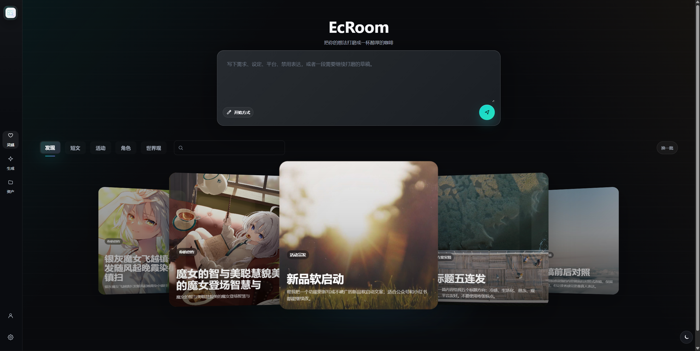
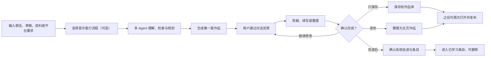
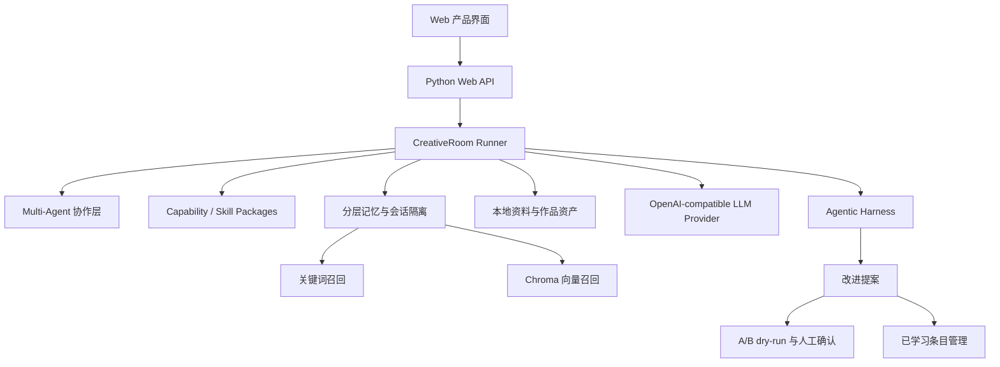

# EcRoom

> 把一个模糊想法，打磨成可以继续发布、收藏、复用和迭代的内容作品。

EcRoom 是一个面向泛内容创作的人机共创工作室。用户用自然语言提出想法、草稿、平台要求或修改意见，系统会组织多个 Agent 完成需求理解、资料检索、创作策略、初稿生成、改稿整理、质量评审、规范检查、作品保存与发布。

它不是只服务某一种题材的写作工具，而是面向更通用的内容创作场景：社媒帖子、长文方案、资料型写作、职业文本、故事世界、视频脚本等。用户在创作过程中通过对话持续反馈；系统只在话题完成后整理与自身工作方式、安全边界、质量评审有关的自进化条目，并交给用户确认、保留或删除。



## 产品演示

https://github.com/user-attachments/assets/6b457418-2031-41be-bb32-bec128b69e5b

## 主要特性

- **多 Agent 创作链路**：将开放式内容创作拆分为理解、检索、规划、写作、编辑、评审、规范检查和归档等阶段。
- **六类通用能力流程**：提供首次启动用的能力包，覆盖想法成稿、长文方案、资料写作、职业文本、故事世界和视频脚本。
- **真实的人机共创闭环**：支持初稿生成、多轮反馈、继续输出、局部改稿、完成话题、保存作品和发布到主页。
- **作品与发布状态管理**：完成后可以只保存到作品库，也可以整理为主页作品；草稿、已发布、收藏和私有作品保持状态一致。
- **会话隔离与可控记忆**：每条对话拥有独立上下文分区；除已确认的系统学习条目外，不跨对话混用资料、反馈或临时设定。
- **已学习条目管理**：系统自进化条目会像本地数据库记录一样保存，用于后续改善协作方式；用户可在数据管理中查看和删除。
- **Agentic Harness 自进化**：把质量问题、规范遗漏和协作方式失败整理为可审阅、可验证、可回滚的 harness 改进提案。
- **混合检索与本地资料**：结合关键词召回与 Chroma 向量检索，支持资料、项目设定、规则和已确认学习条目的后续调用。
- **多模型接入**：支持 Mistral、OpenAI、DeepSeek 等 OpenAI-compatible provider；没有 API Key 时也可以使用本地 stub 跑通流程。
- **产品化前端体验**：包含发现/搜索、创作、历史、作品库、主页、发布编辑、设置与数据管理等界面。

## 产品流程



## 系统结构



## 六类能力流程

EcRoom 的能力包是“初次启动创作”的流程化入口，不是每轮反馈都反复调用的按钮。它们负责帮助用户从模糊任务进入一个结构清晰的第一版，后续修改主要通过对话反馈完成。

- **想法成稿**：把零散想法整理成适合继续打磨的短内容或帖子初稿。
- **长文方案**：先建立主题、结构、论点和段落节奏，再生成长文骨架或正文。
- **资料写作**：围绕用户给出的资料、链接、设定和事实边界生成内容。
- **职业文本**：面向简历、项目经历、说明文档、汇报材料等更克制的文本。
- **故事世界**：处理角色、世界观、剧情钩子、设定一致性和叙事张力。
- **视频脚本**：生成适合真人拍摄、AI 视频或分镜生产的镜头脚本、画面说明和节奏安排。

## 自进化与数据边界

EcRoom 不会在创作过程中把每条用户反馈都自动沉淀为长期记忆。用户反馈首先用于当前对话的改稿和续写。

只有在用户确认完成一个话题后，系统才会整理与以下内容相关的候选项：

- Agent 协作方式是否需要调整。
- 质量评审规则是否需要补足。
- 平台规范、风险边界或 harness 工程规则是否存在遗漏。
- 某次失败是否值得转化为可验证、可回滚的系统改进。

这些条目会进入人工确认流程。确认后的内容会显示在“设置 / 数据管理 / 已学习条目”中，可以删除。删除后，该条目不会继续参与后续检索或系统行为约束。

## 技术栈

- **Backend**：Python、本地 Web API、pytest
- **Frontend**：原生 HTML / CSS / JavaScript
- **LLM**：Mistral / OpenAI / DeepSeek compatible provider
- **Memory**：L0-L3 分层记录、BM25 风格关键词召回、Chroma 向量检索
- **Knowledge**：本地资料库、作品资产、发布草稿与主页作品
- **Evolution**：Agentic Harness、改进提案、人工确认、A/B dry-run、可回滚 amendment

## 快速开始

```powershell
cd EcRoom
python -m pip install -e ".[dev]"
.\scripts\start.ps1
```

打开：

```text
http://127.0.0.1:8765
```

运行测试：

```powershell
.\scripts\test.ps1
```

## 模型配置

项目默认可以使用本地 stub，不填写 Key 也能体验完整产品流程。需要接入真实模型时，先复制配置模板：

```powershell
Copy-Item .env.example .env
```

然后在 `.env` 里填写对应模型的 Key：

```text
ECR_LLM_PROVIDER=mistral
MISTRAL_API_KEY=your_key
ECR_LLM_MODEL=mistral-small-latest
```

OpenAI-compatible 服务也可以这样配置：

```text
ECR_LLM_PROVIDER=openai
OPENAI_API_KEY=your_key
ECR_LLM_MODEL=gpt-4.1-mini
```

也可以在应用内的“设置 / 模型”里填写服务商、模型、Base URL 和 API Key。API Key 只保存在本地工作区，不会回显到页面。

## 项目目录

```text
evolving_creative_room/
  agents/          Agent 角色与协作逻辑
  memory/          记忆、会话隔离、检索与向量后端
  orchestration/   创作编排、作品归档、发布和学习条目
  evolution/       harness 改进提案
  static/          Web 产品界面
  web.py           本地 Web API

harness/
  agents/          Agent 工作规则
  capabilities/    六类通用能力流程
  skills/          可复用创作技能
  rubrics/         质量评审规则
  norms/           平台与项目规则策略
  memory/          记忆抽取策略

docs/
  ECROOM_SSD.md    系统设计文档
  images/          README 与展示图片

tests/             回归测试
scripts/           启动与测试脚本
```

## 当前状态

EcRoom 目前是一个本地可运行的产品原型，已经具备创作、反馈、作品保存、主页发布、资产复用、发现搜索、六类能力流程、多模型接入、会话隔离、混合检索记忆、完成后系统自进化确认和已学习条目管理等核心闭环。

下一阶段更适合继续打磨真实流式 Agent 事件、更多端到端测试、作品发布体验、检索质量评估和长期学习条目的验证策略。
