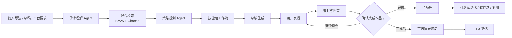
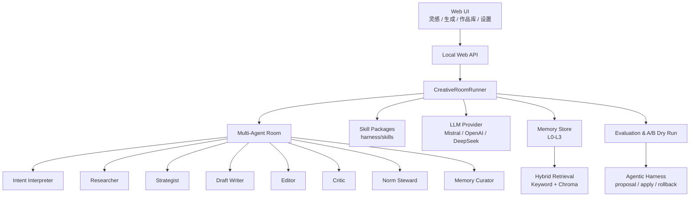
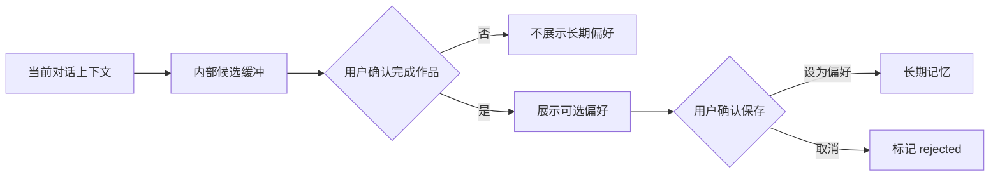

# EcRoom

> 把你的想法打磨成一杯醇厚的咖啡。

EcRoom 是一个面向泛内容创作的人机共创工作室。它不是单纯的“写稿机器人”，而是把一次创作拆成需求理解、资料召回、策略规划、草稿生成、反馈改稿、规范检查、作品归档和偏好沉淀，让用户像和一个创作团队协作一样完成内容。

它适合处理小红书/微博发帖、活动宣发、游戏角色文案、世界观设定、剧情片段、标题方案、改稿润色等开放式创作任务。用户可以自由表达需求，系统负责组织多个 Agent、调用专家技能、召回记忆与资料，并在作品完成后把有价值的偏好和规则沉淀下来。

## Highlights

- **多 Agent 共创**：需求理解、资料检索、创作策略、写作、编辑、评审、平台规范和记忆沉淀分工协作。
- **专家技能包**：技能不是几个提示词按钮，而是带有流程、工具契约、输出规格和评测标准的可复用能力。
- **作品流而非聊天流**：工作中的内容留在近期对话；确认完成后进入作品库，可继续迭代、复用和收藏。
- **分层记忆**：参考 Tencent Agent Memory，使用 L0-L3 结构管理原始证据、原子规则、场景记忆和长期偏好。
- **混合检索**：关键词召回命中平台、角色名、禁用词等精确信号，Chroma 向量召回负责语义相似记忆。
- **Agentic Harness**：失败反馈会进入可审阅、可验证、可回滚的 harness 改进闭环，而不是偷偷改 prompt。
- **多模型接入**：当前支持 Mistral、OpenAI、DeepSeek 风格的 OpenAI-compatible provider。
- **本地可运行**：静态前端 + Python 服务，默认可用 stub 跑通完整流程。

## Product Flow



## Architecture



## Core Concepts

### 1. Creative Room

一次创作会被组织成一个“房间”。用户是创意总监，Agent 是不同职能的创作协作者。系统不会把任务机械切碎，而是围绕创作判断来分工：谁理解需求、谁找资料、谁负责规范、谁判断偏好是否值得保存。

### 2. Skills

技能代表本轮回复的专家路线，而不是长期模式开关。选择技能后，系统会倾向于对应的工作流。

当前内置方向包括：

| 技能 | 适合场景 |
| --- | --- |
| 创作诊断 | 想法还模糊，需要整理 brief 和方向 |
| 资料驱动 | 有链接、资料、平台规则、事实边界 |
| 叙事设定 | 角色、世界观、剧情、canon 一致性 |
| 发布适配 | 微博、小红书、公众号、活动页等发布版本 |
| 深度改稿 | 根据反馈去模板感、重写、局部调整 |
| 方案实验 | 标题、开头、卖点、多方向候选比较 |

### 3. Memory

EcRoom 不会因为一句临时要求就固化用户画像。记忆遵循“完成后可选沉淀”的原则：



分层方式：

| 层级 | 内容 |
| --- | --- |
| L0 | 原始会话、草稿、反馈、资料来源 |
| L1 | 原子偏好、规则、禁用项、平台线索 |
| L2 | 项目、平台、技能上下文等场景记忆 |
| L3 | 用户明确确认过的长期偏好 |

### 4. Agentic Harness

Harness 是系统外部的可编辑工作规则。EcRoom 会把重复失败、评审不足、记忆误固化、平台规范遗漏等问题整理成带证据的改进提案，再通过 A/B dry-run 验证候选规则是否真的更好。

它强调三件事：

- 改进要有证据；
- 改动要可审阅、可回滚；
- 结果要能被评测，而不是靠感觉。

## Run Locally

### 1. Install

```powershell
cd EvolvingCreativeRoom

python -m pip install -e ".[dev]"
```

### 2. Start

```powershell
.\scripts\start.ps1
```

或直接运行：

```powershell
python -m evolving_creative_room.web
```

打开：

```text
http://127.0.0.1:8765
```

### 3. Test

```powershell
.\scripts\test.ps1
```

或：

```powershell
python -m pytest -q
```

## LLM Configuration

没有 API Key 时，项目会使用本地 stub，方便先跑通产品流程。

在项目根目录新建 `.env`，填写对应 provider：

Mistral:

```text
ECR_LLM_PROVIDER=mistral
MISTRAL_API_KEY=your_key
ECR_LLM_MODEL=mistral-small-latest
```

OpenAI:

```text
ECR_LLM_PROVIDER=openai
OPENAI_API_KEY=your_key
ECR_LLM_MODEL=gpt-4.1-mini
```

DeepSeek:

```text
ECR_LLM_PROVIDER=deepseek
DEEPSEEK_API_KEY=your_key
ECR_LLM_MODEL=deepseek-v4-pro
```

也可以在应用的“设置 / 模型设置”里填写服务商、模型、Base URL 和 API Key。

## Vector Store

默认使用 Chroma：

```text
ECROOM_VECTOR_BACKEND=chroma
```

检索策略是混合式的：

- 关键词召回：适合平台名、角色名、禁用词、明确设定；
- 向量召回：适合语义相近的偏好、历史反馈、风格样本；
- 状态过滤：rejected、revoked、deleted 不进入长期召回。

Tencent VectorDB 的 adapter 边界已经预留。没有账号时，Chroma 是当前最稳妥的本地产品化选择。

## Project Structure

```text
evolving_creative_room/
  agents/              Agent 角色与协作逻辑
  memory/              L0-L3 记忆、混合检索、向量后端
  orchestration/       创作编排、反馈处理、作品归档
  evolution/           harness 改进提案与应用
  static/              Web 产品界面
  knowledge.py         资料库与公开网页导入
  evaluation.py        内置评测与 A/B dry-run
  llm.py               Mistral / OpenAI / DeepSeek provider
  web.py               本地 Web API

harness/
  agents/              Agent 工作规则
  skills/              专家技能包
  memory/              记忆提取与治理策略

tests/                 回归测试
scripts/               启动与测试脚本
```

## API Examples

导入公开网页资料：

```powershell
Invoke-WebRequest -UseBasicParsing -Method POST http://127.0.0.1:8765/api/knowledge/import-url `
  -ContentType 'application/json' `
  -Body '{"url":"https://example.com/rules","kind":"norm","tags":"平台规范"}'
```

运行 A/B dry-run：

```powershell
Invoke-WebRequest -UseBasicParsing -Method POST http://127.0.0.1:8765/api/evaluations/ab `
  -ContentType 'application/json' `
  -Body '{"session_id":"session_id","proposal_id":"proposal_id"}'
```

## Status

EcRoom 目前是一个本地可运行的产品原型，已经具备完整的创作链路、记忆沉淀、作品库、专家技能、多模型接入和 harness 改进闭环。下一阶段重点会放在：

- 更稳定的作品归档与再迭代体验；
- 更完整的技能包评测；
- 更细的 Memory Curator 失败样本；
- Tencent VectorDB 正式 adapter；
- 更接近真实产品的前端细节与可访问性。
