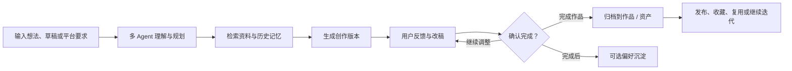
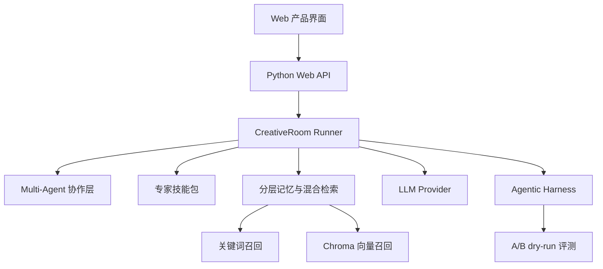

# EcRoom

> 把你的想法打磨成一杯醇厚的咖啡。

EcRoom 是一个面向泛内容创作的自进化 Multi-Agent 共创工作室。用户可以用自然语言提出创作需求，系统会组织多个 Agent 完成需求理解、资料检索、创作规划、草稿生成、改稿评审、平台规范检查和作品归档。

它适合小红书、微博等平台发帖、活动宣发、游戏角色文案、世界观设定、剧情片段、标题方案和改稿润色等开放式写作任务。创作过程中，用户始终保留主导权；系统负责把反馈沉淀为可审阅的偏好与规则，让后续创作更贴近用户表达。


## 主要特性

- **多 Agent 协作**：将内容创作拆分为理解、检索、规划、写作、编辑、评审、规范检查和记忆沉淀等环节。
- **专家技能工作流**：把常见创作能力封装为可复用的技能路线，例如叙事设定、发布适配、资料驱动、深度改稿和方案实验。
- **人机共创闭环**：支持用户多轮反馈、局部修改、确认完成、发布归档、收藏复用和再次迭代。
- **可选择的记忆沉淀**：只有在用户确认作品完成后，系统才会整理可能有价值的偏好，并交给用户选择是否保存。
- **混合检索记忆**：结合关键词检索与 Chroma 向量检索，兼顾平台名、角色名、禁用词等精确信号和语义相似的历史偏好。
- **Agentic Harness 自进化**：把失败反馈、规范遗漏和偏好误判整理为可审阅、可验证、可回滚的系统改进提案。
- **多模型接入**：支持 Mistral、OpenAI、DeepSeek 等 OpenAI-compatible provider；没有 API Key 时也可以使用本地 stub 跑通流程。

## 产品流程



## 系统结构



## 技术栈

- **Backend**：Python、本地 Web API、pytest
- **Frontend**：原生 HTML / CSS / JavaScript
- **LLM**：Mistral / OpenAI / DeepSeek compatible provider
- **Memory**：Chroma、关键词检索、分层记忆记录
- **Evolution**：Agentic Harness、改进提案、A/B dry-run

## 快速开始

```powershell
cd EvolvingCreativeRoom
python -m pip install -e ".[dev]"
.\scripts\start.ps1
```

打开：

```text
http://127.0.0.1:8765
```

运行测试：

```powershell
.\scripts\test.ps1
```

## 模型配置

项目默认可以使用本地 stub，不填写 Key 也能体验完整产品流程。需要接入真实模型时，在项目根目录创建 `.env`：

```text
ECR_LLM_PROVIDER=mistral
MISTRAL_API_KEY=your_key
ECR_LLM_MODEL=mistral-small-latest
```

OpenAI-compatible 服务也可以这样配置：

```text
ECR_LLM_PROVIDER=openai
OPENAI_API_KEY=your_key
ECR_LLM_MODEL=gpt-4.1-mini
```

也可以在应用内的“设置 / 模型设置”里填写服务商、模型、Base URL 和 API Key。

## 项目目录

```text
evolving_creative_room/
  agents/          Agent 角色与协作逻辑
  memory/          记忆、检索与向量后端
  orchestration/   创作编排与作品归档
  evolution/       harness 改进提案
  static/          Web 产品界面
  web.py           本地 Web API

harness/
  agents/          Agent 工作规则
  skills/          专家技能包

tests/             回归测试
scripts/           启动与测试脚本
```

## 当前状态

EcRoom 目前是一个本地可运行的产品原型，已经具备创作、反馈、作品归档、资产复用、专家技能、多模型接入、混合检索记忆和自进化 harness 的基础闭环。
