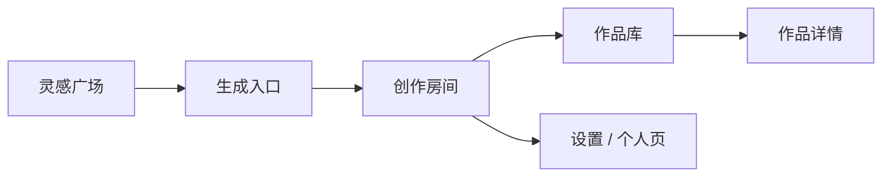

# EcRoom SSD：面向可感知自进化的产品与系统设计

## 0. 文档边界与使用方式

本文是 EcRoom 后续产品、工程、评测和体验迭代的唯一 SSD 入口。原有 `PRODUCT_BLUEPRINT.md`、`PRODUCT_DESIGN.md` 和 `MOTION_DESIGN.md` 中的产品定位、当前实现状态、参考项目、模块设计、动效规范和验收标准已经收拢到本文；这些文件只保留跳转说明，避免同一规则在多处漂移。

本文面向四类使用场景：

- 产品设计：判断某个功能是否符合 EcRoom 的长期方向；
- 工程实现：确定 agent、memory、harness、LLM、前端状态和存储边界；
- 评测治理：定义哪些指标说明系统真的变好；
- 体验细化：约束完成作品、偏好沉淀、资产复用、设置和动效的产品语义。

当实现与本文冲突时，优先按本文修正实现；当真实用户反馈证明本文不合理时，修改本文并说明证据、影响范围和回滚方式。

### 0.1 产品定位

EcRoom 是一个人机共创型内容工作室。用户给出任意创作需求，系统把它整理成可执行的 Creative Intent，组织多个 agent 完成资料召回、创作策略、草稿生成、编辑、评审、规范提醒、记忆沉淀和 harness 进化。

它服务的内容范围包括：

- 社媒帖子：小红书、微博、公众号短文、X/LinkedIn 风格内容；
- 长内容：观点稿、产品文案、研究型文章、活动文案；
- 叙事内容：游戏角色、剧情任务、世界观、角色台词；
- 混合任务：角色宣发、品牌人格文案、活动剧情包装。

产品的长期价值来自三点：

- 用户参与创作过程，系统学习人的判断；
- 记忆有证据链，偏好、项目设定、平台规范分开治理；
- harness 能基于失败证据进化，进化过程可审阅、可评测、可回滚。

### 0.2 当前本地产品基线

当前代码已经具备本地原型的基础闭环：

- 单页 Web 产品界面；
- 本地 Python Web API；
- `CreativeRoomRunner` 编排多 agent 创作流程；
- 项目、会话、作品、资产、记忆、资料库、评测和调用日志的本地文件存储；
- Mistral、OpenAI、DeepSeek 等 OpenAI-compatible provider 接入；
- 未配置 API Key 时可用本地 stub 跑通流程；
- `harness/` 下的 agent、skill、norm 和 memory 规则文件；
- 内置评测与 A/B dry-run 的基础能力。

当前项目目录名为 `EcRoom`。Python 包名仍保持 `evolving_creative_room`，这是 import/package 标识，不等同于仓库目录名或产品展示名。

### 0.3 当前实现成熟度与未满足项

当前实现应被视为“本地可运行产品原型”，不是完全达成 SSD 的产品级系统。后续开发不得因为已有入口存在，就默认能力已经成熟。

成熟度判断：

| 领域 | 当前成熟度 | 说明 |
| --- | --- | --- |
| 产品主路径 | 中等偏高 | 创建会话、生成草稿、反馈、完成作品、资产、发布、偏好设置都有原型入口 |
| 工程边界 | 中等偏低 | runner 聚合过多职责，前端单文件状态过重 |
| 记忆治理 | 中等 | L0-L3、候选和确认存在，但完成后 gating 需要严格化 |
| 自进化 | 低到中 | manifest、apply、A/B 外壳存在，但候选 harness 与真实验证不足 |
| 评测 | 低 | 当前偏冒烟测试，不能充分证明自然度、偏好准确率和自进化收益 |
| Harness 事实源 | 低到中 | 文件存在，但能力包内容仍可能由 Python 常量反向生成 |
| 数据可靠性 | 原型级 | JSON/JSONL 易调试，但缺少 schema、原子写、迁移和修复工具 |
| 前端可靠性 | 原型级 | 产品面丰富，但缺少 E2E 和模块边界 |

当前必须修正的 SSD 偏差：

- learning candidates 必须严格在完成作品后才展示；
- A/B dry-run 必须使用候选 harness，而不是把候选修改当成普通 preference；
- manifest 字段必须统一，避免 `targeted_fix` / `proposed_change` 这类漂移；
- harness skill 文件必须成为事实源，启动时不得无条件重写；
- 自然度失败必须结构化归因，不能靠继续堆关键词和固定句式修补；
- 前端必须补齐 evolution 建议展示入口，并清理 JS 中引用但 HTML 不存在的节点；
- 评测必须从“能跑通”升级为“能证明是否变好”。

## 1. 设计目标

EcRoom 不应只是一个“能写稿的多智能体系统”。它的核心目标是：在不固化用户创作自由的前提下，让系统能从长期协作中学习上下文、改进专家技能，并用可验证的方式证明改进有效。

产品逻辑是：

```text
用户提出创作需求
  -> 多 Agent 协作生成和改稿
  -> 用户继续反馈或确认完成
  -> 系统只在完成后提出少量可保存偏好
  -> 用户确认后沉淀为记忆
  -> 后续创作按场景召回
  -> 重复失败进入 Agentic Harness 改进闭环
```

这条链路里，创作自由始终排在第一位。系统可以理解用户、利用上下文、提出候选记忆，但不能在用户创作过程中持续打断，也不能把一次性的风格选择固化成用户画像。

本设计围绕三个问题展开：

- 系统到底要优化什么；
- 用户如何感知系统在变好；
- Agentic Harness 和分层记忆如何进入真实工程闭环。

### 1.1 核心功能链路

EcRoom 的核心不是“用户输入 -> 模型输出”，而是一条可持续协作链路。所有功能都必须服务这条链路，不能为了展示 agent、展示记忆或展示动效而偏离用户真实创作目标。

```text
自然输入
  -> Creative Intent 建模
  -> 项目资料 / 平台规范 / 历史偏好召回
  -> 能力包影响编排和输出 contract
  -> 多 Agent 生成、编辑、评审、规范检查
  -> 用户反馈或直接改写
  -> 新版本生成和失败信号记录
  -> 用户确认完成作品
  -> 作品进入资产 / 发布链路
  -> 完成后才展示可保存偏好
  -> 用户确认偏好
  -> 后续按作用域召回
  -> 重复失败进入 harness 提案、A/B 验证、人工启用、可回滚
```

这条链路中，最重要的产品判断是：用户始终是创意总监，系统是一个会记得证据、会承认不确定、会逐步变好的协作者。系统不能把用户变成模板选择者，也不能把一次对话中的偶然表达变成长期身份判断。

核心对象之间的关系如下：

| 对象 | 作用 | 生命周期 | 关键边界 |
| --- | --- | --- | --- |
| `CreativeIntent` | 记录本轮用户真正要完成的创作目标 | 单次会话 | 只描述本轮，不等于长期画像 |
| `KnowledgeRecord` | 保存项目资料、平台规范、风格样本、canon | 项目或全局资料库 | 必须有来源、类型、置信度 |
| `MemoryRecord` | 保存用户确认或可回溯的协作经验 | L0-L3 分层 | 长期生效必须有证据和作用域 |
| `CreativeState` | 保存一次创作的共享工作状态 | 单次会话 | agent 只能写自己负责的字段 |
| `DraftVersion` | 保存版本链和父版本关系 | 会话 / 作品 | 用户反馈必须能绑定到具体版本 |
| `LearningCandidate` | 完成后可由用户选择保存的候选偏好 | 完成态候选 | 未确认前不进入长期召回 |
| `ChangeManifest` | harness 改进提案 | 提案 / 版本 | 必须先验证、可回滚、可审阅 |

### 1.2 自然度与反硬编码原则

EcRoom 的自然度来自对用户意图、上下文和证据的动态理解，而不是来自更多 if/else、关键词模板或固定话术。硬编码可以用于原型兜底、实体识别和安全边界，但不能成为创作质量、用户偏好或 agent 决策的主要来源。

禁止出现以下设计：

- 用固定平台模板替代用户输入，例如看到“小红书”就强行套固定标题、emoji、口吻；
- 用关键词直接生成长期偏好，例如看到“冷一点”就写入“用户喜欢冷感”；
- 用静态 agent 顺序处理所有任务，忽略能力包、资料、反馈和项目 canon；
- 用装饰性 loading 阶段伪装真实推理进度；
- 用通用 norm warning 覆盖具体项目设定或用户表达；
- 用一次失败反馈直接修改全局 prompt；
- 把 `skills.py`、前端按钮文案或某个 seed prompt 当成最终产品能力边界。

允许的硬编码必须满足四个条件：

| 条件 | 说明 | 示例 |
| --- | --- | --- |
| 只做兜底 | LLM、harness 或资料不足时维持可运行 | 本地 stub 草稿、默认 eval case |
| 不扩大作用域 | 只影响当前会话或明确的技术边界 | 平台名识别只作为召回线索 |
| 可被覆盖 | 用户、项目资料或 harness 规则可以覆盖 | 用户说“这次不要平台腔”，平台模板不得生效 |
| 可被评测 | 硬编码规则必须进入失败统计 | “模板感”反馈要归因到 draft_writer 或 skill |

自然度治理的工程要求：

- Agent 输出尽量使用结构化 contract，再由 Writer/Editor 生成自然语言，不让所有判断都塞进一个 prompt；
- 平台、角色、世界观、偏好、临时风格必须分字段存储，不能拼成一段不可解释上下文；
- 每条召回内容都要带来源类型和作用域，Writer 只使用与当前任务相关的部分；
- 系统可以提出 2-3 个创作方向，但不能把选项设计成模板按钮；
- 对用户反馈的响应要先定位反馈对象，再改稿，不直接“整体润色”；
- 所有“系统变好”的证据必须来自完成作品、用户确认、编辑距离、失败信号下降或评测提升，而不是来自生成次数增加。

## 2. 北极星指标

### NSM：可复用创作成功率

定义：用户在一次会话中得到可继续使用或保存为资产的内容比例。

计算：

```text
可复用创作成功率 =
  有效完成会话数 / 总创作会话数
```

有效完成会话满足任一条件：

- 用户点击收藏或保存为资产；
- 用户接受最终稿；
- 用户连续反馈后没有出现同类失败信号；
- 用户将某个版本用于后续创作。

这个指标比“生成次数”更重要。EcRoom 的价值不是多生成，而是生成的内容能进入用户的创作流程。

## 3. 分层指标

### 3.1 任务理解指标

目标：系统能准确识别用户这次真正想做什么，而不是把用户固化成某种风格。

指标：

- Intent 完整率：是否抽取出目标、载体、约束、参考、禁用项；
- 临时上下文识别率：是否把“这一次”的风格和参考限制在当前会话；
- 澄清需求率：信息不足时是否给出合理假设，而不是盲目生成。

目标值：

```text
Intent 完整率 >= 85%
临时上下文误固化率 <= 5%
```

### 3.2 记忆召回指标

目标：该召回的记忆能召回，不该召回的记忆不干扰创作。

指标：

- 相关记忆命中率：与当前任务相关的偏好、项目规则、平台规范是否进入上下文；
- 噪声召回率：无关历史是否被召回；
- 证据可追溯率：每条记忆是否能回到原始对话或资料；
- 撤销生效率：删除对话并撤销记忆后，相关记忆是否不再参与召回。

目标值：

```text
相关记忆命中率 >= 80%
噪声召回率 <= 15%
证据可追溯率 = 100%
撤销生效率 = 100%
```

### 3.3 能力包指标

目标：能力包不是标签，而是可复用、可评测、可升级的首轮创作流程。

指标：

- 能力包选择有效率：用户选择开始方式后，工作流、工具、输出结构确实发生变化；
- 能力包输出达标率：输出是否满足该 capability 的 output contract；
- 能力包失败归因率：失败反馈是否能归因到 capability 步骤、工具或规范；
- 能力包升级通过率：新版本 capability 通过 A/B dry-run 后再启用。

目标值：

```text
能力包选择有效率 >= 90%
能力包输出达标率 >= 80%
能力包失败归因率 >= 70%
```

### 3.4 自进化指标

目标：系统不是“自动改 prompt”，而是提出可审阅、可验证、可回滚的 harness 改进。

指标：

- 改进提案证据覆盖率：每条提案是否引用原始失败证据；
- 预测指标填写率：每条提案是否声明预计改善什么；
- A/B 验证完成率：提案是否经过 dry-run 或后续任务验证；
- 回滚可用率：每次启用是否能回到旧版本；
- 净提升率：启用后的能力包或 agent 版本是否提升对应评测分。

目标值：

```text
提案证据覆盖率 = 100%
预测指标填写率 = 100%
A/B 验证完成率 >= 80%
净提升率 > 0
```

### 3.5 用户可感知指标

目标：用户能看见系统为什么这么做、学到了什么、下次会怎么变。

指标：

- 完成后学习展示率：用户点击“完成”后，是否展示少量可判断的候选偏好；
- 用户确认率：用户是否确认某条偏好、规则或工作方式改进；
- 误学习撤销率：用户撤销不正确记忆或工作方式改进的比例；
- 信任反馈：用户是否觉得系统“理解我但不限制我”。

目标值：

```text
完成后学习展示率 >= 90%
误学习可撤销率 = 100%
```

### 3.6 偏好沉淀指标

目标：Memory Curator 能从对话中提取高质量候选，但不把临时创作要求误存为长期偏好。

指标：

- 候选准确率：展示出的候选中，用户认为值得保存或合理的比例；
- 临时要求误固化率：把“这次、本轮、先这样”识别为长期偏好的比例；
- 否定保真率：包含“不要、避免、禁止、不能”的规则是否完整保留否定；
- 作用域准确率：平台、项目、角色、全局偏好是否被分到正确范围；
- 候选压缩率：一次完成后展示的候选数量是否足够少，避免造成选择压力。

目标值：

```text
候选准确率 >= 75%
临时要求误固化率 <= 5%
否定保真率 = 100%
单次候选数量 <= 5
```

## 4. 系统设计

### 4.1 Context Scope：避免固化用户

EcRoom 的上下文不按“用户是谁”来固化，而按作用域管理。系统要先判断一条信息应该影响哪里，再决定是否保存。

| 作用域 | 含义 | 生命周期 | 默认行为 | 例子 |
| --- | --- | --- | --- | --- |
| Session | 本次创作意图、临时风格、当前参考 | 当前会话 | 会话结束后默认不保存 | 这次写冷一点、这次参考某作品气质 |
| Project | 项目 canon、账号风格、平台规则、系列设定 | 项目内 | 只影响当前项目 | 某角色不能说长句、某账号不做硬广 |
| Global | 用户明确确认的长期工作偏好 | 跨项目 | 默认关闭自动升级，需要确认或高置信度 | 默认不要模板腔、先给可改版本 |
| Rejected | 用户否定或撤销的信息 | 永久排除，除非恢复 | 不参与召回和自进化 | 用户说“不要再记这个” |

原则：

- 用户一次说“这次写冷一点”，不能变成“用户永远喜欢冷感”；
- 用户明确说“以后都这样”或多次确认后，才进入 Global Context；
- 删除对话并撤销记忆后，相关证据不再参与召回和自进化。

### 4.2 Memory Action Model

偏好沉淀不能打断创作。系统可以在后台观察用户需求、反馈和最终稿变化，但这些候选项在会话进行中只留在隔离缓冲区，不进入长期记忆，也不展示给用户。

当用户认为某个版本已经可用，点击创作版本右下角的“完成”后，系统才展示本次会话沉淀出的候选偏好。用户可以撤销完成，撤销后候选区收起，会话回到继续创作状态。

候选记忆的默认状态是 `candidate`。产品层只保留两个动作：

| 用户动作 | 目标状态 | 生效范围 | 语义 |
| --- | --- | --- | --- |
| 设为偏好 | global_active | 跨会话 | 写入可管理的长期偏好，后续创作可被召回 |
| 取消 | ignored | 不保存 | 不进入偏好，不作为负反馈，也不打断创作 |

当前会话里的临时要求天然由对话上下文生效，不需要额外的“本次保留”按钮。这样用户不必在每次生成后做记忆治理，只在确认作品完成时处理真正值得长期保存的内容。

候选项质量规则：

- 保留完整语义，尤其是“不要、禁止、避免、不能”等否定和限制词；
- “这次、本次、当前、先、暂时”这类临时指令默认不推荐为长期偏好，除非用户同时表达“以后、长期、默认、记住”；
- 不把原句截成孤立名词，例如“不要夸张承诺”不能变成“夸张承诺”；
- 合并重复、包含关系和低价值碎片，优先展示用户能判断的完整规则；
- 平台、角色、世界观等线索保留类型字段，但前端统一让用户选择是否设为长期偏好。

#### 4.2.1 完成后 gating 的工程规则

当前实现必须向以下状态机收敛，避免系统在创作过程中提前展示或写入长期偏好：

```text
working
  -> internal_observation_buffer
  -> completed_pending_learning
  -> user_confirmed_preference
  -> active_memory
```

各状态含义：

| 状态 | 允许行为 | 禁止行为 |
| --- | --- | --- |
| `working` | 保存 L0 原始会话、更新短期 canvas、记录内部失败信号 | 展示偏好候选、写入 L2/L3、影响其他会话 |
| `internal_observation_buffer` | 暂存可能有价值的偏好、规则、否定和反馈对象 | 进入 `memory.search_records` 召回 |
| `completed_pending_learning` | 用户点击完成后生成候选并展示最多 3-5 条 | 自动设为偏好、默认勾选、阻塞继续修改 |
| `user_confirmed_preference` | 用户点击“设为偏好”后 materialize 到 L2/L3 | 无证据写入、扩大作用域 |
| `active_memory` | 后续按项目、平台、global 作用域召回 | 被已删除/撤销证据继续影响 |

后端职责：

- `finalize()` 只允许保存 L0、L1 evidence、session meta、metrics 和内部 observation buffer；
- `finalize()` 不得创建前端可见 learning candidates；
- `complete_session(completed=true)` 才调用 Memory Curator candidate generation；
- `complete_session(completed=false)` 必须隐藏未确认候选，并保留已经由用户手动确认的长期偏好；
- `LearningStore.apply(action=preference)` 才能写入 `global_active` 或 `project_active` memory；
- `memory.search_records()` 必须过滤 `candidate`、`evidence`、`ignored`、`rejected`、`revoked`、`deleted`；
- 删除会话时，未确认候选直接撤销；已确认偏好默认保留，但必须能从设置页单独删除。

前端职责：

- `sessionReviewBtn` 只在 session meta `completed=true` 且存在 pending `ReviewItem` 时展示；
- 未完成会话即使 API 返回候选，也必须隐藏复盘入口，作为防御性 UI；
- “完成作品”必须先二次确认或展示完成后的发布提示，不直接把学习动作当成完成动作；
- “继续修改”必须回到 `working` 状态，并收起复盘入口；
- 复盘条目必须说明来源、类型、保存后的影响和作用域，不能只显示一句抽象总结；
- 前端不再保留独立 `learningPanel` 视觉入口，学习候选和工作方式建议统一进入 `ReviewItem` 队列。

评测要求：

| Case | 预期 |
| --- | --- |
| 用户生成但未完成作品 | learning candidates 不在 session view 暴露给前端 |
| 用户点击完成作品 | 展示候选数量不超过配置上限 |
| 用户撤销完成状态 | 候选区隐藏，未确认候选不参与召回 |
| 用户确认偏好 | L3 或 L2 出现 confirmed memory，后续相关任务可召回 |
| 用户删除会话并清理记忆 | 未确认候选和相关 evidence 不再影响召回 |

### 4.3 Multi-Agent Collaboration

EcRoom 的多智能体不是把写作任务机械拆碎，而是围绕“创作、约束、反馈、记忆”形成协作关系。每个 agent 只承担一类判断，避免一个大 prompt 同时负责理解、检索、写作、规范和记忆。

| Agent | 职责 | 产物 | 不负责 |
| --- | --- | --- | --- |
| Orchestrator | 读取用户输入、能力包选择和会话状态，安排本轮工作流 | agent 顺序、共享上下文 | 不直接写稿 |
| Intent Agent | 理解目标、载体、平台、素材、约束和临时要求 | CreativeIntent | 不沉淀长期记忆 |
| Research Agent | 召回资料、平台规则、项目 canon、历史偏好 | facts / sources | 不判断偏好是否长期有效 |
| Strategist | 把需求、资料和规则整理为创作策略 | brief / direction | 不输出最终稿 |
| Writer / Editor | 生成初稿、改稿、回应用户反馈 | draft versions | 不决定长期记忆 |
| Critic / Norm Agent | 检查清晰度、自然度、平台风险、canon 冲突 | comments / warnings | 不替用户决定是否完成 |
| Memory Curator | 观察对话和反馈，提炼候选偏好与规则 | candidate_memory | 不直接写入长期记忆 |

共享状态只保存本轮需要的信息：需求、已召回资料、项目规则、用户反馈、草稿版本、评审意见和候选记忆。Memory Curator 可以读取这些状态，但它不能改变草稿，也不能在用户点击“完成”前把候选推到长期记忆里。

#### 4.3.1 Shared State 设计

多 Agent 不通过自然语言互相“猜”，而是围绕一个共享的 `CreativeState` 工作。每个 agent 只能读写自己负责的字段，避免状态污染。

```text
CreativeState
  session_id
  project_id
  intent: CreativeIntent
  facts: list[str]
  strategy: list[str]
  drafts: list[DraftVersion]
  comments: list[AgentComment]
  human_feedback: list[HumanFeedback]
  warnings: list[str]
  messages: list[AgentMessage]
  memory_candidates: list[LearningCandidate]  // 逻辑字段，可由 LearningStore 持久化
```

字段职责：

| 字段 | 写入者 | 读取者 | 说明 |
| --- | --- | --- | --- |
| `intent` | Intent Agent、Capability Context | 全部 agent | 本轮目标、载体、约束、风格、平台、能力包上下文 |
| `facts` | Research Agent、Norm Agent、Capability Context | Strategist、Writer、Critic、Memory Curator | 召回资料、平台规范、项目 canon、capability contract |
| `strategy` | Strategist | Writer、Editor、Critic | 本轮创作路线，不直接展示为最终稿 |
| `drafts` | Writer、Editor | Critic、Norm Agent、Memory Curator、前端 | 每次生成或改稿的版本链 |
| `comments` | Critic、Norm Agent | Editor、前端、Harness Evolver | 质量和规范检查意见，默认折叠展示 |
| `human_feedback` | Human / Web API | Editor、Memory Curator、Harness Evolver | 用户对具体版本的反馈 |
| `warnings` | Norm Agent、Research Agent | Writer、Editor、前端 | 风险和边界提醒 |
| `messages` | 全部 agent | Trace、Observability、Harness Evolver | 工作流轨迹，不等于用户可见正文 |
| `memory_candidates` | Memory Curator / LearningStore | 前端、MemoryStore | 完成后候选偏好，不直接参与长期召回 |

写入规则：

- Intent Agent 只补全 `intent`，不写长期记忆；
- Research Agent 只写 `facts`，不直接改草稿；
- Writer / Editor 只写 `drafts`，不写偏好候选；
- Critic / Norm Agent 只写 `comments` 和 `warnings`，不替用户否定作品；
- Memory Curator 只写候选，不改 `drafts`，不直接写 L3；
- Harness Evolver 只读轨迹和失败证据，提出可审阅改进，不在用户会话中即时改组件。

#### 4.3.2 Agent 执行协议

每个 agent 的执行需要遵守统一协议：

```text
input:
  state snapshot
  capability package context
  retrieved memory / knowledge
  previous agent outputs

process:
  validate required inputs
  run role-specific steps
  write only owned fields
  emit AgentMessage trace
  emit metric events

output:
  AgentResult {
    role
    summary
    metadata
    changed_fields
    failure_signal?
  }
```

失败处理：

- 缺少必要输入：写入 `comments` 或 `warnings`，继续给出保守版本；
- 检索为空：降低事实置信度，不编造来源；
- 输出不满足 capability contract：由 Critic 标注失败点，并进入 Harness evidence；
- 用户反馈与已有规则冲突：优先使用本轮用户反馈，旧记忆只作为参考；
- agent 失败不能中断整个创作，除非无法生成任何可读内容。

#### 4.3.3 Orchestrator

职责：把用户输入、当前页面、能力包选择和历史状态转成一个本轮工作流。

输入：

- 用户输入文本；
- 当前 session 状态；
- 选中的 capability_id；
- 是否为新会话、继续反馈、资产做同款或完成确认；
- 当前项目和资产上下文。

内部步骤：

1. 判断本轮类型：新创作、继续反馈、资产复用、完成确认、标题修改；
2. 创建或加载 `CreativeState`；
3. 注入选中的 Capability Package；
4. 根据能力包的 `pipeline`、用户输入信号和已有事实选择 agent；
5. 控制顺序执行，并在每个阶段写入 trace；
6. 在生成结束后调用 Memory Curator 观察，但不展示候选；
7. 用户点击完成后，允许前端读取候选。

输出：

- 本轮工作流阶段；
- 更新后的 `CreativeState`；
- 可展示的草稿版本；
- 工作流 trace；
- 候选记忆状态。

#### 4.3.4 Intent Agent

职责：把用户自然语言拆成系统可执行的意图，不做长期记忆判断。

输入：

- 原始需求；
- 用户在输入框中的直接补充；
- 本轮能力包参考；
- 当前项目和资产上下文。

内部步骤：

1. 抽取目标：发帖、改稿、角色文案、世界观、活动宣传、标题方案等；
2. 抽取载体：微博、小红书、公众号、游戏策划文档、角色小传、短文案等；
3. 抽取对象：角色、平台、活动、产品、世界观设定、参考作品；
4. 抽取约束：必须保留、禁用表达、长度、结构、风格边界；
5. 标记临时词：这次、本轮、先、暂时、这一版；
6. 标记长期词：以后、默认、记住、一直、我的风格；
7. 把能力包需要的字段补进 `intent.project_context`。

输出字段：

- `intent.goal`
- `intent.medium`
- `intent.audience`
- `intent.constraints`
- `intent.style`
- `intent.evaluation_criteria`
- `intent.project_context.signals`

失败处理：

- 信息不足时不弹窗打断，先生成“假设 brief”；
- 同时存在多个目标时保留主目标，把次目标放进可选方向；
- 临时词和长期词冲突时，交给 Memory Curator 判断候选，不直接固化。

#### 4.3.5 Research Agent

职责：召回本轮需要的资料、记忆和规范。

输入：

- `intent.raw_request`
- `intent.constraints`
- `intent.user_preferences`
- 能力包的 `tool_contract`
- 平台、角色、项目、URL、实体名。

检索策略：

```text
query_builder
  -> exact terms: 平台名、角色名、作品名、禁用词、URL
  -> semantic query: 用户目标 + 风格 + 场景
  -> filters: project_id、layer、status、tags
  -> hybrid retrieve: BM25 + Chroma vector
  -> rerank: exact entity > project canon > confirmed preference > generic memory
```

输出：

- `facts`：可用事实、项目 canon、平台规范、历史偏好；
- `source_refs`：资料来源；
- `warnings`：无法访问链接、资料置信度不足、来源不明确。

失败处理：

- 链接不可访问：保留 URL 线索，禁止编造页面内容；
- 检索为空：记录“无可靠资料”，让 Writer 只基于用户输入生成；
- 召回过多：按平台、项目、确认状态和新鲜度裁剪；
- 召回冲突：标注冲突来源，交给 Strategist 做保守取舍。

#### 4.3.6 Strategist

职责：把需求、资料、规则和 capability contract 整理成创作策略。

输入：

- `intent`
- `facts`
- capability workflow；
- 历史反馈；
- 规范和 canon 警告。

内部步骤：

1. 固定不可变约束；
2. 确认本轮成功标准；
3. 选择正文结构：短帖、长文、角色设定、发布版本、方案矩阵；
4. 选择语气策略；
5. 生成 Writer 需要的 brief；
6. 明确哪些内容不能混进正文，只能作为后台约束。

输出：

- `strategy[]`
- `writer_brief`
- `evaluation_plan`

失败处理：

- 约束冲突时优先用户最新反馈；
- capability contract 与用户需求冲突时，用户需求优先，能力包降级为参考；
- 平台规则不确定时，采用更保守表达。

#### 4.3.7 Writer / Editor

职责：生成可继续讨论的作品版本，并根据反馈改稿。

Writer 内部步骤：

1. 读取 `writer_brief`；
2. 按 skill output contract 选择结构；
3. 使用 `facts`，但不把后台规则机械写进正文；
4. 输出完整版本；
5. 标注 `rationale`，说明本版为什么这样写。

Editor 内部步骤：

1. 定位用户反馈对应的段落或问题；
2. 区分保留、删除、替换、增强；
3. 先处理用户指定点，再整体润色；
4. 生成新版本，保留 parent_version_id；
5. 不把候选偏好直接写入正文。

输出：

- `DraftVersion.content`
- `DraftVersion.parent_version_id`
- `DraftVersion.rationale`

失败处理：

- 用户反馈模糊：给一个保守改版，不要求用户填表；
- 用户要求和平台规范冲突：优先给安全替代表达；
- 草稿过长：保留核心内容，必要时拆成版本和说明。

#### 4.3.8 Critic / Norm Agent

职责：检查作品是否满足目标、capability contract、平台规范和项目设定。

Critic 检查项：

- 是否回应用户明确需求；
- 是否有模板感、空泛句、过度解释；
- 是否保留核心信息；
- 是否符合能力包输出规格；
- 是否有继续修改空间。

Norm Agent 检查项：

- 平台表达边界；
- 夸张承诺、误导性表达、硬广风险；
- 版权、隐私、事实不确定；
- 角色 canon、世界观一致性；
- 用户禁用词和项目规则。

输出：

- `comments[]`
- `warnings[]`
- `failure_signal`

失败处理：

- 低风险问题折叠展示；
- 高风险问题进入 `warnings`；
- 反复出现的问题进入 Harness evidence。

#### 4.3.9 Agent 通信与前端状态

多 agent 不能像黑盒串联。每个 agent 开始、完成、失败和降级时，都要向会话流写入 `AgentEvent`：

```text
AgentEvent
  event_id
  session_id
  turn_id
  agent_id
  status: queued / running / completed / degraded / failed
  stage_label
  input_refs
  output_refs
  failure_signal
  visible_to_user: true / false
```

前端流式状态来自这些事件，而不是做一个纯视觉动画。展示文案要轻，例如：

| Agent | 用户可见状态 |
| --- | --- |
| Intent Agent | 正在理解需求 |
| Research Agent | 正在查找资料和规则 |
| Strategist | 正在整理创作路线 |
| Writer | 正在生成版本 |
| Editor | 正在根据反馈改稿 |
| Critic / Norm Agent | 正在检查表达和边界 |
| Memory Curator | 已记录可选偏好，完成后可查看 |

并不是每个 agent 都必须展示。短任务只展示关键阶段；复杂任务才展开更多状态。这样用户能感知系统在认真工作，同时不会看到一堆后台日志。

#### 4.3.10 Agent 触发敏感性

Orchestrator 需要根据用户输入触发不同 agent，而不是固定全量跑：

| 用户信号 | 触发重点 |
| --- | --- |
| 提到平台，如小红书、微博、公众号 | Research Agent 查平台规范，Norm Agent 检查发布边界 |
| 提到链接、作品、人物、书名、角色名 | Research Agent 做资料检索，Strategist 标注事实边界 |
| 提到“继续修改、第二段、标题、不要模板” | Editor 前置，Critic 检查反馈响应度 |
| 提到“以后、记住、默认” | Memory Curator 提高长期候选置信度 |
| 提到“这次、先、本轮” | Memory Curator 降低长期候选置信度 |
| 选择某个能力包 | Orchestrator 读取对应 Capability Package，调整 agent 顺序和评测 |

触发不是硬编码模板，而是意图解析、实体识别、检索命中和历史反馈共同决定。Agent 的任务计划必须写入 `CreativeState.messages`，便于后续追踪为什么本轮调用了某个 agent。

### 4.4 Memory Curator Agent

Memory Curator 是多智能体中的专职“偏好沉淀官”。它的目标不是从用户话里抓关键词，也不是直接写入用户画像，而是在创作过程中把可能值得沉淀的信息标注出来，等用户确认作品完成后再让用户决定是否保存。

它在每轮对话后都会观察，但不会打扰用户。它读取的信息包括：用户原始需求、后续反馈、直接改稿、平台与资料线索、评审意见、最终草稿与用户点击完成的动作。

处理流程：

```text
用户需求 / 用户反馈
  -> 语义片段拆分
  -> 信号类型识别
  -> 临时性与长期性判断
  -> 作用域推断
  -> 候选规则改写
  -> 重复与碎片合并
  -> 完成后展示
  -> 用户确认后写入记忆
```

Memory Curator 先把用户话语拆成可判断的语义片段。每个片段都要保留完整语义，不能把否定词、范围词和对象切掉。

| 信号类型 | 识别对象 | 候选改写方式 |
| --- | --- | --- |
| 平台信号 | 小红书、微博、B站、公众号、抖音等 | “涉及微博时，优先检查该平台的表达习惯和发布边界。” |
| 平台规范信号 | 不要硬广、避免夸张承诺、标题自然、别像广告 | “发布到小红书时，表达不要太硬广。” |
| 表达偏好 | 克制一点、更自然、不要模板腔、更像真人 | “表达需要更自然，避免明显模板感。” |
| 项目规则 | 角色不能崩、世界观保持一致、某设定不能改 | “该项目后续创作需要保持角色与世界观设定一致。” |
| 临时要求 | 这次冷一点、本轮短一点、先不要复杂 | 只进入当前会话上下文，不推荐为长期偏好 |
| 长期偏好 | 以后默认、记住我喜欢、之后都不要 | 可以作为长期偏好候选展示 |

作用域判断：

- `session`：本次创作里的临时风格、参考、修改要求；
- `project`：角色 canon、系列设定、账号表达边界；
- `platform`：只有相关平台场景才召回的规范和表达习惯；
- `global`：用户明确确认的长期工作偏好。

Memory Curator 必须特别处理几个误学习风险：

- 用户只是指定这次任务，不等于长期偏好；
- 用户只是举例，不等于默认风格；
- 平台名只是发布目标，不等于用户永远写这个平台；
- “不要夸张承诺”必须完整保留，不能沉淀成“夸张承诺”；
- “这次语气冷一点”只影响当前会话，不能变成“用户喜欢冷感”；
- “标题太模板”应归纳成“标题避免模板感”，而不是保存原句情绪。

候选项需要携带结构化字段：

```text
kind: platform_rule / expression_preference / project_rule / canon_rule
scope: session / project / platform / global
content: 用户能读懂的候选偏好
evidence: 来自哪一轮对话或哪条反馈
confidence: 置信度
reason: 为什么系统认为它值得保存
effect: 保存后下次怎样影响创作
```

#### 4.4.1 Memory Curator 内部算法

Memory Curator 的内部实现分为六步。它不依赖单个关键词判断，也不把大模型的一句总结直接当成偏好写入。

第一步是事件切片。系统把一轮用户输入拆成多个 `utterance_span`，每个片段保留原文、轮次、关联草稿版本、用户动作和上下文位置。切片的目标不是越碎越好，而是让每个片段都能单独回答三个问题：用户在评价什么、这件事是否可复用、它应该影响哪里。

```text
utterance_span
  span_id
  session_id
  turn_id
  draft_version_id
  raw_text
  target_object: title / paragraph / tone / platform / character / plot / whole_draft
  polarity: prefer / reject / constrain / temporary / unknown
  temporal_marker: this_time / project / future / always / unknown
```

第二步是信号识别。Curator 会用规则、检索和 LLM 判断共同完成识别：

- 规则负责稳定词：平台名、否定词、时间范围词、以后、默认、记住、这次、先；
- BM25 负责精确命中：角色名、作品名、平台名、禁用词；
- 向量检索负责找相近历史：用户过去是否反复纠正过同类问题；
- LLM 负责语义判断：这句话是在给本轮改稿意见，还是在表达可复用习惯。

第三步是作用域判断。作用域先保守后升级：

```text
默认 scope = session
如果绑定同一项目 canon、角色设定或账号边界 -> project
如果只在某平台发布时成立 -> platform
如果用户明确说以后、默认、记住，或跨项目重复出现 -> global_candidate
```

作用域升级必须有证据。单次“帮我写小红书”只能说明本轮平台，不说明用户长期偏好小红书风格。单次“不要像模板”通常是本轮反馈；如果多个项目都出现同类反馈，才可以生成“表达避免模板感”的长期候选。

第四步是候选改写。改写要把口语反馈变成可执行规则，但不能改掉原意：

| 原始反馈 | 错误候选 | 合格候选 |
| --- | --- | --- |
| 标题太像模板 | 用户喜欢模板标题 | 标题需要减少模板感，保留具体信息 |
| 这次语气冷一点 | 用户喜欢冷感 | 本轮语气偏冷，不作为长期偏好 |
| 不要夸张承诺 | 夸张承诺 | 发布表达避免夸张承诺 |
| 角色别崩 | 用户喜欢角色文案 | 本项目后续创作需要保持角色设定一致 |

第五步是评分和合并。候选进入前端前，需要经过一个可解释评分：

```text
score =
  evidence_strength * 0.30
  + reusability * 0.25
  + scope_confidence * 0.25
  + user_intent_clarity * 0.15
  - interruption_risk * 0.20
```

评分字段含义：

- `evidence_strength`：证据是否来自明确反馈、重复反馈或完成版本；
- `reusability`：这条规则后续是否真的能改善创作；
- `scope_confidence`：作用域是否清楚；
- `user_intent_clarity`：用户是否明确表达“以后、默认、记住”等意图；
- `interruption_risk`：展示它是否会给用户造成负担。

同类候选会合并，而不是堆叠。例如“不要模板腔”“标题别像模板”“第二段自然一点”可以合并为“表达需要更自然，避免明显模板感”，但如果其中一条只针对标题，就不能强行扩大到全文。

第六步是完成后确认。Curator 在用户点击“完成作品”前只更新内部缓冲，不展示偏好确认。完成作品是一次创作的 commit 点，表示用户认为当前版本已经足够可用，系统才可以把这轮对话里的稳定信号整理成候选偏好。完成后最多生成 3 条高价值候选，前端只在作品卡片角落显示小图标；用户点开后才在居中 modal 中逐条确认。用户点“保存这条”后，候选才写入 L1/L2/L3 或项目规则；用户点“跳过”后，候选标记为 ignored，不参与召回。

#### 4.4.2 写入与删除策略

用户删除对话时，系统不能简单地把所有长期记忆一起删除。对话、资产、偏好和 harness 证据需要分开处理：

| 数据 | 删除对话后的处理 |
| --- | --- |
| 会话消息与草稿 | 删除或软删除，不再显示在历史里 |
| 未确认候选偏好 | 直接删除 |
| 已确认偏好 | 默认保留，因为它是用户明确保存过的规则 |
| 与该会话绑定的项目规则 | 如果没有被其他资产或项目引用，提示用户可一并清理 |
| Harness 失败证据 | 脱敏后保留聚合指标，不保留正文 |

设置页需要提供“偏好管理”。用户可以看到每条偏好来自哪个会话或项目，也可以单独删除。这样可以避免两个极端：删除一个聊天就把用户认真保存的偏好清掉，或者用户已经不想要某条偏好却找不到入口。

候选项在会话中只作为内部缓冲存在，不参与长期召回。用户点击“完成作品”后，前端只通过低打扰小图标提示高置信、低重复、可读性强的复盘项。用户点击“撤销完成状态”后，会话回到工作草稿态，未处理复盘项隐藏或过期；已手动保存的偏好不被撤销，因为它们已经是用户明确确认过的数据。用户点击“保存这条”后，系统再写入 L3、项目规则或待验证 harness proposal；用户点击“跳过”后，该候选不再影响后续创作。

Memory Curator 的输出必须能被评测。失败类型包括：临时要求误固化、否定丢失、平台规则归错作用域、候选过多、候选太碎、把能力包选择误当成偏好。这些失败会进入 Agentic Harness，成为改进 Memory Curator 自身规则、提示词、eval case 和过滤策略的证据。

### 4.5 Memory：参考 Tencent Agent Memory

采用 L0-L3 分层：

| 层级 | 内容 | 用途 |
| --- | --- | --- |
| L0 | 原始会话、草稿、反馈、资料来源 | 证据回溯 |
| L1 | 原子偏好、规则、禁用项、平台线索 | 精准召回 |
| L2 | 场景记忆，如项目、平台、能力包上下文 | 任务组织 |
| L3 | 稳定长期偏好 | 默认个性化 |

L1-L3 不是自动等同于 Session/Project/Global。层级描述“抽象程度”，作用域描述“生效范围”。例如“不要硬广”可以是本次 Session 规则，也可以是某账号 Project 规则，也可以是用户 Global 偏好，必须由证据和用户确认共同决定。

召回策略：

```text
BM25 精确召回 + Chroma 向量召回 + 层级权重 + 证据状态过滤
```

BM25 负责角色名、平台名、禁用词、明确实体；向量召回负责语义相近的偏好和历史经验。状态为 revoked、rejected、deleted 的记忆不进入召回。

### 4.6 产品模块与数据拓扑

EcRoom 的工程边界按产品对象划分，而不是按页面堆功能。每个模块都必须有清楚的数据所有权、用户可见语义和评测入口。

#### 4.6.1 Project Space

项目空间用于隔离不同创作项目的资料、记忆和会话。默认项目用于快速试用；正式使用时，每个账号、游戏项目、品牌或内容系列都应建立独立项目。

当前实现：

- `ProjectStore`；
- Web 新建/切换项目；
- session、memory、knowledge 携带 `project_id`；
- 默认项目保证首次体验不需要预配置。

后续增强：

- 项目归档；
- 项目导入/导出；
- 项目级模型配置；
- 项目成员与权限；
- 项目级规范、canon 和风格样本的批量审计。

#### 4.6.2 Creative Workspace

创作工作台由三层路径构成：

- 灵感页：展示可复用的创作素材，用户可以喜欢、收藏、应用；
- 生成页：展示创作输入、流式生成、对话历史、草稿版本和持续反馈；
- 资产与个人页：沉淀完成作品、收藏素材、发布作品和个人展示内容。

当前 UI 是单页本地应用，便于快速迭代。后续即使替换为正式前端，API、数据结构和状态语义也应保持稳定。页面切换不能改变底层对象语义：工作中会话、完成作品、收藏素材、发布作品必须是不同状态，而不是同一份聊天记录的不同列表皮肤。

#### 4.6.3 Agent Runtime

当前 agent 采用轻量编排：

```text
Intent Interpreter
-> Context Builder / Research Agent
-> Strategist
-> Draft Writer
-> Editor
-> Critic Panel
-> Norm Steward
-> Memory Curator
-> Harness Evolver
```

产品级目标：

- 工作流按 Creative Intent 动态选择 agent；
- 支持 interrupt/resume；
- 支持 agent 分支和版本比较；
- 关键节点支持人工确认；
- agent 输出全部进入 trace；
- 用户反馈能绑定到具体 draft、agent comment、skill step 或 norm warning。

#### 4.6.4 Knowledge and Norms

资料库承担项目知识和平台规范管理。它和 Memory 的边界不同：Knowledge 保存用户明确放入或系统从来源导入的资料，Memory 保存用户协作中沉淀出的偏好、经验和规则。

资料类型：

| 类型 | 内容 | 关键字段 |
| --- | --- | --- |
| `project` | 项目背景、需求、素材 | source、project_id、summary |
| `norm` | 平台规则、发布边界、合规说明 | platform、source_url、captured_at、confidence |
| `style` | 用户或品牌风格样本 | sample_text、style_tags、scope |
| `canon` | 世界观、角色、剧情连续性 | entity、rule、conflict_policy |

产品级要求：

- 每条规范记录来源；
- 平台规则保留抓取日期；
- 规则建议标注置信度；
- 规则和用户口味分开存储；
- 低置信度规则要求人工确认；
- URL 导入只把用户已经找到的公开资料转成可召回 record，不替用户做未经确认的网络事实判断。

#### 4.6.5 存储结构

本地原型使用 `.ecr_workspace/` 保存运行数据。数据结构要为后续数据库迁移留出边界：

```text
.ecr_workspace/
  projects.jsonl
  refs/
  memory/
  knowledge/
  evolution/
  evolution_applied/
  evaluations/
  observability/
  published_posts.json
  media/
```

核心对象：

- `ProjectRecord`：项目空间；
- `CreativeIntent`：创作任务意图；
- `CreativeState`：一次 session；
- `DraftVersion`：草稿版本；
- `AgentComment`：agent 评论；
- `HumanFeedback`：用户反馈；
- `MemoryRecord`：L0-L3 记忆；
- `KnowledgeRecord`：项目资料和规范；
- `ChangeManifest`：进化提案；
- `EvalRun`：评测运行；
- `LLMCallRecord`：模型调用记录；
- `PublishedPost`：用户发布到个人主页的作品；
- `MediaAsset`：上传、灵感或生成图片等媒体引用。

#### 4.6.6 LLM Provider 层

模型接入放在 `llm.py`。产品代码不直接依赖某一家 SDK，agent 只调用统一的 chat 接口。

当前支持：

| Provider | 默认模型 | Key |
| --- | --- | --- |
| Mistral | `mistral-small-latest` | `MISTRAL_API_KEY` |
| OpenAI | `gpt-4.1-mini` | `OPENAI_API_KEY` |
| DeepSeek | `deepseek-v4-pro` | `DEEPSEEK_API_KEY` |

运行时通过 `.env` 中的 `ECR_LLM_PROVIDER` 选择 provider，通过 `ECR_LLM_MODEL` 覆盖模型。没有配置 provider 时，系统使用本地 stub。OpenAI-compatible 服务可配置 Base URL、模型名和 API Key；应用内设置页也提供相同配置入口。

这层设计保证可换模型。后续增强包括 tool calls、JSON mode、重试、限流、成本统计、provider 级连接测试和按项目覆盖模型配置。

### 4.7 工程边界与反硬编码治理

当前原型可以由一个 runner 串起所有能力，但产品级实现必须拆分边界。否则 SSD 中的“组件级 observability、可回滚、自进化、可评测”都会停留在文档层。

目标服务边界：

| 服务 | 负责 | 不负责 |
| --- | --- | --- |
| `SessionService` | 创建会话、加载状态、反馈、完成/撤销完成、删除会话 | 不直接写长期记忆 |
| `IntentService` | Creative Intent 抽取、澄清、临时上下文识别 | 不做最终写作 |
| `ContextService` | 记忆、资料、规范、canon 的作用域召回和上下文压缩 | 不判断长期偏好 |
| `AgentRuntime` | 按 capability contract 和 intent 编排 agent、记录 trace | 不管理资产和发布 |
| `MemoryService` | L0-L3、candidate、confirmed preference、撤销和冲突检测 | 不生成 UI 展示文案 |
| `KnowledgeService` | 资料库、URL 导入、来源、规则置信度和更新时间 | 不把资料误写成用户偏好 |
| `CapabilityRegistry` | 从 harness 加载能力包、校验 contract、提供版本信息 | 不由 Python 常量反向覆盖 harness |
| `EvaluationService` | eval case、A/B dry-run、指标汇总、验证报告 | 不直接应用 harness 修改 |
| `EvolutionService` | 生成 manifest、diff、版本、回滚计划 | 不静默修改系统 |
| `AssetService` | 完成作品、收藏、喜欢、资产详情、继续迭代 | 不处理偏好学习 |
| `PublishService` | 发布草稿、标签、封面媒体、个人主页作品 | 不自动替用户发布 |
| `SettingsService` | 模型、偏好策略、数据管理、profile | 不把 UI 偏好写入创作记忆 |

拆分顺序：

1. 先抽 `MemoryService`、`EvaluationService`、`EvolutionService`，因为它们直接关系 SSD 的可验证闭环；
2. 再抽 `CapabilityRegistry`，让 harness 文件成为事实源；
3. 再抽 `AssetService` 和 `PublishService`，减少 runner 对产品对象的耦合；
4. 最后拆前端模块，避免后端拆分后前端仍是单文件状态泥潭。

#### 4.7.1 Capability Registry 事实源

能力包必须从 `harness/capabilities/{capability_id}` 加载，而不是每次启动由 Python 常量生成。允许保留 seed 脚本，但只能在缺失文件时初始化，不能无条件覆盖人工修改或 evolver 修改。旧 `harness/skills/{skill_id}` 只作为一个迁移周期内的兼容输入。

目标加载流程：

```text
read harness/capabilities/*/capability.json
  -> validate required fields
  -> load workflow.md / eval_cases.json / examples.jsonl
  -> build runtime CapabilityPackage
  -> expose version, contract, metrics
```

`skills.py` 的未来定位：

- 可以作为默认能力包 seed 的来源；
- 可以提供 schema、validator、loader；
- 不再是能力包真实内容的唯一事实源；
- 不应在 runner 初始化时重写 `harness/skills` 或 `harness/capabilities`；
- 当 harness 文件缺失或 schema 错误时，应给出明确错误或使用只读 fallback。

能力包重复使用本身不是问题，但它的生命周期必须符合创作现实。一个 capability pack 是“初次生成的创作模式 / 启动包”，用于把模糊需求快速组织成一个有特点、完整、可继续修改的初始版本。进入同一会话的后续反馈后，不应反复重新调用这个 capability；后续反馈应走改稿链路，使用当前稿件、用户反馈、已确认约束和初始 capability 留下的上下文来调整。

跨不同创作会话可以重复使用同一个 capability。同一会话内，capability 的作用方式是：

```text
初次生成：应用 capability pack，形成创作路线、约束和输出 contract
后续反馈：不重新注入首轮能力包，只基于当前稿件和反馈改稿
完成后复盘：从用户反馈和最终结果里判断是否保存偏好/项目规则
```

因此，capability 在产品层不是“每条消息都可点的工具”，而是“新内容项目的启动模式”。用户选择后，系统应该把它转化成首轮创作需要的能力包：

- 输入理解：识别任务类型、平台、角色/世界观/资料来源、目标读者；
- 创作路线：决定首稿应该先解决结构、资料依据、职业语境、叙事连续性、视频生产结构还是自然表达；
- 输出 contract：规定首稿应交付什么，例如单版正文、多方案、改稿说明、发布检查或资料引用；
- 评价标准：首轮完成后用同一套标准检查是否偏题、模板化、违反平台边界或破坏 canon；
- 失败处理：如果 capability 与需求冲突，降级为通用创作或提示用户重新开一个更明确的新项目。

这个能力包只在首轮显式运行一次。进入同一会话后，它不作为按钮继续出现，也不在用户反馈中重复注入。它留下的合理遗产只有两类：

- 会话内遗产：已经生成的稿件、已确认约束、当前项目上下文、质量检查结果；
- 完成后候选：用户反复确认或明确长期化的反馈，进入完成后复盘，等待用户选择“设为偏好 / 保存为项目规则 / 忽略”。

反馈文本里的旧式 `使用技能：xxx` 属于技术指令，不应被沉淀为用户偏好或项目规则。用户如果确实要换创作模式，应通过新会话启动新的 capability，而不是在同一稿件中反复叠加模式。

真正需要治理的是多个 capability pack 同时出现在初次生成时的组合边界：

- 同一轮对话里重复声明同一个 capability，系统只保留一次；
- 系统必须选出一个 primary capability，并把其他兼容 capability 作为 supporting capability；
- 明显会让任务跑偏的组合要降级，例如用户明确要求“写成一篇完整文章”时，短帖化能力不得把长文压成平台帖；
- `idea_to_draft` 是默认轻量启动能力，遇到明确的长文、资料、职业、叙事或视频任务时自动降级为 intent support；
- 一轮最多激活 2 个生产型 capability 和 1 个辅助型 capability，避免约束、评测指标和 agent sequence 过度堆叠；
- 被降级的 capability 必须写入 `capability_plan.suppressed`，便于调试和后续评测。

`capability_plan` 最小结构：

```text
primary: video_script
supporting: [knowledge_grounded]
suppressed: [idea_to_draft]
notes: [...]
```

能力包 schema 必填字段：

```text
capability_id
version
user_visible_label
entry_examples
input_contract
pipeline
tool_contract
output_contract
quality_gates
failure_policy
rollback_target
```

每次能力包变更必须记录：

- 变更前版本；
- 变更后版本；
- 触发失败证据；
- 受影响 eval cases；
- A/B 结果；
- 是否启用；
- 回滚路径。

#### 4.7.2 自然度保护层

为了避免硬编码逻辑破坏整体项目自然度，所有生成链路必须经过自然度保护层。该保护层不是一个单独 agent，而是一组跨 agent 的约束：

| 风险 | 保护规则 | 归因目标 |
| --- | --- | --- |
| 平台模板化 | 平台只提供约束和语气边界，不提供固定句式 | `social_brief` / `draft_writer` |
| 角色失真 | Writer 必须读取 canon 和不可改动设定，不凭关键词发挥 | `story_world` / `canon_keeper` |
| 偏好误固化 | 临时词默认阻止 L3 写入 | `memory_curator` |
| 反馈响应差 | 改稿前先定位反馈对象和 parent draft | `revision_quality` / `editor` |
| 规范泛化 | Norm comment 必须区分 hard rule、soft convention、project preference | `norm_steward` |
| 过度解释 | 草稿正文不写系统规则、平台检查过程和 agent 内心独白 | `draft_writer` |
| 视频不可生产 | 视频脚本必须能落到镜头、动作、时长、声音、字幕和生成/拍摄备注 | `video_script` / `strategist` |

自然度失败信号：

- 用户反馈“太模板”“AI 味”“不像人写的”；
- 用户反馈“没有按我说的改”“第二段没改”“方向不对”；
- 草稿包含泛化承诺、固定营销句式或过度解释；
- 平台适配覆盖了原始角色/项目语气；
- 规范检查给出没有来源和适用范围的泛泛提醒。

这些信号不能只进入普通 feedback note。必须记录为结构化 `failure_signal`，绑定到 skill、agent、draft version 和候选 harness component。

#### 4.7.3 Naturalness Profile：轻量自然度诊断层

自然度保护层需要一个工程落点，但不能新增一个会让链路臃肿的“自然度 agent”。本项目采用 `NaturalnessProfile` 作为共享诊断层：它只负责评估、归因和给出可观测指标，不直接生成正文、不替代 Writer/Editor 的创作判断。

`NaturalnessProfile` 的设计目标：

| 目标 | 说明 | 不做什么 |
| --- | --- | --- |
| 识别模板化 | 捕捉固定营销腔、系统说明腔、过度泛化、重复连接词 | 不提供固定替换句 |
| 识别反馈响应风险 | 判断最新稿是否明显缺少用户刚刚要求的对象或方向 | 不自动改写用户文本 |
| 识别语境压扁 | 检查平台规范是否覆盖角色、项目、用户语气 | 不把平台风格写成固定模板 |
| 供评测和演化使用 | 输出 `score`、`signals`、`notes`，进入 eval 与 A/B | 不单独决定是否应用 harness 修改 |

数据结构：

```text
NaturalnessProfile
  score: 0.0-1.0
  signals: list[str]          # template_style, over_explained, feedback_target_missed, platform_overfit...
  notes: list[str]            # 面向工程/评审的简短解释
  evidence: list[str]         # 命中的文本片段或反馈证据
```

运行位置：

```text
DraftWriter / Editor 生成 draft
  -> CriticPanel 调用 NaturalnessProfile
  -> Runner.finalize 记录结构化 failure_signals
  -> Evaluation.score_state 写入 naturalness_score
  -> A/B dry-run 比较 baseline/candidate 的 naturalness_delta
  -> HarnessEvolver 只在重复失败、完成后反馈或 eval 下降时提出修改
```

工程边界：

- 诊断层可以使用少量启发式词表，因为它只用于识别风险和解释评分；
- 启发式不得直接拼接进正文，不得生成“更自然”的固定替换句；
- 任何新增自然度规则都必须同时说明它绑定的失败信号、评测场景和回滚方式；
- 自然度评分不能单独代表质量，必须和反馈响应度、平台贴合度、canon 一致性共同判断；
- 对 LLM 生成结果和本地 stub 结果使用同一套诊断口径，避免只在真实模型下可观测。

最小实现策略：

```text
evolving_creative_room/naturalness.py
  evaluate_naturalness(text, request, feedback, platforms) -> NaturalnessProfile

CriticPanel
  添加一条自然度诊断 comment，severity=quality

CreativeState
  不新增厚重对象，只把诊断结果存入 draft rationale/comment/failure_signals/eval notes

Evaluation
  score_state 增加 naturalness_score 和 notes

A/B
  case 行输出 baseline_naturalness、candidate_naturalness、naturalness_delta
```

这样做的好处是自然度成为“可度量的共同语言”，但不会把项目推向一堆互相抢职责的 agent。

## 5. Capability Packs：通用内容创作能力包

当前能力体系应从“内容分类按钮”转向“可复用、可评测、可升级的通用创作能力包”。前台不需要强调“技能”，用户只是在选择一种开始方式；后台通过 capability pack 初始化工作流、输出结构和评测标准。

### 5.1 交互语义

能力包不是长期模式开关，也不是每条消息都要重复选择的工具。它是“新内容项目的首轮启动方式”：用户开始一个新创作时可以选择能力包，系统用它建立专业工作流；进入同一会话后的反馈阶段，不再重复选择能力包，只走改稿链路。

输入框里可以出现轻量启动语，但它只帮助用户表达需求，不代表能力本身。真正生效的是后台 Capability Pack：它告诉编排器首轮优先走哪些 agent、召回哪些知识、遵守哪些输出规格、用哪些评测项检查结果。

### 5.2 Capability Pack 的内部结构

每个 Capability Pack 包含：

```text
capability_id
version
trigger
input_contract
workflow_steps
tool_contract
output_contract
evaluation
examples
failure_policy
change_log
```

每个能力包必须具备四层内容，才能称为“封装好的专家能力”：

| 层级 | 作用 | 文件或字段 |
| --- | --- | --- |
| 语义层 | 说明能力解决什么问题、适用和不适用的场景 | `skill.json` 的 trigger、tags、failure_policy |
| 流程层 | 把能力拆成可执行步骤，交给多 agent 协作 | `workflow.md`、workflow_steps、agent_sequence |
| 工具层 | 说明什么时候需要检索、规范检查、对比、评分、引用资料 | tool_contract、knowledge_query、norm_query |
| 评测层 | 判断这次能力有没有真的发挥作用 | eval_cases、output_contract、metric_binding |

这四层不写成硬编码分支，而是作为 harness 组件交给编排器读取。编排器根据 capability_id 注入上下文、选择 agent、约束输出结构，并在最后把结果交给评审 agent 检查。

#### 5.2.1 Capability Pack 文件结构

产品级实现中，每个能力包是一组可审阅文件，而不是一个按钮文案。工程路径仍可沿用 `harness/skills`，但语义上它代表 capability pack：

```text
harness/skills/{capability_id}/
  skill.json
  workflow.md
  prompt_fragments.md
  tool_contract.json
  output_schema.json
  eval_cases.json
  examples.jsonl
  failure_policy.md
  changelog.md
```

字段含义：

| 文件 | 作用 |
| --- | --- |
| `skill.json` | 能力元信息、版本、触发条件、agent_sequence、tags |
| `workflow.md` | 人类可读的流程说明，供产品和工程审阅 |
| `prompt_fragments.md` | 注入给各 agent 的短提示片段，不包含整套大 prompt |
| `tool_contract.json` | 需要调用的检索、规范、评分、对比工具及参数约束 |
| `output_schema.json` | 输出结构要求，供 Writer 和 Critic 检查 |
| `eval_cases.json` | 能力评测样例，覆盖成功和失败场景 |
| `examples.jsonl` | 用户输入示例，用于触发、测试和 few-shot |
| `failure_policy.md` | 输入不足、工具失败、约束冲突时如何降级 |
| `changelog.md` | 每次 Harness 改动、指标变化和回滚点 |

#### 5.2.2 能力包运行时协议

能力包被选择后，只影响首轮生成，不长期保持。运行时流程：

```text
用户选择 capability_id
  -> 前端标记 selectedCapability
  -> 提交本轮输入
  -> Orchestrator 读取 capability package
  -> capability context 注入 CreativeState
  -> agent_sequence 决定本轮 agent 顺序
  -> tool_contract 决定 Research / Norm / Critic 的工具和检索策略
  -> output_schema 决定 Writer 输出形态
  -> evaluation 决定 Critic 检查项
  -> 首轮结束后 selectedCapability 复位
```

能力包不能覆盖用户输入。冲突优先级：

```text
用户本轮明确要求
  > 用户已确认偏好 / 项目规则
  > 平台规范 / 安全边界
  > 能力包默认流程
  > 通用写作习惯
```

如果用户选择了“写视频脚本”，但明确说“只要口播稿，不要分镜”，系统应保留视频脚本的节奏和口语化检查能力，但输出口播稿，不强行生成完整 shot list。

#### 5.2.3 能力包对 Agent 的影响方式

能力包通过四种方式影响工作流：

1. Agent 顺序  
   例如 `knowledge_grounded` 会把 Research Agent 前置；`video_script` 会加入 Shot Planner / Prompt Builder；`professional_writer` 会强化 Norm Agent 的风险检查。

2. 共享上下文字段  
   能力包把 `input_contract`、`workflow_steps`、`output_contract` 写入 `intent.project_context.capability_workflows`，供后续 agent 读取。

3. 工具契约  
   能力包声明需要哪些检索或检查能力。例如 `knowledge_grounded` 需要 `knowledge.search`，`video_script` 需要镜头可生产性检查。

4. 评测契约  
   Critic 根据能力包的 evaluation 和 output_schema 检查结果。如果输出不合格，记录 capability_contract_fail。

运行时不应出现“能力包只是把一句提示塞进输入框”的情况。输入框参考文字只是用户可见的启动语，真正的能力逻辑来自 Capability Pack。

#### 5.2.4 能力包运行时数据结构

提交首轮输入时，前端只传 `selected_capability_id`，不把能力流程展开塞进用户文本。后端生成一个 `CapabilityContext`，写入共享状态：

```text
CapabilityContext
  capability_id
  version
  user_visible_hint
  input_contract
  agent_sequence
  workflow_steps
  tool_contract
  output_schema
  evaluation_plan
  reset_after_turn: true
```

每个 agent 只读取自己需要的部分：

| Agent | 读取内容 | 产出 |
| --- | --- | --- |
| Intent Agent | `input_contract`、用户输入 | 结构化意图和缺失字段 |
| Research Agent | `tool_contract`、实体、平台、链接 | 资料、规范、引用和不确定项 |
| Strategist | `workflow_steps`、召回资料、偏好 | 写作路线和取舍 |
| Writer / Editor | `output_schema`、writer_brief | 正文或改稿版本 |
| Critic / Norm Agent | `evaluation_plan`、output_schema | 质量分、风险和失败信号 |
| Memory Curator | 用户反馈、完成版本、capability_id | 候选偏好，但不把 capability_id 本身当偏好 |

能力包运行结束后，系统生成 `CapabilityRunRecord`：

```text
CapabilityRunRecord
  run_id
  session_id
  capability_id
  capability_version
  input_summary
  agent_sequence_used
  tool_calls
  output_contract_pass
  critic_scores
  failure_signals
  user_followup_feedback
```

这个记录会进入 Agentic Harness。Harness 看到的是可定位的失败，而不是一句笼统的“效果不好”。例如用户说“这个视频脚本没法拍”，系统应记录为 `video_production_unshootable`，并绑定到 `video_script.workflow_steps`，而不是盲目修改全局 prompt。

#### 5.2.5 能力包与普通对话的切换

能力包只对新内容项目的首轮有效。同一会话后续反馈不再重复选择能力包。切换规则：

- 用户提交后清空 `selected_capability_id`；
- 用户再次点击同一能力时取消选择；
- 取消选择时移除输入框内由系统自动插入的参考提示；
- 用户手写的内容不被删除；
- 如果用户没有选能力包，Orchestrator 按普通创作流程自动判断；
- 如果用户明确提出“继续按刚才那种方式”，Intent Agent 可以沿用上一轮的能力遗产，但不得把能力包本身写入长期偏好。

这样既保留专业能力，又不会把能力包变成隐形的长期模式。

### 5.3 新六大通用能力包

EcRoom 的能力包面向主流内容创作母任务，而不是面向单一行业、单一平台或单一题材。用户侧可以看到“开始方式”，但系统内部使用 capability pack 来组织首轮创作。能力包只负责初始化专业工作流；后续反馈统一进入改稿链路，由后台 `revision_quality` 常驻能力负责定位反馈、保留有效信息和检查自然度。

用户侧推荐文案：

| 用户看到 | 后台 capability_id | 适用内容 |
| --- | --- | --- |
| 从一个想法开始 | `idea_to_draft` | 帖子、短文、灵感、观点、日常表达 |
| 写一篇完整内容 | `longform_builder` | 文章、专栏、newsletter、博客、报告 |
| 基于资料创作 | `knowledge_grounded` | 链接、笔记、会议记录、设定、规范、素材 |
| 写工作内容 | `professional_writer` | 邮件、公告、提案、说明、汇报、产品介绍 |
| 写故事 | `story_world` | 小说、剧本、角色、世界观、故事片段、互动叙事 |
| 写视频脚本 | `video_script` | AI 视频、真人拍摄、口播、广告片、教程、短剧 |

能力包不是固定模板。它们只提供任务建模、流程顺序、输出 contract、检查标准和失败降级策略。正文表达必须由当前用户输入、资料、项目上下文和反馈共同决定，不能因为选择某个能力包就套固定句式。

通用评测维度：

| 维度 | 说明 |
| --- | --- |
| intent_fit | 是否准确识别用户要做的内容类型、对象、目标和边界 |
| contract_pass | 输出是否满足该能力包要求的结构 |
| naturalness | 是否像真实创作者表达，而不是系统说明或模板腔 |
| evidence_use | 涉及资料时是否区分事实、推断和缺失信息 |
| continuation_ready | 首版是否能自然进入后续反馈和改稿 |
| scope_safety | 是否避免把本轮能力选择误沉淀为长期偏好 |

#### 5.3.0 统一流程包协议

每个 capability pack 都必须是一套完整流程，而不是一段 prompt。成熟产品里的“模板/工作流/AI agent”之所以可复用，是因为它们把输入、流程、产出、质检、后续编辑和数据反馈连成闭环。EcRoom 的能力包必须满足同一协议：

```text
Capability Pack
  1. Intake             接收用户输入和素材
  2. Interpretation     判断真实任务、对象、目标、边界
  3. Planning           建立该能力专属中间结构
  4. Production         生成首版内容或生产文件
  5. Quality Gate       结构、自然度、事实、风险、可用性检查
  6. Feedback Bridge    把首版变成可继续修改的状态
  7. Telemetry          记录能力运行、失败信号和评测证据
```

统一技术对象：

```text
CapabilityContext
  capability_id
  version
  user_visible_label
  trigger_reason
  input_contract
  pipeline_steps[]
  intermediate_schema
  output_contract
  quality_gates[]
  fallback_policy
  feedback_bridge

CapabilityArtifact
  artifact_id
  capability_id
  session_id
  visible_output
  hidden_plan
  quality_report
  edit_handles[]
  source_refs[]
  created_at

CapabilityRunRecord
  run_id
  capability_id
  version
  pipeline_status[]
  output_contract_pass
  quality_gate_results[]
  failure_signals[]
  user_followup_feedback
```

统一前端原则：

- 用户看到“开始方式”，不看到 `capability_id`、schema、confidence、source_id；
- 首轮可以有轻量说明，但不能把流程步骤大段展示成系统内心独白；
- 后续反馈输入区不再出现能力包选择；
- 如果能力包输出了中间结构，默认折叠或不展示，除非用户请求“给我大纲/分镜/依据”；
- 每个能力包必须产出 `edit_handles`，让用户可以自然继续说“更短”“更专业”“按第二段改”“把第 3 镜换掉”。

统一后端原则：

- 能力包由 `CapabilityRegistry` 从 harness 文件加载，不靠前端按钮硬编码；
- 路由可以由用户选择、Intent Agent 推断或二者组合，但用户明示永远优先；
- 每个流程阶段写入 trace，但 Writer 不能把 trace 直接写入正文；
- Quality Gate 只诊断和请求返修，不使用固定替换句生成正文；
- 失败信号必须绑定 capability、pipeline_step、agent、draft_version；
- 能力包选择本身不得进入长期记忆。

统一成熟度门槛：

| 成熟度项 | 必须满足 |
| --- | --- |
| 输入完整性 | 能处理缺字段，不强迫用户先填表 |
| 中间结构 | 有明确 schema，能被 Critic 检查 |
| 输出可用性 | 首版能直接被用户继续修改或使用 |
| 低硬编码 | 规则只用于路由、诊断、边界，不生成模板正文 |
| 可观测 | 每次运行有 run record、gate result、failure signal |
| 可进化 | eval case 能验证能力包升级是否真的变好 |

#### 5.3.1 想法成稿：idea_to_draft

定位：把用户的短想法、碎片表达、情绪、观点或模糊需求整理成一个可读、自然、可继续修改的首版。它面向“我有个想法，但还没组织好”的高频场景，覆盖帖子、短文、随笔、社区发言、个人观点、轻量说明和灵感表达。

流程包 pipeline：

| 阶段 | 处理内容 | 产物 |
| --- | --- | --- |
| Intake | 接收短想法、情绪、片段、限制词 | raw_idea、must_keep、must_avoid |
| Interpretation | 判断表达目的和默认读者 | expression_goal、audience_guess |
| Planning | 生成内部角度并选主角度 | IdeaDraftPlan |
| Production | 写一个自然首稿 | primary_draft |
| Quality Gate | 检查原意、自然度、过度扩写 | quality_report |
| Feedback Bridge | 给低打扰修改入口 | edit_handles |
| Telemetry | 记录角度选择和失败信号 | CapabilityRunRecord |

输入 contract：

- 原始想法或一句话；
- 可选表达目的：分享、解释、安利、记录、吐槽、观点、邀请讨论；
- 可选读者对象；
- 可选语气约束；
- 必须保留或不能出现的信息。

运行流程：

```text
Intent Agent
  -> 抽取核心想法、表达目的、读者对象和明显约束
Strategist
  -> 生成 2-3 个可行角度，但默认只选择一个最稳角度进入写作
Draft Writer
  -> 写一个自然首版，不输出分析过程
Critic
  -> 检查是否清楚、像人写、没有过度解释
Memory Curator
  -> 只记录本轮证据，不在未完成前展示偏好候选
```

输出 contract：

```text
primary_draft: string          # 完整首稿
optional_openings: string[]    # 可选开头，最多 3 个，非必需
edit_handles: string[]         # 后续可改方向，如“更短、更锋利、更温和”
hidden_reasoning_summary       # 仅存入 trace，不展示为正文
```

实现要点：

- 不强迫用户补全字段；缺失信息用保守假设处理；
- 如果用户输入非常短，优先生成“短而完整”的版本，不扩写成虚胖长文；
- 可选角度只作为内部策略，不把用户变成选择题答题者；
- 不默认加平台标签、emoji、标题党结构；
- 首稿结束后要能直接接“继续修改”，而不是要求用户重新描述任务。

失败降级：

- 输入不足：生成一个小稿 + 两个可继续方向；
- 意图冲突：选择最符合用户原句的方向，并把冲突写入 trace；
- 语气过度模板化：触发 `template_style` failure_signal，绑定 `idea_to_draft.workflow_steps`。

核心数据结构：

```text
IdeaDraftPlan
  raw_idea
  expression_goal: share | explain | opinion | recommend | record | discuss | other
  audience_guess
  tone_guess
  must_keep[]
  must_avoid[]
  angle_candidates[]
    angle_id
    strategy
    why_it_fits
    risk
  selected_angle
  draft_constraints
```

质量检查：

| 检查项 | 失败信号 |
| --- | --- |
| 原意保留 | `idea_core_lost` |
| 过度扩写 | `idea_overexpanded` |
| 模板腔 | `template_style` |
| 角度跑偏 | `idea_angle_drift` |
| 后续不可改 | `continuation_not_ready` |

成熟实现细节：

- 系统可以在内部生成多个角度，但默认只输出一个主版本，避免让用户先做选择题；
- `angle_candidates` 不应直接变成前端卡片，除非用户要求“多给几个方向”；
- 如果输入带有强情绪，首稿优先保留情绪强度，再调整表达清晰度；
- 如果输入像“随手发帖”，输出应短、自然、有生活口吻，不自动变成营销文；
- 如果输入像“观点表达”，必须保留观点立场，不能中和成空泛两面话；
- 生成后的 `edit_handles` 只作为低打扰修改入口，不进入长期偏好。

#### 5.3.2 长文构建：longform_builder

定位：为文章、专栏、newsletter、博客、报告、深度观点稿建立结构，再生成完整内容。它解决“内容比较长，不能只靠一句提示直接写”的问题。

流程包 pipeline：

| 阶段 | 处理内容 | 产物 |
| --- | --- | --- |
| Intake | 接收主题、材料、长度、读者和立场 | topic、audience、constraints |
| Interpretation | 判断内容类型和论证目标 | content_type、thesis_guess |
| Planning | 建立大纲、段落功能、证据位置 | LongformPlan |
| Production | 按结构写正文 | full_draft |
| Quality Gate | 检查结构、论点、重复、证据 | quality_report |
| Feedback Bridge | 支持按段落、标题、深度继续改 | revision_handles |
| Telemetry | 记录结构断裂、资料缺失、自然度 | CapabilityRunRecord |

输入 contract：

- 主题或问题；
- 目标读者；
- 观点立场或结论倾向；
- 资料、例子或论据；
- 长度/深度要求；
- 是否需要标题、小标题、摘要或结尾行动。

运行流程：

```text
Intent Agent
  -> 识别主题、读者、体裁、立场和完成标准
Research Agent
  -> 召回资料、笔记、项目背景和已确认偏好
Strategist
  -> 建立文章骨架：主论点、段落功能、证据位置、转折关系
Draft Writer
  -> 按结构写完整正文
Editor
  -> 删除重复、修复跳跃、调整段落节奏
Critic
  -> 检查结构完整性、论证连贯性和自然度
```

输出 contract：

```text
title_options: string[]        # 2-4 个
outline:
  thesis
  sections[]
full_draft: string
summary: string                # 可选摘要
revision_handles: string[]     # 可继续要求：更短、更深、更案例化等
```

实现要点：

- 大纲是内部骨架，默认不压过正文；用户需要时才展开；
- 每段必须有段落功能：提出问题、解释、例证、转折、总结、行动；
- 有资料时要标记证据来源；没有资料时不能装作做了研究；
- 长文不是堆字数，Critic 必须检查重复段落和泛泛表达；
- 允许先输出“结构 + 第一版”，而不是一次追求最终稿。

失败降级：

- 没有明确立场：写成中性分析稿；
- 资料不足：标记“可补充资料点”，不编造事实；
- 结构断裂：记录 `longform_structure_gap` 并触发 Editor 返修。

核心数据结构：

```text
LongformPlan
  topic
  thesis
  audience
  content_type: essay | blog | newsletter | report | guide | analysis
  outline[]
    section_id
    heading
    function: setup | argument | evidence | example | contrast | synthesis | action
    key_points[]
    evidence_refs[]
    transition_goal
  style_constraints
  missing_evidence[]
```

质量检查：

| 检查项 | 失败信号 |
| --- | --- |
| 结构完整 | `longform_structure_gap` |
| 论点清晰 | `thesis_unclear` |
| 段落功能 | `section_function_missing` |
| 证据位置 | `evidence_misplaced` |
| 重复堆字 | `longform_redundancy` |
| 结尾无力 | `weak_closure` |

成熟实现细节：

- 长文首版必须先有内部 `LongformPlan`，否则 Writer 容易直接堆段落；
- 每个 section 至少承担一种明确功能，不能连续多个段落都只是泛泛解释；
- 如果用户没有要求展示大纲，前端只展示正文；大纲存入 trace 和评测；
- 如果资料引用不足，系统应降低确定性，不写“显然、证明、必然”等强结论；
- newsletter 和报告不应共用同一种结构，`content_type` 要影响标题、摘要、段落长度和结尾；
- 长文改稿时必须保留 outline 的版本链，避免用户改一段导致整篇结构散掉。

#### 5.3.3 资料创作：knowledge_grounded

定位：用户提供资料、链接、笔记、会议记录、规范、设定或素材时，先把可用信息整理成事实边界，再生成内容。它不是“联网搜索替用户找答案”，而是“基于用户给出的材料和项目资料，避免胡编和误用”。

流程包 pipeline：

| 阶段 | 处理内容 | 产物 |
| --- | --- | --- |
| Intake | 接收 URL、粘贴文本、笔记、项目资料 | source_items_raw |
| Interpretation | 判断资料类型、可用范围、用户目标 | source_intent |
| Planning | 建来源地图、事实边界和禁止推断 | GroundingBundle |
| Production | 基于资料生成内容 | draft |
| Quality Gate | 检查事实一致性、冲突、不确定性 | source_quality_report |
| Feedback Bridge | 支持补资料、改重点、换体裁 | source_edit_handles |
| Telemetry | 记录来源覆盖、冲突和误用风险 | CapabilityRunRecord |

输入 contract：

- 原始资料、链接、笔记或粘贴文本；
- 用户希望使用的部分；
- 目标内容类型；
- 不可改动信息；
- 需要保密、弱化或避免展开的信息；
- 引用或来源展示要求。

运行流程：

```text
Intent Agent
  -> 识别资料类型、实体、时间、术语、输出目标
Research Agent
  -> url.import / knowledge.search / memory.search / local excerpt parse
Strategist
  -> 区分 confirmed facts、user claims、style references、unknowns
Draft Writer
  -> 只基于可用资料生成，缺失处使用谨慎表达
Critic / Norm Agent
  -> 检查事实一致性、引用边界、版权和夸张承诺
Memory Curator
  -> 完成后才提取项目资料或规则候选
```

数据结构：

```text
GroundingBundle
  source_items[]
    source_id
    source_type: url | pasted_text | note | project_knowledge | memory
    title
    excerpt
    confidence
    usable_for: fact | style | constraint | background
  unknowns[]
  forbidden_inferences[]
```

输出 contract：

```text
source_summary: string         # 可选，短摘要
uncertain_points: string[]     # 只在必要时展示
draft: string
source_usage_notes: string[]   # 面向用户可读，不泄露内部 trace
```

实现要点：

- 资料中的事实、用户判断、风格参考必须分开；
- URL 导入失败时不得假装读取成功；
- Writer 不能把“参考风格”误写成事实；
- 资料创作可以与 `longform_builder`、`professional_writer`、`video_script` 组合，但最多一个作为 primary；
- 所有来源进入 trace，前端只显示用户能理解的来源摘要。

失败降级：

- 资料过长：先摘要并提问是否聚焦，但仍可输出初版；
- 来源冲突：标记冲突，选择保守写法；
- 缺失关键信息：明确写入 `unknowns`，不自动脑补。

来源处理规则：

```text
SourceUsePolicy
  confirmed_fact: 可以进入正文
  user_claim: 可以进入正文，但避免伪装成客观事实
  style_reference: 只能转译为抽象风格约束
  constraint: 作为边界，不直接塞进正文
  unknown: 不写确定结论
  conflict: 标记冲突并选择保守表达
```

质量检查：

| 检查项 | 失败信号 |
| --- | --- |
| 来源覆盖 | `source_coverage_low` |
| 事实误用 | `source_fact_misused` |
| 推断冒充事实 | `inference_as_fact` |
| 风格参考复刻 | `style_reference_overcopied` |
| 来源冲突未处理 | `source_conflict_ignored` |
| 不确定性缺失 | `uncertainty_missing` |

成熟实现细节：

- pasted_text、URL、项目资料和记忆召回必须带不同 source_type，不能混成一段上下文；
- 用户给出的资料优先级高于系统历史记忆，除非资料本身与项目硬规则冲突；
- 如果资料里有“不要写/不能说/尚未公布”，必须进入 `forbidden_inferences`；
- 如果用户让系统“根据资料自由发挥”，也只能在资料边界内扩展，不得新增具体事实；
- 如果输出用于公开发布，Norm Agent 必须检查版权、夸张承诺、隐私和未授权披露；
- 前端展示“依据摘要”时要面向用户，不显示内部 source_id 或置信度计算细节。

#### 5.3.4 职业写作：professional_writer

定位：处理工作、组织、商业和协作语境中的内容，包括邮件、公告、提案、产品介绍、会议总结、说明文、项目汇报、简历/自荐和对外沟通。它的成熟度来自信息层级、语气分寸和行动请求，而不是华丽表达。

流程包 pipeline：

| 阶段 | 处理内容 | 产物 |
| --- | --- | --- |
| Intake | 接收沟通背景、对象、要点、限制 | communication_input |
| Interpretation | 判断对象关系、目的、渠道、风险 | ProfessionalBrief |
| Planning | 排列信息层级和行动请求 | message_plan |
| Production | 生成正文、主题、短版本或行动项 | main_draft |
| Quality Gate | 检查语气、CTA、承诺、敏感风险 | professional_quality_report |
| Feedback Bridge | 支持变正式、变短、变坚定、换对象 | edit_handles |
| Telemetry | 记录语气失衡、CTA 缺失、风险词 | CapabilityRunRecord |

输入 contract：

- 沟通对象：客户、同事、上级、用户、合作方、公众；
- 沟通目的：通知、说服、请求、解释、总结、推进、道歉、确认；
- 必须包含的信息；
- 希望对方采取的下一步；
- 语气：正式、友好、克制、坚定、简洁；
- 风险边界：敏感承诺、法律/财务/医疗等高风险内容需提示人工复核。

运行流程：

```text
Intent Agent
  -> 识别沟通对象、目的、场景、关系和 CTA
Strategist
  -> 组织信息优先级：先结论、再依据、再行动
Draft Writer
  -> 生成正文、标题/主题、必要的短版本
Norm Agent
  -> 检查高风险承诺、歧义、过度保证和不礼貌表达
Critic
  -> 检查是否清楚、可执行、语气合适
```

输出 contract：

```text
subject_or_title: string
main_draft: string
short_version: string          # 可选，用于 IM/短信/短通知
action_items: string[]         # 如果是汇报/会议/推进类内容
risk_notes: string[]           # 仅必要时展示
```

实现要点：

- 先确定“对方读完要做什么”，再写正文；
- 默认不使用夸张营销词和空泛套话；
- 对外承诺必须谨慎，涉及高风险内容时提醒人工复核；
- 同一输入可输出正式版和短消息版，但不默认塞太多版本；
- 不把一次职业语气选择沉淀为用户长期风格。

失败降级：

- 缺少对象：按中性专业语气写；
- 缺少 CTA：给出“可选下一步”但不强行替用户决定；
- 高风险领域：输出低风险草稿 + 人工复核提示。

核心数据结构：

```text
ProfessionalBrief
  audience_role
  relationship_context
  communication_goal: inform | request | persuade | apologize | summarize | propose | confirm
  required_points[]
  sensitive_points[]
  desired_action
  tone_profile
    formality
    warmth
    firmness
    brevity
  delivery_channel: email | im | memo | proposal | announcement | report
  risk_level
```

质量检查：

| 检查项 | 失败信号 |
| --- | --- |
| 对象匹配 | `audience_mismatch` |
| 目的清晰 | `communication_goal_unclear` |
| 行动请求 | `cta_missing` |
| 语气失衡 | `tone_mismatch` |
| 承诺过度 | `professional_claim_risk` |
| 信息层级混乱 | `information_hierarchy_fail` |

成熟实现细节：

- 邮件默认需要 subject；IM 短消息默认不需要标题；
- 提案和汇报必须先给结论或建议，再展开依据，避免“流水账”；
- 道歉、拒绝、催办等敏感沟通要优先控制关系语气，不追求华丽；
- 产品介绍要区分功能、价值、证据和限制，不能只写卖点堆叠；
- 简历/自荐类内容要尽量具体，但不能伪造成就；
- 高风险行业内容只做表达整理，不替代专业意见。

#### 5.3.5 叙事创作：story_world

定位：处理小说、剧本、角色、世界观、故事片段、互动叙事、剧情任务和虚构项目资料。它不是“游戏专用能力”，而是通用叙事能力：管理人物、冲突、场景、连续性、世界规则和可扩展钩子。

流程包 pipeline：

| 阶段 | 处理内容 | 产物 |
| --- | --- | --- |
| Intake | 接收人物、事件、规则、片段、风格参考 | narrative_input |
| Interpretation | 判断叙事对象和目标形态 | narrative_goal |
| Planning | 建实体、关系、时间线、场景功能 | NarrativeState |
| Production | 生成正文、设定、对白或大纲 | main_output |
| Quality Gate | 检查角色、世界规则、时间线、冲突 | continuity_report |
| Feedback Bridge | 支持按角色、场景、设定、伏笔继续改 | next_hooks |
| Telemetry | 记录设定冲突、参考复刻、角色漂移 | CapabilityRunRecord |

输入 contract：

- 叙事对象：人物、事件、场景、世界规则、剧情节点、对白、梗概；
- 已有设定和不可改内容；
- 目标形态：片段、设定文档、人物小传、剧情大纲、对白、故事章节；
- 参考风格或情绪；
- 时间线、关系、冲突或伏笔要求。

运行流程：

```text
Intent Agent
  -> 抽取人物、地点、事件、关系、冲突、时间线和叙事目标
Research Agent
  -> 召回项目资料、历史设定、角色记忆和 canon records
Strategist
  -> 建立 story brief：角色欲望、阻力、变化、场景功能
Draft Writer
  -> 生成叙事正文或设定文档
Canon Keeper / Critic
  -> 检查设定冲突、角色动机、时间线和语气一致性
Memory Curator
  -> 完成后提出项目 canon 候选，不写入全局偏好
```

内部数据结构：

```text
StoryBrief
  entities[]
    name
    type: character | place | object | faction | event | rule
    known_facts[]
    open_questions[]
  conflict
  scene_function
  continuity_constraints[]
  expansion_hooks[]
```

输出 contract：

```text
story_brief: string            # 可选，短而清晰
main_output: string            # 正文/设定/对白/大纲
canon_notes: string[]          # 仅列必要一致性提醒
next_hooks: string[]           # 可继续扩展的方向
```

实现要点：

- 参考作品只能抽象为气质、结构或叙事功能，不能复刻具体表达；
- 角色和世界观不是关键词堆砌，必须有欲望、阻力、代价或变化；
- Canon 候选默认 project scope；
- 如果用户只要正文，不展示长篇设定分析；
- 叙事创作可以与 `video_script` 组合，用于短剧、分镜或剧情视频。

失败降级：

- 设定不足：生成低承诺版本，保留开放问题；
- 设定冲突：列出冲突并选择用户最新明确要求优先；
- 角色失真：记录 `character_continuity_drift`，绑定 story_world eval。

叙事对象模型：

```text
NarrativeState
  premise
  entities[]
    entity_id
    name
    type
    stable_traits[]
    mutable_traits[]
    relationships[]
    unresolved_threads[]
  timeline[]
    event_id
    order
    cause
    consequence
  world_rules[]
    rule
    scope
    exceptions
  scene_plan
    pov
    setting
    conflict
    turn
    exit_state
```

质量检查：

| 检查项 | 失败信号 |
| --- | --- |
| 角色连续性 | `character_continuity_drift` |
| 世界规则一致 | `world_rule_conflict` |
| 时间线一致 | `timeline_conflict` |
| 冲突有效 | `conflict_weak` |
| 场景功能 | `scene_function_missing` |
| 参考过度复刻 | `reference_overcopy` |

成熟实现细节：

- `stable_traits` 不可随意改变，`mutable_traits` 可以随着剧情发展变化；
- 每个场景要有 scene_function，不能只是氛围描写；
- 如果用户要“角色设定”，输出应偏资料卡和可扩展钩子；如果用户要“故事片段”，输出应偏正文；
- 世界规则必须有作用域，不能一句规则影响所有情节；
- 用户给参考作品时，系统只抽象“节奏、冲突类型、叙述视角、情绪密度”，不复刻名称、桥段和表达；
- 完成后可沉淀的是项目 canon，不是用户全局口味。

#### 5.3.6 视频脚本：video_script

定位：为 AI 视频生成、真人拍摄、口播、广告片、教程、短剧、产品视频和内容号视频生成可生产的脚本。它不是“写一段视频文案”，而是输出能被创作者、剪辑师、摄像或 AI 视频工具使用的生产文件。

流程包 pipeline：

| 阶段 | 处理内容 | 产物 |
| --- | --- | --- |
| Intake | 接收视频目标、素材、时长、比例、风格 | video_input |
| Interpretation | 判断生产方式和内容类型 | production_mode、video_type |
| Planning | 建 beat sheet、镜头/段落结构 | VideoScript.plan |
| Production | 输出分镜、AI prompt、拍摄备注或口播稿 | VideoScript.shots / segments |
| Quality Gate | 检查可生成、可拍、可剪、可读 | feasibility_report |
| Feedback Bridge | 支持按镜头、口播段、CTA、风格继续改 | shot_edit_handles |
| Telemetry | 记录镜头过载、动作冲突、口播僵硬 | CapabilityRunRecord |

生产方式分支：

| production_mode | 启用流程 | 默认输出 |
| --- | --- | --- |
| `ai_video` | Shot Planner + Prompt Builder + Feasibility Gate | 分镜表、每镜头 prompt、negative prompt、连续性备注 |
| `live_action` | Shot Planner + Production Adapter + Risk Gate | shooting script、shot list、场地/道具/收音/B-roll |
| `talking_head` | Beat Sheet + Voiceover Writer + Subtitle Gate | hook、口播稿、字幕节奏、屏幕提示、B-roll 建议 |
| `hybrid` | Shot Planner + Prompt Builder + Production Adapter | AI prompt 与真人备注并列，但控制篇幅 |
| `slideshow` | Segment Planner + Visual Prompt + Caption Gate | 画面页结构、旁白、字幕、配图提示 |

适配对象：

| 对象 | 需要的输出 |
| --- | --- |
| AI 视频工具 | 分镜 prompt、主体动作、镜头运动、光线、风格、负面提示、连续性备注 |
| 真人拍摄 | shot list、场地、演员/主体、道具、机位、收音、B-roll、剪辑节奏 |
| 口播/知识视频 | hook、段落、口播稿、字幕、屏幕提示、节奏点 |
| 广告/产品视频 | 受众、痛点、卖点、证据、CTA、风险词检查 |
| 短剧/叙事视频 | 场景、人物动作、对白、冲突、转场、情绪曲线 |

输入 contract：

- 视频目标：解释、种草、宣传、教程、剧情、记录、广告、品牌片；
- 受众和发布语境；
- 视频长度、比例、语言、是否需要字幕；
- 制作方式：AI 生成、真人拍摄、混合制作、口播、图文转视频；
- 可用素材：人物、产品、图片、场景、设定、资料；
- 风格参考：电影感、纪实、竖屏短视频、教程、访谈、广告；
- 风险边界：不能承诺、不能出现、不能复刻的画面或表达。

运行流程：

```text
Intent Agent
  -> 识别视频类型、目标、时长、比例、生产方式和约束
Strategist
  -> 建立视频结构：hook、发展、信息点、高潮/转折、结尾 CTA
Shot Planner
  -> 拆成镜头：镜号、时长、景别、主体动作、镜头运动、声音和字幕
Prompt Builder
  -> 对 AI 视频镜头生成结构化 prompt 和 negative prompt
Production Adapter
  -> 对真人拍摄镜头生成场地、道具、B-roll、收音和剪辑备注
Critic / Norm Agent
  -> 检查可生成性、可拍性、镜头过载、动作冲突和风险词
```

核心数据结构：

```text
VideoScript
  project_goal
  audience
  format:
    duration_seconds
    aspect_ratio
    production_mode: ai_video | live_action | hybrid | talking_head | slideshow
  creative_concept
  beat_sheet[]
  shots[]
    shot_id
    duration
    visual
    subject_action
    camera
      shot_size
      angle
      movement
      lens_or_depth
    scene
      location
      lighting
      color_mood
      props
    audio
      voiceover
      dialogue
      sfx
      music_mood
    subtitle
    ai_prompt
    negative_prompt
    live_action_notes
    continuity_notes
  production_notes
  risk_notes
```

输出 contract：

```text
创意概念
视频结构 / beat sheet
分镜脚本表
AI 视频 prompt 版本
真人拍摄备注
字幕 / 口播稿
风险与修正建议
```

AI 视频 prompt 生成规则：

- 每个镜头只描述一个主要动作，避免“一镜到底”塞入多个复杂事件；
- prompt 分字段组织：subject、action、scene、camera、lighting、style；
- 镜头运动使用稳定术语：slow dolly in、pan left、static wide shot、handheld drift、orbit、tracking shot；
- 对文字、手部、面部、多人交互、复杂物理动作给出风险提示；
- 需要连续角色时，保留角色描述、服装、颜色、道具和镜头衔接；
- 负面提示用于规避 extra limbs、distorted face、unreadable text、fast chaotic motion 等常见失败。

真人拍摄脚本规则：

- 每个镜头必须能被摄制执行：机位、景别、主体、动作、场地、声音至少明确其一；
- 口播稿要适合真实朗读，不能像文章段落；
- B-roll 必须服务信息点，不堆无意义氛围镜头；
- 对成本、场地、演员、道具和安全风险给出低干扰备注；
- 剪辑节奏必须和时长匹配，30 秒视频不能塞入 12 个复杂镜头。

质量检查：

| 检查项 | 失败信号 |
| --- | --- |
| 镜头可生成性 | `video_generation_overloaded_shot` |
| 镜头可拍性 | `video_production_unshootable` |
| 动作冲突 | `video_motion_conflict` |
| 画面连续性 | `video_continuity_gap` |
| 口播自然度 | `voiceover_script_stiff` |
| 商业风险 | `video_claim_risk` |

失败降级：

- 用户只给一句想法：输出 30-60 秒基础脚本，不强行做长片；
- 未说明生产方式：默认 hybrid，可同时给 AI prompt 和真人备注，但控制长度；
- 画面要求过复杂：拆镜头或提示生成风险；
- 用户要“C站/AI 视频工作流”：优先输出镜头 prompt、负面提示和连续性描述，不输出冗长拍摄术语。

### 5.4 能力包如何参与多 Agent 协作

能力包进入工作流后，不替代多 agent，而是改变多 agent 的顺序和关注点：

```text
Capability Pack
  -> Orchestrator 读取 input/output contract
  -> Intent Agent 提取该能力需要的字段
  -> Research Agent 按 tool_contract 检索资料或规范
  -> Specialist Agent 按 workflow_steps 生成中间结果
  -> Writer/Editor 产出版本
  -> Critic/Norm Agent 按 evaluation 检查
  -> Memory Curator 只沉淀用户确认后的稳定偏好
```

能力失败时，系统不直接“调大模型重试”。它需要记录失败发生在哪个环节：输入不足、资料未召回、流程步骤缺失、输出 contract 不达标，还是评测标准不合适。只有这样，Agentic Harness 才能提出可验证的能力升级。

能力升级不是直接改大 prompt，而是修改某个 Capability Pack：

- 增加 workflow step；
- 调整 tool contract；
- 增加失败样例；
- 增加 eval case；
- 更新 output contract；
- 回滚到旧版本。

### 5.5 Capability Contract 评测

每次能力运行后都要生成一条 capability episode：

```text
capability_episode
  session_id
  capability_id
  version
  input_hash
  agent_sequence
  tools_used
  output_contract_pass
  evaluation_scores
  failure_signals
  user_feedback_after_output
```

评测分为三层：

| 层级 | 检查内容 | 例子 |
| --- | --- | --- |
| Schema Check | 是否满足输出结构 | 视频脚本是否有分镜、镜头时长、声音/字幕和生产备注 |
| Quality Check | 是否达到能力目标 | 长文是否有清晰论点、结构和段落功能 |
| User Feedback Check | 用户后续反馈是否说明能力失败 | 用户说“这不像能拍的视频”“资料里的重点没用上” |

失败信号会绑定到具体组件：

- `intent_missing_field`
- `research_no_source`
- `norm_boundary_missed`
- `revision_feedback_ignored`
- `video_generation_overloaded_shot`
- `longform_structure_gap`
- `memory_candidate_bad_scope`

只有当失败信号有证据、可复现、能通过 eval case 验证时，Harness Evolver 才能提出能力升级。

### 5.6 能力包与 Memory Curator 的边界

能力包可以影响首轮创作路线，但不能直接变成用户偏好。比如用户选择“写视频脚本”，只说明本轮需要视频化生产结构，不说明用户以后默认都要视频脚本表达。

Memory Curator 只从以下信号中提取候选：

- 用户明确说“以后、默认、记住、一直”；
- 用户反复在多个会话中纠正同类问题；
- 用户点击完成后，某条规则与最终稿强相关；
- 用户在反馈中明确表达可复用规则；
- 平台或项目约束具有稳定生效场景。

Memory Curator 不从以下内容中提取长期偏好：

- 能力包选择本身；
- 系统自动填入输入框的启动参考文字；
- agent 的内部策略；
- Critic 的单次建议；
- 未被用户确认的草稿方向；
- 明确带有“这次、本轮、先、暂时”的要求。

## 6. Agentic Harness 设计

参考 AHE 的三个 observability：

### 6.1 Component Observability

每个可进化组件必须文件化、版本化、可回滚：

```text
harness/
  agents/
  skills/
  prompts/
  evals/
  policies/
```

每个组件有：

- owner；
- version；
- change log；
- linked eval cases；
- rollback target。

Memory Curator 也必须作为 harness 组件管理，而不是写死在业务代码里。它需要有独立的：

- extraction policy：如何拆分用户话语、保留否定和判断临时性；
- scope policy：如何区分 session、project、platform、global；
- candidate filter：如何过滤碎片、重复、低价值候选；
- rewrite policy：如何把口语反馈改写成用户能确认的规则；
- eval cases：覆盖误固化、否定丢失、平台识别、项目 canon、能力包误存等失败样例。

### 6.2 Experience Observability

原始轨迹不能直接塞给 evolver，需要压缩成可消费证据：

```text
raw session -> failure signals -> skill episode -> evolution evidence
```

证据类型：

- 用户反馈：太模板、方向不对、平台不对；
- 评审失败：规范风险、canon 冲突、输出不符合 contract；
- 检索失败：该召回的资料没有召回；
- 记忆失败：临时要求被当成长期偏好、否定词丢失、平台规则归错范围；
- 交互失败：用户反复纠正同一问题。

### 6.3 Decision Observability

每次 harness 改动必须声明预测：

```text
如果升级 video_script v1.0 -> v1.1，
预计 “镜头可生产性” 提升，
同类“脚本没法生成/没法拍”的失败减少。
```

提案字段：

- target_component；
- evidence_ids；
- root_cause；
- proposed_change；
- predicted_metric；
- validation_plan；
- risk；
- rollback_plan。

Manifest schema 必须统一。当前和后续实现中，`proposed_change` 是规范字段名；如果历史数据中存在 `targeted_fix`，读取层必须兼容并迁移为 `proposed_change`。A/B dry-run、前端展示、apply proposal 和日志都只能读取规范字段，避免字段漂移造成“候选修改为空”的假验证。

Memory Curator 的提案示例：

```text
target_component: memory_curator.scope_policy
evidence_ids: session_xxx / feedback_xxx
root_cause: “这次”类临时词没有阻止长期候选生成
proposed_change: 在 scope policy 中加入临时性优先规则，并补充 eval case
predicted_metric: 临时上下文误固化率下降
validation_plan: 跑 memory_curator eval cases，对比候选准确率和否定保真率
rollback_plan: 回退到上一版 scope policy
```

### 6.4 Harness 事实源与版本治理

Agentic Harness 的核心不是“能把一段 amendment 追加到 markdown 文件”，而是让系统行为的可变部分有真实版本、真实 diff、真实验证和真实回滚。产品级 harness 必须满足：

```text
harness source
  -> runtime loader
  -> versioned candidate copy
  -> eval / A-B dry-run
  -> human review
  -> activation
  -> validation log
  -> rollback
```

事实源规则：

- `harness/` 文件是可进化行为的事实源；
- Python 代码可以提供 loader、schema、fallback、validator，但不能长期作为能力包或 agent 工作规则的事实源；
- 启动应用时不得无条件重写 `harness/skills`；
- evolver 不得直接修改 runtime 正在读取的文件，应先生成 candidate 版本；
- apply proposal 必须记录 diff，不只是追加文本；
- 每次启用必须记录旧版本、新版本、评测结果、人工确认和 rollback target；
- 如果 candidate 版本没有通过最低 eval gate，只能保留为 proposal，不能启用。

版本目录建议：

```text
harness/
  skills/
    video_script/
      skill.json
      workflow.md
      eval_cases.json
      examples.jsonl
      changelog.md
  versions/
    video_script/
      1.0/
      1.1-candidate/
      1.1/
  applied/
    chg_xxx.json
```

应用记录必须包含：

```text
proposal_id
manifest_id
target_component
old_version
candidate_version
activated_version
diff_summary
eval_baseline_run_id
eval_candidate_run_id
eval_delta
human_reviewer_note
activated_at
rollback_target
post_activation_validation
```

### 6.5 真实 A/B dry-run

A/B dry-run 必须比较“当前 harness”和“候选 harness”，不能只把候选修改塞进普通 preference。普通 preference 会污染用户上下文，无法证明组件本身变好。

正确流程：

```text
baseline_harness = current active harness
candidate_harness = current harness + proposal diff

for each eval_case:
  run case with baseline_harness
  run same case with candidate_harness
  compare capability contract, quality, failure signals, memory behavior

if candidate passes gates:
  allow human activation
else:
  keep proposal but mark needs_revision
```

评测隔离要求：

- baseline 和 candidate 使用同一 eval case、同一输入、同一项目资料和同一模型配置；
- candidate 只能改变目标 harness component，不得把额外偏好注入用户上下文；
- eval run 必须记录 harness version id；
- 每个 case 输出需要保留 draft、comments、failure_signals、skill_episode；
- 评分必须拆分为 contract score、quality score、memory score、norm score 和 user-signal proxy；
- A/B 结果必须能解释“为什么更好或更差”，不能只给平均分。

最低启用 gate：

```text
candidate_average >= baseline_average
target_metric_delta > 0
critical_regression_count = 0
contract_pass_rate >= 90%
memory_bad_scope_count = 0 for memory-related changes
```

如果是自然度相关改动，还必须检查：

- 模板感反馈预测下降；
- 固定平台句式减少；
- 用户原始语气保留度不下降；
- 规范提醒不进入正文；
- 变体之间差异更明显。

## 7. 产品可感知设计

### 7.1 从对话完成到作品归档

EcRoom 不是把所有内容都保存成聊天记录。一次创作有两个阶段：

| 阶段 | 产品语义 | 存放位置 | 用户下一步 |
| --- | --- | --- | --- |
| 工作中 | 还在探索、试写、反馈、改稿 | 生成页左侧的近期对话 | 继续对话、重命名、删除 |
| 已完成 | 当前版本已经能作为一件作品使用 | 作品库 / 个人主页作品区 | 查看成品、继续迭代、作为素材复用 |

因此，“完成作品”不是普通聊天里的结束标记，而是把会话转成作品资产的提交动作。用户点击完成后必须有一次二次确认，避免误触把工作中对话移走。

二次确认弹窗需要说明：

- 作品会进入作品库，不再作为近期工作对话展示；
- 原始创作过程仍可从作品详情进入查看；
- 后续可以基于这份作品继续迭代；
- 完成后才会展示可选偏好沉淀。

完成后的数据写入：

```text
session.completed = true
session.completed_at = now
session.archive = "works"
session.work_category = 用户选择或系统推断的作品分类
asset.source = "session"
asset.asset_id = session_id
asset.prompt = 初始关键需求
asset.final_content = 最新版本
asset.iteration_prompt = 基于作品继续迭代时回填到输入框的上下文
```

近期对话列表默认只展示 `completed=false` 的会话。作品库只收录 `completed=true` 的会话资产，以及用户从灵感页收藏的素材。这样用户看到的是“正在做的事”和“已经完成的作品”，而不是一堆混在一起的聊天。

从作品继续迭代时，不直接把用户带回旧会话继续聊天，而是把作品的关键需求、最终版本和用户的新目标一并带到生成入口，开启新的创作链路。旧作品是素材和上下文，不是被反复拖长的聊天线程。

### 7.1.1 从完成作品到发布作品

“完成作品”和“发布作品”是两个不同动作：

| 动作 | 产品语义 | 数据状态 | 用户感知 |
| --- | --- | --- | --- |
| 完成作品 | 这版内容可以作为成品资产保存 | `session.completed=true`，进入作品库 | 结束工作态，进入作品资产 |
| 发布作品 | 用户愿意把这版内容展示在个人主页 | 生成或更新 `published_post` | 先进入发布编辑页；发布后成为主页帖子 |

用户点击“完成作品”并二次确认后，系统在页面中央弹出发布提示：

```text
这版作品已经保存。要发布到个人主页吗？
[发布作品] [只保存作品] [继续修改]
```

三个动作的语义：

- 发布作品：基于当前最终版本创建发布草稿，并进入发布编辑页；
- 只保存作品：保留在作品库，不进入个人主页已发布区；
- 继续修改：撤销完成状态或关闭提示，用户回到创作对话。

发布编辑页是一个正式页面，不使用小弹窗承载完整编辑。它的路径可以是 `/publish/{post_id}`，用于把“创作结果”发布到个人主页。已发布作品再次打开时，不应回到编辑器语义，而应以帖子详情呈现：大封面、作者、发布时间、用户输入标签、正文和少量管理动作。只有用户点击“编辑帖子”时，才重新进入发布编辑页。

发布页字段：

| 字段 | 来源 | 是否可编辑 | 说明 |
| --- | --- | --- | --- |
| 标题 | 会话标题或用户输入 | 是 | 不自动替用户发布，标题可手动修改 |
| 正文 | 最新最终稿 | 是 | 用户可以继续手动改写 |
| 标签 | 用户手动输入 | 是 | 系统不提供默认标签池，不由 Agent 自动检索或自动决定 |
| 封面图 | 灵感图、用户上传或空封面 | 是 | 图片保存为媒体资源，帖子只保存引用 |
| 状态 | draft / published | 是 | 草稿可保存，发布需用户明确点击 |

标签设计必须遵守：

- Agent 不自动检索标签；
- Agent 不把平台、人物、风格自动写成最终标签；
- 系统不提供默认标签，避免把平台、风格或内容类型预设成用户的发布分类；
- 用户手动输入标签，按回车确认；
- 标签去重、限制数量、允许删除；
- 标签只用于发布展示和用户管理，不进入长期偏好记忆。

发布后的帖子详情必须区别于灵感详情和发布编辑器：

- 灵感详情的主动作是“应用”，用于把外部或示例素材带入创作；
- 已发布帖子属于用户自己的作品，主动作应是“编辑帖子”或“打开原会话”；
- 删除帖子只影响个人主页和资产库里的发布入口，不应撤销已经确认的长期偏好或项目规则；
- 已发布帖子可以出现在作品库，但点击后仍打开帖子详情，而不是“整理成作品”的编辑页。

发布数据模型：

```text
published_post
  post_id
  work_id              // session_id 或 asset_id
  session_id
  title
  body
  tags[]               // 用户选择/输入
  cover_media_id
  cover_url
  status               // draft / published
  created_at
  updated_at
  published_at

media_asset
  media_id
  file_path
  public_url
  mime_type
  size
  source               // uploaded / inspiration / generated
  created_at
```

当前本地实现可以用 JSON + 本地文件模拟数据库：

```text
.ecr_workspace/published_posts.json
.ecr_workspace/media/{media_id}.jpg|png|webp
```

产品级迁移时，这两类数据可以分别进入 `published_posts` 与 `media_assets` 表。图片不建议写进帖子 JSON，也不建议提交到 GitHub；帖子只保存媒体引用。

### 7.1.2 灵感空间、预览返回与统一素材资产

灵感页不是普通列表，也不是简单照搬图片社区。它承担两个任务：

1. 帮用户快速看到“别人或自己曾经做过的内容创作样式”；
2. 让素材可以被收藏、喜欢、应用到创作入口，形成可复用资产。

#### 空间轮转

灵感推荐区采用空间展台，而不是平面瀑布流。鼠标进入推荐区域后，滚轮只驱动这一组卡片轮转，不直接滚动整页。轮转方向遵循用户直觉：

| 操作 | 空间表现 | 数据行为 |
| --- | --- | --- |
| 向下滚动 | 卡片顺时针前进一格，后排卡片进入中心位 | `inspirationRotation += 1` |
| 向上滚动 | 卡片逆时针回退一格，上一张卡片回到中心位 | `inspirationRotation -= 1` |
| 鼠标离开区域 | 停止拦截滚轮，页面恢复正常滚动 | 不改数据 |

实现细节：

- 推荐区维护一个局部状态 `inspirationRotation`；
- 每一批素材渲染后保持在 DOM 中，滚轮时只更新卡片的 `space-n` 槽位类，不重新创建卡片；
- 槽位沿水平椭圆轨道排列，中心位在前景，两侧位接近同一水平线，后排轻微上移，避免过大的高低差；
- 向下滚轮时，右前方卡片进入中心位，中心位卡片滑向左前方，形成顺时针转动感；
- 向上滚轮时，左前方卡片进入中心位，中心位卡片滑向右前方，形成逆时针转动感；
- `left/top/transform/opacity/width` 使用同一组 CSS transition，保证是连续滑动，不是闪现重排；
- 中心位拥有最高 `z-index`、更大的尺寸和更高透明度；后排卡片降低透明度但不完全隐藏；
- 一次滚轮事件只推进一格，并设置约 170-220ms 的节流，避免滚轮过快造成跳帧；
- 卡片数量多于可见槽位时，通过“换一批”切换批次，每批最多展示 8 张；批次内仍可用滚轮循环轮转；
- “换一批”不改变筛选条件，只改变当前批次，按钮显示当前批次序号；
- 移动端不使用 3D 轮转，改为横向滑动卡片，避免手势冲突。

#### 灵感分类

灵感分类保持静态，不做夸张动态。分类服务于“创作意图”，不是照搬社交平台频道：

- 发现：综合灵感与近期可复用资产；
- 短文：短内容、开头、标题、社媒笔记；
- 活动：宣发、活动页、 campaign 方向；
- 角色：角色登场、台词、人设片段；
- 世界观：设定、城市、阵营、剧情钩子。

分类切换只改变素材集合，不改变创作系统的泛用性。用户可以从任意分类进入生成，最终仍由需求理解和能力包流决定具体创作路径。

分类页视觉规则：

- 只有“发现”使用空间轮转，因为它承担首页记忆点和探索感；
- 短文、活动、角色、世界观使用等尺寸方块拼接，方便扫读和比较；
- 桌面端优先保持一排四个固定尺寸卡片。素材不足四个时保持左对齐，不为了铺满容器而拉伸；
- 中等屏幕降为三列或两列，移动端降为单列；每个断点仍保持同一行内卡片等宽等高；
- 方块卡片保留图片、标题、类型和提示词摘要；
- 方块边缘使用轻玻璃底、圆角、细边框和低强度高光，避免变成普通表格；
- 分类页不拦截滚轮，页面按常规滚动，点击卡片仍打开同一个灵感预览。

#### 预览与返回

灵感预览可使用居中弹层，但必须符合页面层级：

- 关闭按钮固定在预览卡片右上角，不能漂到内容区中间；
- 关闭预览回到打开前的灵感/资产/个人页，不跳到默认主页；
- 进入资产详情、发布页等正式页面时，返回按钮优先走浏览器历史；
- 如果没有可回退历史，则回到进入该页面之前记录的 `previousScreen`。

前端维护一个轻量的 `navigationReturnStack`：

```text
openPreview(source)       // 只开弹层，不改路由
openAsset(asset_id)       // push {from: currentScreenName}
openPublish(post_id)      // push {from: currentScreenName, session_id}
closeDetailOrBack()       // history.length 可用则 back，否则 showScreen(from)
```

#### 收藏、喜欢与资产统一

同一个素材无论来自发现页、收藏页、喜欢页还是资产库，都应被视为同一个内容对象。不能因为历史数据里缺字段，就在某个页面丢掉图片或正文。

交互也必须统一：来自灵感的内容，无论入口是首页、资产库、个人主页的“赞过”还是“收藏”，都打开同一个灵感预览层。用户在这个预览层里可以喜欢、取消喜欢、收藏、取消收藏、应用到创作入口。资产库不能为收藏素材另做一套“资产详情”，否则用户会误以为这是另一个对象。

已发布作品是另一类对象，因为它属于用户自己整理并发布的作品。它可以出现在个人主页和资产库里，但点击后进入发布作品页，允许继续编辑或删除。删除后，它必须同时从个人主页和资产库里的已发布作品入口消失。

统一资产字段：

```text
asset_id
source_id
title
prompt
final_content
image
liked
collected
category
skills[]
platforms[]
```

同步规则：

- 收藏和喜欢都写入同一条 `collected_assets` 记录；
- `source_id` 是去重主键，避免同一灵感出现多份；
- 取消收藏只改变 `collected=false`，不删除 liked 状态；
- 取消喜欢只改变 `liked=false`，不删除 collected 状态；
- 如果旧资产没有 `image`，再次从灵感页操作时用当前素材的图片补齐；
- 个人主页的“赞过”和资产库的“收藏”使用同一份资产数据渲染，卡片必须保留图片、标题、提示词和最终版本；
- 对早期没有封面的资产，前端使用产品内置灵感图作为视觉兜底。兜底只影响展示，不改变用户原始内容。

#### 进入与推理加载

EcRoom 进入页面时需要有一个短暂的启动场景，而不是直接把复杂界面摊开。启动层使用生日蛋糕线框作为产品化加载符号：蛋糕从底部填充到 100%，随后淡出进入主界面。这个符号来自产品的创作隐喻：把松散想法慢慢烤热，最后形成可继续使用的作品。

同一个蛋糕符号也用于生成中的推理状态，但它只承担“正在加工”的视觉提示。真正的进度仍然由多 Agent 工作流状态决定：

```text
需求理解 -> 资料检索 -> 创作策略 -> 初稿写作 -> 改稿整理 -> 质量评审 -> 规范/设定检查
```

前端显示必须遵守两点：

- 蛋糕动画可以循环，但下方阶段文字必须来自真实 workflow preview 或 trace；
- 当工作流推进到下一 Agent，阶段标签和说明才更新，避免把装饰性动画误当成真实推理过程。
- `记忆沉淀` 不作为生成中的进度阶段展示；它只在用户完成作品后，作为复盘队列的后台候选生成结果出现。

### 7.2 完成后再学习

偏好提示只在用户确认“完成作品”后出现：

- 创作版本右下角提供“完成作品”按钮；
- 点击后弹出二次确认，不直接归档；
- 完成后按钮变为“撤销完成状态”；
- 完成后才在输入框下方展示“可沉淀偏好”小盒；
- 默认折叠，不遮挡正文，也不挤压输入框；
- 用户不处理也可以继续修改。

这里展示的是 Memory Curator 的候选结果，不是系统已经替用户做出的记忆结论。产品表达要轻，不要让用户感觉每句话都被审查或归档。候选区应该像“可保存的工作习惯”，而不是后台日志。这个设计参考成熟对话产品的记忆边界：聊天历史、临时上下文和长期记忆分开管理，长期记忆需要用户能看见、能删除、能关闭或撤回。

完成和撤销的语义：

| 状态 | 含义 | 记忆行为 | 前端表现 |
| --- | --- | --- | --- |
| 工作中 | 用户还在探索、改稿、试方向 | 只更新当前对话上下文和内部候选缓冲 | 不展示偏好盒 |
| 完成作品 | 用户认为当前版本已经可用，并确认归档 | 从内部缓冲生成可选偏好候选 | 进入作品库，输入框下方出现小型折叠盒 |
| 撤销完成状态 | 用户继续修改，刚才的完成判断作废 | 隐藏候选，不新增长期偏好；已确认保存的偏好保持不变 | 回到工作中对话 |

每条候选项必须先说明三件事：

- 它来自哪条证据；
- 它大概属于哪类信息；
- 保存为偏好后，下一次会怎样影响创作。

用户操作只保留两种：

| 动作 | 适用对象 | 结果 |
| --- | --- | --- |
| 设为偏好 | 表达偏好、平台线索、角色规则、常用限制 | 写入可管理的偏好列表 |
| 取消 | 低价值或不确定候选 | 不保存，不打扰用户 |

默认不自动“设为偏好”。系统可以持续更新候选项，但偏好保存需要用户明确动作。设置页提供“偏好”模块，展示已保存条目，并允许删除。

### 7.3 工作方式改进卡片

当系统发现重复失败时，展示：

```text
问题：最近 3 次视频脚本都被反馈“镜头太复杂，没法生成/没法拍”
原因：能力流程先追求画面氛围，过晚检查单镜头动作数量和生产约束
建议：把“镜头可生产性检查”加入 video_script workflow step 2
预计改善：镜头可生成性和可拍性
验证方式：A/B dry-run 跑 video_script eval cases
```

用户可选择：

- 启用；
- 先对比；
- 暂不启用；
- 删除这条改进建议。

### 7.4 能力包版本页

每个能力包展示：

- 当前版本；
- 最近改进；
- 适用场景；
- 输入输出规格；
- 评测分；
- 失败案例；
- 回滚按钮。

### 7.5 会话标题、时间与界面偏好

会话标题不是原始输入的截断。系统在创建会话后生成一个短标题，要求：

- 6-14 个中文字符为主；
- 能概括创作任务，不照搬整句需求；
- 用户可以手动修改，修改后以用户标题为准；
- 历史列表和会话页共用同一标题。

会话页左上角显示真实更新时间，不写死“今天”。时间来自会话元信息，规则为：

- 当天显示“今天 HH:mm”；
- 昨天显示“昨天 HH:mm”；
- 更早显示“YYYY/MM/DD HH:mm”。

右上角保留低负担界面控制，不放“资产库”这种重复入口。资产库继续由左侧主导航进入；所有主页面右上角固定使用明暗主题切换按钮。主题属于用户界面偏好，保存在浏览器本地，不参与创作记忆。

### 7.6 设置控制中心

设置不使用抽屉承载。它采用类似成熟对话产品的居中 modal：左侧 section，右侧详情，背景保留当前创作上下文但不可操作。这样用户管理模型、偏好和数据时不会离开正在创作的作品，也不会把设置误理解成另一个内容页面。

设置分区必须覆盖：

| Section | 作用 | 是否影响后端 |
| --- | --- | --- |
| 常规 | 主题、语言、动效、默认项目 | 影响 UI preference |
| 模型设置 | 服务商、模型、Base URL、API Key 和连接测试 | 影响 LLM Client |
| 创作偏好 | 已保存偏好、项目规则入口、完成后学习策略 | 影响 Memory Curator 候选筛选 |
| 数据管理 | 导出、删除、清理未确认复盘、重建索引 | 影响本地 workspace |
| 作品与发布 | 主页展示、封面资产、发布草稿 | 影响 PublishService |
| 高级 | harness 记录、eval、debug 开关 | 只面向高级用户 |

个人资料可从设置跳转到个人主页管理，但设置内不塞完整主页编辑器。自进化属于系统内部能力，不提供给用户一个笼统开关；用户能感知的是创作质量、偏好沉淀、能力包稳定性和错误修正结果，而不是“是否启用 harness”。偏好记忆必须来自用户在创作完成后的确认。

### 7.7 动效系统

动效的目标不是装饰，而是让用户感知：想法进入房间、Agent 正在协作、草稿逐步成形、作品被归档、经验被沉淀。所有动效都必须服务产品语义，不能制造假的系统进度。

#### 7.7.1 动效原则

| 场景 | 用户感知 | 动效语义 |
| --- | --- | --- |
| 灵感到生成 | 从外部灵感进入创作房间 | 轻微推进、背景后退 |
| 生成到对话 | 输入变成一次正式创作 | 输入框收束、消息浮出 |
| Agent 工作中 | 多个角色分阶段协作 | 工作台依次亮起 |
| 能力包选择 | 本轮选择创作路线 | 轻量菜单展开、选择后回到输入焦点 |
| 完成作品 | 草稿成为作品资产 | 卡片收束、归档反馈 |
| 作品详情 | 从作品库进入成品空间 | 卡片放大、景深展开 |
| 偏好沉淀 | 完成后才出现可保存经验 | 低位小盒浮出 |

约束：

- 不做大幅弹跳、旋转、持续闪烁；
- 动画时间以 160ms-520ms 为主；
- hover 只做轻景深和玻璃层级，不改变布局；
- 所有动效必须支持 `prefers-reduced-motion`；
- 不用颜色作为唯一状态提示；
- 动效不能阻止键盘操作或焦点管理。

#### 7.7.2 Motion Tokens

```text
--motion-fast: 160ms
--motion-medium: 280ms
--motion-slow: 480ms
--ease-out: cubic-bezier(.16, 1, .3, 1)
--ease-in-out: cubic-bezier(.65, 0, .35, 1)
--glass-blur: 20px
```

这些 token 统一控制页面转场、浮层、卡片 hover、输入框启动和 Agent 工作流。前端新增动效时，必须优先复用 token，避免每个组件散落自己的曲线和时长。

#### 7.7.3 页面空间模型

EcRoom 的页面不是并列标签，而是不同空间层级：



页面切换策略：

- 普通前进：轻微从右下进入；
- 返回或关闭：轻微从左侧回到外层；
- 进入作品详情：由小卡片展开成大空间；
- 进入对话：输入框收束成第一条消息；
- 移动端优先保持连续性和可读性，不强行复刻桌面空间动画。

当前实现采用统一 `screen-enter` 机制，不为每个页面写硬编码动画。后续如果需要更精确的共享元素转场，可以在卡片点击时记录卡片坐标，用 FLIP 动画完成真实展开。

#### 7.7.4 关键交互动效

输入提交：

1. 输入框出现一次短促的 `composerLaunch`；
2. 页面进入对话空间；
3. 用户输入变成右侧消息；
4. Agent 工作台卡片从下方浮出；
5. 阶段灯依次推进。

Agent 工作台：

- 当前阶段有 glow；
- 已完成阶段颜色降低但保持可读；
- 阶段 tag 按序浮入；
- 工作台卡片有轻玻璃和内部流光；
- 阶段必须对应真实 workflow preview 或 trace，不用装饰动画伪造推理状态。

开始方式菜单：

- 只在首轮创作入口出现；
- 菜单本身有 blur，但不遮挡主输入；
- 每个开始方式 hover 只做轻微层级变化；
- 选中后把开始方式写入 session meta，而不是写入用户正文；
- 首版生成后入口收起，反馈区不再出现开始方式菜单。

完成作品：

1. 点击完成作品；
2. 草稿卡片出现短暂收束/归档动画；
3. 后端标记完成；
4. 作品进入作品库；
5. 输入框下方出现可选偏好小盒；
6. 近期对话不再把它当工作中对话展示。

作品库和灵感素材墙：

- 作品卡片 hover 时上浮 4px，背景层和文字层产生轻微位移；
- 灵感卡片按顺序浮入，hover 时轻微靠近用户；
- 搜索、筛选或换批时不做夸张重排动画，避免干扰浏览；
- 移动端不用复杂 3D 轮转，改为横向滑动或稳定栅格。

玻璃浮层：

- 开始方式菜单、预览详情、删除确认、改进提案确认、头像裁剪、可选复盘弹窗使用统一玻璃层；
- 入场时背景 blur，内容从 12px 下方上浮，透明度从 0 到 1；
- 不遮挡主体时使用小浮层，不把轻量动作升级成大 modal。

#### 7.7.5 当前落地范围

当前已经落地或应保持的范围：

- 全局 motion token；
- 页面转场；
- 灵感素材墙入场与轻景深；
- 输入框提交动效；
- 消息与草稿入场；
- Agent 工作台动态；
- 开始方式菜单玻璃展开；
- modal/preview 玻璃入场；
- 作品卡片轻景深；
- 完成作品卡片收束；
- 可选偏好小盒浮出；
- reduced motion 保护。

后续可以继续做：

- 作品卡片到详情页的真实共享元素 FLIP；
- 完成作品二次确认里的作品预览缩略卡；
- 根据 Agent trace 精准显示阶段时长；
- 作品归档后从对话区进入作品库入口的路径动画。

## 8. 达成路径

### 阶段 1：指标埋点

实现：

- session_success；
- memory_hit；
- memory_noise；
- memory_candidate_created；
- memory_candidate_confirmed；
- memory_candidate_rejected；
- memory_curator_error；
- capability_contract_pass；
- failure_signal；
- evolution_prediction；
- ab_eval_result。

### 阶段 2：Capability Package 文件化

把当前 `skills.py` 和旧 `harness/skills` 迁移为：

```text
harness/capabilities/{capability_id}/capability.json
harness/capabilities/{capability_id}/workflow.md
harness/capabilities/{capability_id}/schemas.json
harness/capabilities/{capability_id}/eval_cases.json
harness/capabilities/{capability_id}/examples.jsonl
```

### 阶段 3：进化提案绑定能力包指标

每个提案必须绑定一个指标：

- 反馈响应度；
- 规范适配；
- 角色一致性；
- 资料命中率；
- 偏好候选准确率；
- 临时要求误固化率；
- 输出自然度；
- 可复用成功率。

### 阶段 4：Memory Curator 文件化

把偏好沉淀逻辑从零散规则整理成 harness 组件：

```text
harness/memory_curator/
  extraction_policy.md
  scope_policy.md
  rewrite_policy.md
  filters.json
  eval_cases.json
  changelog.md
```

每次修改 Memory Curator，都必须跑候选准确率、临时要求误固化率、否定保真率和单次候选数量的评测。

### 阶段 5：用户可感知界面

新增：

- 完成后可保存偏好；
- 创作上下文面板；
- 能力包版本页；
- 改进建议卡片；
- A/B 对比视图。

### 8.1 当前实现整改路线

本节用于约束从当前原型走向 SSD 要求的具体改动。后续开发必须优先处理 P0，再处理 P1，最后做 P2 体验增强。

#### P0-1：修正完成后学习 gating

问题：系统可能在 `finalize()` 阶段生成前端可见 learning candidates，违背“完成作品后才学习”的产品边界。

目标改动：

```text
CreativeRoomRunner.finalize()
  - 保存 L0 / evidence L1 / session metrics
  - 更新 internal observation buffer
  - 不返回、不创建前端可见候选

CreativeRoomRunner.complete_session(completed=true)
  - 加载 state
  - 调用 MemoryCurator / LearningStore 生成候选
  - 写入 candidates.jsonl status=candidate
  - session_view 才暴露 candidates

CreativeRoomRunner.complete_session(completed=false)
  - 标记 session working
  - 前端隐藏候选
  - 未确认候选 status=revoked 或 hidden
```

验收：

- 未完成会话的 `/api/session/{id}` 不暴露可展示 learning candidates；
- 完成后候选出现，数量不超过 `memory_policy.candidate_limit`；
- 撤销完成后候选不展示、不召回；
- 确认偏好后才写入 L2/L3；
- 删除会话能撤销未确认候选。

#### P0-2：修正 manifest 字段和 A/B 空验证

问题：提案字段存在 `targeted_fix` / `proposed_change` 漂移，A/B dry-run 可能拿不到候选修改，造成假验证。

目标改动：

```text
EvolutionProposal
  proposed_change: str
  evidence_ids: list[str]
  risk: str
  rollback_plan: str

compat loader
  if targeted_fix and not proposed_change:
    proposed_change = targeted_fix

run_ab_evaluation()
  - 读取 proposed_change
  - 生成 candidate harness copy
  - 用 candidate harness loader 跑 eval
  - 写入 baseline/candidate harness_version
```

验收：

- manifest JSON 中必须有 `proposed_change`；
- A/B 结果中必须有 baseline harness version 和 candidate harness version；
- candidate 修改为空时，A/B 直接失败并标记 `invalid_candidate`；
- apply proposal 只能应用通过最低 eval gate 的 candidate。

#### P0-3：停止启动时重写 harness capability 文件

问题：启动时由 Python 常量写入 `harness/skills` 或 `harness/capabilities`，会让 harness 不是真实事实源。

目标改动：

```text
CapabilityRegistry.load(root)
  - 优先读取 harness/capabilities
  - 兼容读取旧 harness/skills
  - 校验 capability.json / workflow.md / schemas.json / eval_cases.json / examples.jsonl
  - 返回 runtime CapabilityPackage

CapabilityRegistry.seed_missing(root)
  - 只在缺失时初始化
  - 不覆盖已有文件

CreativeRoomRunner.__init__
  - load CapabilityRegistry
  - 不调用无条件 write_skill_packages
```

验收：

- 手动修改 `harness/capabilities/video_script/workflow.md` 后，重启不被覆盖；
- capability runtime 使用 harness 文件中的版本和 workflow；
- schema 错误能在启动或测试中明确暴露；
- evolver 修改 capability candidate 后，A/B 能加载候选版本。

### 8.2 向 90% 成熟度靠近的一次集中改造

本节不是承诺一次修改后产品真实达到 90%，而是规定一次集中工程改造必须补齐哪些“接近 90% 所需的结构”。目标是把 EcRoom 从“早期可信创作系统”推进到“可持续验证、可持续返修、可持续演化”的阶段。

#### 8.2.1 成熟度差距对照

| 维度 | 当前状态 | 接近 90% 需要的状态 | 本轮最小实现 |
| --- | --- | --- | --- |
| Agent 协作 | 基本线性流水线 | 评审发现关键问题后能触发一次受控返修 | 增加一次 `quality_repair_pass`，只由 Critic/Naturalness/Norm 触发，最多一次 |
| 创作自然度 | 可诊断，但生成仍可能混入过程说明 | 正文和评审说明分离，过程说明不进入最终稿 | Editor 清理 LLM/本地输出中的过程包装，把解释留在 comment/trace |
| 评测厚度 | 小型冒烟 eval | 覆盖自然度、反馈响应、平台适配、canon、记忆边界 | 扩展 eval case，输出 coverage / naturalness / readiness 解释 |
| 记忆边界 | 完成后才候选，但 scope 仍偏粗 | 临时偏好、项目规则、平台规则、长期偏好明确分层 | Learning candidate 使用 `suggested_scope` 和风险分；项目规则默认 project |
| 演化可信度 | manifest + A/B 已存在 | 提案要有证据门槛、最低评测门槛、可解释结论 | A/B 输出 `readiness`，apply 前检查 eval gate |
| 前端解释性 | 有演化卡片 | 用户能看到证据、风险、验证计划 | 演化卡片展示 evidence/risk/validation，不新增复杂页面 |

#### 8.2.2 轻量返修机制

返修机制必须是“评审后的一次修正”，不是无限 agent 辩论。

触发条件：

```text
latest NaturalnessProfile.score < 0.78
OR failure_signals contains:
  - over_explained
  - template_style
  - generic_language
  - feedback_target_missed
OR norm/critic comment severity indicates quality blocker
```

执行规则：

```text
run_seed_session()
  DraftWriter / Editor / Critic / Norm
  -> record_failure_signals
  -> if needs_repair and not repaired:
       Orchestrator adds quality_repair_pass event
       EditorAgent receives latest draft + comments
       CriticPanel rechecks
       NormSteward rechecks only when platform/canon signals exist
  -> MemoryCurator
  -> finalize
```

硬边界：

- 一轮 session 最多一次返修；
- 返修只处理“已被诊断出的具体问题”，不新增方向；
- 返修不得把“修改说明、变更说明、待讨论方向”写进最终稿；
- 如果返修后自然度仍低，只记录 failure_signal，不继续循环。

#### 8.2.3 正文与过程说明分离

EcRoom 的正文输出必须像作品，而不是像系统报告。解释、修改理由、风险提醒可以存在，但必须进入 comment、trace、evolution card 或 side panel。

Writer/Editor 输出治理：

```text
LLM draft/edit result
  -> detect process wrapper
  -> extract likely final copy block
  -> if changed:
       add AgentComment(severity=quality, comment="已将过程说明从正文中移出")
  -> save clean draft
```

允许清理的结构：

- `以下是...`
- `编辑版：`
- `变更说明：`
- `待讨论方向：`
- `请确认偏好`
- markdown 分隔线和说明标题

禁止清理的结构：

- 用户明确要求保留的说明；
- 正文内天然存在的叙事分节；
- 资料引用或发布风险提示的外部面板内容。

#### 8.2.4 评测加厚与可解释 A/B

评测不追求数量堆叠，而是覆盖核心失败类型。

新增 eval clusters：

| cluster | 覆盖问题 | 必须输出 |
| --- | --- | --- |
| `naturalness_eval` | 过程说明、模板腔、泛化形容 | `naturalness_score`、失败 notes |
| `revision_eval` | 第二段/标题/语气没有按反馈改 | target coverage |
| `video_script_eval` | 镜头过载、动作冲突、口播僵硬、不可拍 | shot feasibility、prompt clarity |
| `knowledge_grounded_eval` | 资料误用、来源缺失、推断冒充事实 | source coverage、uncertainty precision |
| `story_world_eval` | 人物/世界规则/时间线被写散 | continuity coverage |
| `memory_boundary_eval` | 临时要求误固化、scope 过大 | scope risk |

A/B 输出必须包含：

```text
baseline_average
candidate_average
delta
naturalness_delta
case-level notes
readiness:
  applicable | needs_review | blocked
readiness_reasons[]
```

应用门槛：

```text
apply proposal only if:
  readiness == applicable
  candidate_average >= baseline_average
  no case naturalness_delta < -0.05
  proposal has evidence_ids or explicit reviewer_note
```

#### 8.2.5 记忆边界治理

完成后学习仍然是唯一入口，但候选本身必须更明确：

```text
preference:
  默认 session scope
  只有出现“以后/长期/默认/记住/我的风格”才建议 global

project_rule:
  默认 project scope
  只有明确跨项目适用才建议 global

platform_rule:
  默认 global，但只在平台实体明确时生成

canon:
  默认 project scope，不能写入 global preference
```

候选风险：

- `scope_confidence < 0.6` 时前端仍可展示，但不默认鼓励全局应用；
- `interruption_risk > 0.4` 时只建议 session/project；
- 包含“这次/本次/先/暂时”的内容不能成为 global。

#### 8.2.6 完成后复盘与自进化统一入口

`完成后可选沉淀` 和 `工作规则改进` 不能是两个视觉模块。它们本质上都是一次创作完成后的复盘问题：

```text
这次创作结束后，有哪些东西值得带到以后？
```

区别只在于“带到以后”的对象不同：

| 类型 | 改变什么 | 用户实际在确认什么 |
| --- | --- | --- |
| 偏好沉淀 | EcRoom 记住用户或项目 | 以后类似创作要不要参考这条偏好/规则 |
| 工作方式调整 | EcRoom 改进自己的协作流程 | 以后类似创作时，助理要不要换一种处理顺序或检查方式 |

用户侧不使用“自进化”“harness”“manifest”“LearningCandidate”等工程词。推荐用户可见命名：

- 主入口：`本次复盘`；
- 徽标文案：`3 条可确认`；
- 弹窗标题：`这次有什么值得保留？`；
- 偏好类条目：`记住这个偏好`；
- 项目类条目：`保存为项目规则`；
- 工作方式类条目：`调整助理工作方式`；
- 跳过动作：`跳过`；
- 技术折叠区：`为什么会建议这条`。

触发规则：

- 创作过程中只记录内部观察和失败信号，不展示复盘入口；
- 用户点击 `完成作品` 或结束当前话题后，后端生成复盘队列；
- 对话角落出现小图标和数量徽标；
- 默认不自动打开弹窗，不挤压消息、输入框或主创作区；
- 用户点开后逐条确认，任意选择后进入下一条；
- 设置页只管理长期结果，不承担当前会话复盘。

统一复盘弹窗结构：

```text
Chat corner:
  小图标入口
  待处理数量徽标
  默认不展开、不挤压创作区

Review modal:
  每次只展示一条
  显示类型、建议、原因、以后影响、适用范围
  按钮只有“跳过 / 保存或允许”
  任意选择后进入下一条
  技术细节默认折叠为“为什么会建议这条”
```

展示原则：

- 用户默认看到的是“这次有什么值得保留”，不是候选 ID、harness 文件路径或 manifest；
- `candidate_id`、`target_component`、`validation_plan`、`rollback_plan` 只进入折叠技术细节；
- 偏好沉淀、项目规则和工作方式调整进入同一个 Review Queue；
- 原 `learningPanel` 不再作为独立视觉入口，学习候选转为 `ReviewItem(source_type=memory/project_rule)`；
- 原工作规则角落图标转为 `本次复盘` 入口，工作方式建议转为 `ReviewItem(source_type=assistant_workflow)`；
- 涉及角色、世界观、canon 的改进默认作用于当前项目或类似叙事任务；
- 涉及平台规范的改进默认作用于对应平台任务；
- 涉及自然度/模板感的改进默认作用于类似内容类型，不能自动泛化到所有项目；
- 用户点击 `跳过` 后当前 session 不再展示该建议，但保留 evidence；
- 用户点击 `允许这样调整` 后，如果缺少 A/B 或足够人工证据，只进入 `needs_validation/blocked`，不能直接写入 harness。
- 折叠区只显示用户能理解的建议依据，不展示 candidate id、目标对象、置信度、harness 路径等内部字段；这些内容只保留在 `technical_ref` 和日志里。
- 复盘弹窗不再提供补充说明输入框。系统应从用户的保存、跳过、后续反馈和重复失败中判断自进化方向，而不是要求用户填写审批备注。
- 完成作品弹窗只负责作品去向，不放置复盘按钮；复盘只通过对话标题或完成稿角落的小图标徽标进入。

统一 DTO：

```text
ReviewItem
  item_id
  session_id
  source_type: memory | project_rule | assistant_workflow
  title
  suggestion
  reason
  evidence_summary
  impact
  suggested_scope
  allowed_scopes
  confidence
  status: pending | accepted | skipped | blocked
  technical_ref
```

三层自进化边界：

| 层级 | 作用 | 是否需要完成后确认 |
| --- | --- | --- |
| 本次对话内适应 | 用户继续反馈，系统立刻改稿，并把反馈变化记录为本会话证据 | 不需要，只影响当前会话 |
| 完成后记忆沉淀 | 用户确认某条偏好或项目规则值得保留 | 需要，影响后续召回 |
| 助理工作方式调整 | 系统发现重复失败或明确改进点 | 需要，且受评测/人工 gate 约束 |

工作流阶段展示必须对应用户正在等待的真实创作动作。初始生成阶段可以展示 `需求理解 -> 资料检索 -> 创作策略 -> 初稿写作 -> 改稿整理 -> 质量评审 -> 规范/设定检查`，不得显示长期 `记忆沉淀`。继续修改阶段可以展示 `反馈定位 -> 上下文对齐 -> 改稿整理 -> 质量复核 -> 反馈沉淀`；这里的 `反馈沉淀` 只表示记录本次反馈改变了什么，作为本会话后续改稿和完成后复盘依据，不表示立刻写入长期偏好。

#### 8.2.8 设置体系

设置应借鉴 ChatGPT 的“弹窗 + 左侧分区 + 右侧明确设置项”结构，但不能照搬账号、账单、远程浏览器数据等不属于 EcRoom 的功能。设置入口必须保留当前创作上下文，不应切到一个空的后台页面。

EcRoom 设置分区：

| 分区 | 用户问题 | 主要内容 |
| --- | --- | --- |
| 常规 | 我在 EcRoom 中如何显示 | 个人资料入口、主题说明、运行状态 |
| 模型 | 创作使用什么模型 | provider、model、API Key、连接测试、高级 Base URL |
| 个性化 | EcRoom 记住了我什么 | 已确认偏好、候选策略、完成后学习开关 |
| 数据管理 | 我的创作数据在哪里 | 对话记录、作品库、偏好记忆、项目资料、工作规则建议 |
| 工作规则 | EcRoom 是否可以复盘和改进自己 | 自动提出改进建议、能力包运行记录、最低评测样本 |

数据管理不能再使用“仅删除对话 / 清理本次记忆 / 彻底删除”作为全局设置语言。这三个动作只属于单条对话删除流程，而且必须改写成更准确的用户语义：

- 从历史中移除；
- 同时撤销本次未确认学习；
- 删除本次原始文件。

全局数据管理必须按数据对象说明：

- 对话记录：左侧历史中的创作过程；
- 已完成作品：作品库中的成果和发布草稿；
- 偏好记忆：用户确认保存的长期偏好和项目规则；
- 项目资料：导入的链接、规范、设定和 canon；
- 工作规则建议：创作助理请求调整工作方式的复审项。

模型设置只展示用户需要决策的内容：当前连接状态、服务商、模型、API Key、连接测试和可折叠高级连接设置。内部错误栈、无用调试字段和过多 provider 说明不进入主界面。

#### 8.2.7 本轮验收清单

- 本地 fallback 不再把编辑建议追加到正文；
- 至少一个自然度失败能触发一次返修；
- 返修次数最多一次；
- A/B 结果包含 readiness 和 case-level naturalness delta；
- apply proposal 有最低 gate；
- Learning candidate 的 scope 默认更保守；
- 前端演化卡片展示证据、风险、验证计划；
- 全量测试通过。

#### P0-4：补结构化 failure signal

问题：用户反馈和 agent 评论目前容易停留在自然语言 note，难以归因到 capability、agent、draft 和 harness component。

目标改动：

```text
FailureSignal
  signal_id
  session_id
  draft_version_id
  skill_id
  agent_role
  component
  failure_type
  evidence_text
  severity
  created_at
```

失败类型至少包括：

- `template_style`
- `feedback_target_missed`
- `platform_overfit`
- `norm_generic`
- `canon_conflict`
- `memory_bad_scope`
- `memory_negation_lost`
- `variant_similarity_fail`
- `source_not_used`
- `contract_missing_field`

验收：

- 用户说“太模板”时生成 `template_style`；
- 用户说“第二段没改”时生成 `feedback_target_missed` 并绑定 draft；
- Memory Curator 候选作用域错误时生成 `memory_bad_scope`；
- Harness Evolver 只能基于结构化 failure signal 生成 proposal。

#### P1-1：拆分 Runner 服务边界

问题：单个 runner 负责过多产品对象，难以评测、回滚和扩展。

目标拆分：

```text
orchestration/
  runner.py              thin facade
  session_service.py
  agent_runtime.py
  context_service.py
  memory_service.py
  evaluation_service.py
  evolution_service.py
  asset_service.py
  publish_service.py
  skill_registry.py
```

迁移策略：

- 保留现有 API 不变；
- 每次只迁移一个服务；
- 迁移后补对应 service tests；
- runner 只协调服务，不持有所有业务细节；
- 前端无感知迁移。

验收：

- runner 文件长度明显下降；
- 每个 service 有独立测试；
- memory/evolution/evaluation 可以单独实例化；
- 现有 29 个测试继续通过；
- 新增 service tests 覆盖主要失败路径。

#### P1-2：升级评测体系

问题：当前评测偏冒烟测试，不能证明自然度、偏好准确率和自进化有效。

新增评测集：

| Eval Suite | 覆盖问题 | 必测指标 |
| --- | --- | --- |
| `memory_curator_eval` | 临时误固化、否定丢失、作用域错误 | 候选准确率、误固化率、否定保真率 |
| `revision_eval` | 没按反馈改、段落定位失败、去模板失败 | 反馈响应度、编辑距离、自然度 |
| `idea_to_draft_eval` | 想法扩写过度、模板腔、没有保留原意 | intent_fit、naturalness、continuation_ready |
| `longform_builder_eval` | 结构松散、论证跳跃、重复堆字 | structure_score、coherence、redundancy |
| `knowledge_grounded_eval` | 资料误用、来源缺失、推断冒充事实 | source coverage、uncertainty precision |
| `professional_writer_eval` | 语气不合适、CTA 缺失、承诺过度 | audience_fit、action_clarity、risk control |
| `story_world_eval` | 角色崩坏、世界观冲突、伏笔断裂 | continuity_score、entity consistency |
| `video_script_eval` | 镜头过载、动作冲突、口播僵硬、不可拍 | shot feasibility、prompt clarity、voiceover naturalness |
| `harness_ab_eval` | 候选 harness 是否真的改善 | target metric delta、regression count |

评分结构：

```text
EvalResult
  contract_score
  quality_score
  memory_score
  norm_score
  naturalness_score
  failure_signals[]
  evidence_refs[]
```

验收：

- 每个 suite 至少 8-12 个 case；
- 每个 case 有 expected signals 和 forbidden failures；
- A/B 输出 case 级解释；
- 评测失败能绑定到 harness component；
- 自然度相关改动必须看 `naturalness_score`。

#### P1-3：前端模块化和 E2E

问题：单文件前端状态过重，容易出现 UI 入口残留、状态不一致和回归。

目标拆分：

```text
static/
  app.js                 bootstrap/router only
  api.js
  screens/chat.js
  screens/assets.js
  screens/publish.js
  screens/settings.js
  screens/profile.js
  components/learning.js
  components/skill_menu.js
  components/workflow_trace.js
```

E2E 必测链路：

- 创建会话 -> 生成草稿；
- 未完成时不展示偏好候选；
- 完成作品 -> 展示发布提示和候选偏好；
- 撤销完成 -> 候选隐藏；
- 设为偏好 -> 设置页可见，后续召回；
- 收藏/喜欢同一灵感 -> 资产和个人页同步；
- 发布作品 -> 个人主页出现；
- 删除会话 -> 对应记忆影响撤销；
- 设置模型 -> API key 不回显；
- reduced motion 下动效不阻止操作。

验收：

- Playwright 或等价浏览器测试覆盖上述链路；
- HTML 中不存在 JS 引用但缺失的 DOM 节点；
- 页面路由返回逻辑稳定；
- 移动端布局不出现按钮文字溢出或关键操作遮挡。

#### P2-1：数据治理和存储可靠性

问题：JSON/JSONL 适合原型，但缺少可靠产品需要的 schema、原子写和迁移。

目标改动：

- `.ecr_workspace/schema.json` 记录 schema version；
- 所有写入使用临时文件 + replace 的原子写；
- 增加 `ecr doctor` 检查数据损坏、孤儿媒体、失效 evidence refs；
- 增加 `ecr rebuild-index` 重建 Chroma / Tencent VectorDB 索引；
- Knowledge 增加 `captured_at`、`last_verified_at`、`confidence`、`rule_category`；
- Memory 增加 `scope`、`source_type`、`revoked_at`、`confirmed_by`；
- media asset 不进入 Git，帖子只保存引用。

验收：

- 中断写入不会产生半截 JSON；
- 数据 schema 可迁移；
- 删除会话后 orphan refs 可被 doctor 发现；
- 向量索引可从 records 全量重建。

#### P2-2：自然度持续改进机制

目标不是写死“更自然”的规则，而是持续收集自然度失败并让 harness 改进。

自然度数据来源：

- 用户反馈；
- 用户直接改写；
- 草稿与用户改写的差异；
- Critic 的模板感评论；
- 发布后用户是否继续编辑；
- A/B 中自然度评分变化。

自然度改进只允许通过以下方式进入系统：

- 修改 draft_writer / editor / revision_quality / video_script harness；
- 增加 anti-template examples；
- 增加 eval case；
- 调整 output contract；
- 调整 feedback target locator；
- 调整 platform adaptation boundary。

禁止：

- 在代码里增加更多固定句式；
- 用固定替换表去“去 AI 味”；
- 因为一次反馈永久改变全局风格；
- 把平台风格覆盖用户和项目语气。

## 9. 产品级实施规格

本章是工程迭代的执行规格。前文定义产品目标、能力包、记忆、自进化、体验和达成路径；本章把这些设计压成可以直接拆任务、写接口、建数据结构、写测试和做迁移的 contract。后续代码实现如果与本章冲突，以本章为准；如果真实实现证明本章字段不足，必须先补本文，再改代码。

### 9.1 规格分层

EcRoom 的设计文档按四层使用，避免“产品想法、工程实现、评测标准”混在一起：

| 层级 | 作用 | 主要读者 | 必须产物 |
| --- | --- | --- | --- |
| PRD Layer | 解释用户问题、目标人群、核心路径、交互语义 | 产品、设计、工程 | 用户场景、功能边界、状态语义 |
| SSD Layer | 解释系统边界、模块职责、数据流、agent 流程 | 工程、架构、评测 | 数据模型、接口、状态机、调用链 |
| Harness Layer | 解释可进化规则、能力包、agent prompt、eval | 工程、评测、人工审核 | harness 文件、版本、diff、eval case |
| Acceptance Layer | 解释什么叫完成、什么叫变好、什么必须回归 | 全员 | 验收 checklist、自动测试、人工评审标准 |

本章中使用的关键词含义如下：

- **必须**：当前或下一轮实现不得绕过；
- **默认**：没有额外用户选择时采用；
- **禁止**：实现中不得出现，除非先修改 SSD 并写明理由；
- **可选**：可以延后，但需要保持接口兼容；
- **内部**：可以记录在 trace、run record、debug view 中，但不能作为正文展示给普通用户；
- **用户可见**：必须使用面向创作者的语言，不显示 schema、confidence、agent 名称、代码路径。

### 9.2 产品对象与用户场景

EcRoom 是通用内容创作协作系统，不是游戏文案工具、社媒发布工具或 prompt 模板站。能力包只负责首轮启动时帮用户把模糊任务变成高质量首稿，后续协作进入反馈与改稿链路。

核心用户场景：

| 场景 | 用户表达 | 系统应做 | 系统不应做 |
| --- | --- | --- | --- |
| 碎片想法成稿 | “我有个观点，帮我写成一段” | 判断表达目的，生成自然首稿 | 强迫用户选模板或自动加标签 |
| 长内容构建 | “帮我写一篇文章/方案/长帖” | 建结构、论证、段落推进 | 直接堆长文，缺少结构与可改点 |
| 基于资料创作 | “根据这些资料写” | 区分事实、推断、缺失、引用 | 把资料外推成确定事实 |
| 职业写作 | “帮我写邮件/公告/汇报” | 管理对象、目的、语气、责任边界 | 输出夸张承诺或不合场景语气 |
| 叙事创作 | “写角色/世界观/剧情/场景” | 管理 canon、冲突、人物动机 | 把单次设定扩散到全局偏好 |
| 视频脚本 | “做一个能拍/能生成的视频脚本” | 拆镜头、口播、字幕、AI prompt 或拍摄备注 | 只写一段泛泛视频文案 |
| 继续修改 | “第二段更克制”“不要这么 AI” | 定位反馈对象，生成新版本，记录失败信号 | 重新弹能力包或重复首轮流程 |
| 完成作品 | “这版可以了” | 保存作品资产，进入可选复盘 | 创作中途弹记忆治理 |
| 发布作品 | “展示到主页” | 进入帖子化发布编辑页 | 把发布命名成技术动作 |

产品心智：

```text
新内容项目：
  用户选择或系统识别开始方式
  -> 能力包生成首版
  -> 用户反馈迭代
  -> 完成作品
  -> 可选复盘 / 可选发布

已有内容项目：
  用户继续反馈
  -> feedback pipeline
  -> revision_quality gate
  -> 新版本
  -> 完成 / 继续
```

### 9.3 信息架构与前端状态机

前端不应围绕“技能”组织，而应围绕用户的创作状态组织。

主要页面：

| 页面 | 路由 | 职责 | 主要状态 |
| --- | --- | --- | --- |
| 创作首页 | `/` | 新建创作，展示六个开始方式 | `idle`、`intake_composing` |
| 对话创作页 | `/chat/{session_id}` | 首稿、反馈、版本、完成、复盘入口 | `working`、`generating`、`completed` |
| 作品库 | `/assets` | 已完成作品和收藏素材 | `list`、`empty`、`loading` |
| 作品详情 | `/asset/{asset_id}` | 查看成品、继续迭代、发布 | `read`、`reuse` |
| 发布编辑 | `/publish/{post_id}` | 帖子化整理、封面、标签、发布状态 | `draft`、`published` |
| 个人主页 | `/profile` | 展示已发布作品 | `published`、`liked`、`collected` |
| 设置弹窗 | `/settings/{section?}` | 模型、数据、个性化、偏好、项目设置 | modal route |

创作页状态机：

```text
empty
  -> composing_initial_request
  -> capability_selected | capability_inferred
  -> initial_generating
  -> working
  -> feedback_submitted
  -> revision_generating
  -> working
  -> completed
  -> review_available
  -> published_draft_available
```

状态约束：

| 状态 | 允许显示 | 禁止显示 |
| --- | --- | --- |
| `empty` | 六个开始方式、主输入框 | 记忆候选、工作规则建议 |
| `initial_generating` | 轻量进度、当前阶段 | 技术 trace、agent 内部推理 |
| `working` | 当前草稿、反馈输入、完成按钮、小图标复盘入口条件隐藏 | 能力包按钮、学习候选弹窗 |
| `revision_generating` | 修改中的进度、可取消提示 | 再次选择首轮能力包 |
| `completed` | 完成状态、发布提示、复盘小图标 | 大面积挤压正文的复盘面板 |
| `review_available` | 对话卡片角落小图标和数量 | 默认展开的技术建议列表 |
| `published` | 帖子化成品视图 | “整理成作品”这种内部流程文案 |

能力包入口设计：

- 只在新建创作或空白输入状态出现；
- 文案使用用户语言，例如“把想法写成稿”“写长文/方案”“根据资料写”“写职业文本”“写故事/设定”“写视频脚本”；
- 用户也可以不点能力包，系统通过 intent inference 选择；
- 一旦首版生成，能力包入口从反馈输入区消失；
- 后续所有修改都走 `feedback_pipeline`，不再重复能力包。

复盘入口设计：

- 每个完成作品卡片右下角或标题角落显示一个小图标；
- 只有 `ReviewItem.status=pending` 且 `session.completed=true` 才显示；
- 点击后打开居中 modal；
- modal 每次只展示一条复盘项；
- 用户动作只有“保存这条”“跳过”；
- 任一动作后自动进入下一条；
- 没有复盘项时不显示入口，不占布局。

复盘项用户文案规则：

| 内部类型 | 用户看到的标题 | 用户看到的说明 |
| --- | --- | --- |
| `memory_candidate` | “下次要记住这条吗？” | “你这次反复强调了 X。保存后，类似创作会默认参考。” |
| `project_rule` | “保存为本项目规则？” | “这条只影响当前项目，不会影响其他创作。” |
| `harness_proposal` | “改进我的工作方式？” | “我在这类任务中出现了重复问题。保存后会进入待验证改进，不会立刻改变其他项目。” |
| `canon_candidate` | “加入本作品设定？” | “这会帮助后续角色、剧情或世界观保持一致。” |

禁止直接展示：

- `confidence=0.69`；
- `candidate_type=project_rule`；
- `target_object=character`；
- `harness/agents/...`；
- “证据 9 条，风险：待人工复核”；
- “应用工作规则”这种没有用户语义的按钮。

### 9.4 数据模型

所有数据模型必须有 `schema_version`、`created_at`、`updated_at` 或明确不可变说明。JSON 文件仍可作为本地原型存储，但写入必须原子化，读取必须兼容旧字段。

#### 9.4.1 CapabilitySpec

能力包定义存放在 `harness/capabilities/{capability_id}/capability.json`。旧 `harness/skills` 迁移后不再作为主事实源。

```json
{
  "schema_version": "capability_spec.v1",
  "capability_id": "video_script",
  "version": "1.0.0",
  "user_visible_label": "写视频脚本",
  "short_description": "生成可拍摄、可剪辑或可用于 AI 视频工具的脚本。",
  "entry_examples": ["帮我做一个 30 秒产品视频", "把这个故事改成 AI 视频分镜"],
  "input_contract": {
    "required": ["raw_request"],
    "optional": ["audience", "format", "materials", "tone", "constraints"]
  },
  "pipeline": [
    "intake",
    "interpretation",
    "planning",
    "production",
    "quality_gate",
    "feedback_bridge",
    "telemetry"
  ],
  "intermediate_schema": "VideoScriptPlan.v1",
  "output_contract": "VideoScriptArtifact.v1",
  "quality_gates": ["contract_pass", "naturalness", "feasibility", "scope_safety"],
  "fallback_policy": "produce_minimal_usable_draft",
  "feedback_bridge": {
    "edit_handles": ["按镜头修改", "改口播", "缩短时长", "换风格", "加强结尾"]
  },
  "harness_refs": {
    "workflow": "workflow.md",
    "eval_cases": "eval_cases.json",
    "examples": "examples.jsonl"
  }
}
```

字段规则：

| 字段 | 类型 | 必填 | 说明 |
| --- | --- | --- | --- |
| `capability_id` | string | 是 | 稳定内部 ID，不展示给用户 |
| `version` | semver | 是 | harness 版本 |
| `user_visible_label` | string | 是 | 前端显示名 |
| `input_contract` | object | 是 | 不用于强迫用户填表，只用于校验 |
| `pipeline` | string[] | 是 | 必须覆盖七阶段 |
| `quality_gates` | string[] | 是 | 至少包含 contract 和 naturalness |
| `fallback_policy` | string | 是 | 输入不足或模型失败时如何降级 |

#### 9.4.2 SessionRecord

```json
{
  "schema_version": "session.v2",
  "session_id": "ses_xxx",
  "project_id": "default",
  "title": "城市简介被诅咒的灰色之都核心冲突魔女",
  "status": "working",
  "phase": "feedback",
  "capability": {
    "capability_id": "story_world",
    "version": "1.0.0",
    "selection_source": "user_selected",
    "used_for_initial_draft": true
  },
  "raw_initial_request": "...",
  "messages": [],
  "draft_versions": [],
  "review_items": [],
  "completed": false,
  "completed_at": null,
  "published_post_id": null,
  "created_at": "2026-06-10T00:00:00Z",
  "updated_at": "2026-06-10T00:00:00Z"
}
```

状态枚举：

| status | 含义 |
| --- | --- |
| `working` | 仍在创作和反馈 |
| `generating` | 正在生成或修改 |
| `completed` | 用户确认当前版本可作为作品保存 |
| `archived` | 用户主动归档或删除到历史 |
| `deleted` | 已删除，不参与普通列表 |

`phase` 枚举：

| phase | 使用场景 |
| --- | --- |
| `initial_intake` | 首次输入 |
| `initial_generation` | 能力包首版生成 |
| `feedback` | 后续反馈 |
| `revision` | 生成改稿 |
| `completion_review` | 完成后复盘 |
| `publish_editing` | 发布编辑 |

#### 9.4.3 DraftVersion

```json
{
  "draft_id": "draft_xxx",
  "version_index": 3,
  "source": "revision_pipeline",
  "capability_id": "story_world",
  "content": "...",
  "content_type": "story_scene",
  "quality_report_id": "qr_xxx",
  "edit_handles": [
    {"handle_id": "h1", "label": "改第二段", "target": "paragraph:2"},
    {"handle_id": "h2", "label": "降低 AI 味", "target": "global_style"}
  ],
  "created_by": "draft_writer",
  "created_at": "2026-06-10T00:00:00Z"
}
```

实现要求：

- `content` 是用户可见正文，不能混入 internal trace；
- `quality_report_id` 指向内部报告，默认不展示；
- `edit_handles` 必须足够让用户自然继续修改；
- 每次用户反馈都生成新版本，不覆盖旧版本；
- 删除会话时按用户选择决定是否撤销相关 memory evidence。

#### 9.4.4 CapabilityRunRecord

```json
{
  "schema_version": "capability_run.v1",
  "run_id": "run_xxx",
  "session_id": "ses_xxx",
  "capability_id": "video_script",
  "capability_version": "1.0.0",
  "trigger": "initial_request",
  "pipeline_status": [
    {"step": "intake", "status": "pass", "agent": "intent_agent"},
    {"step": "planning", "status": "pass", "agent": "strategist"},
    {"step": "quality_gate", "status": "warn", "agent": "critic"}
  ],
  "input_snapshot_id": "snap_xxx",
  "artifact_id": "art_xxx",
  "quality_gate_results": [],
  "failure_signals": [],
  "model_trace_ids": [],
  "created_at": "2026-06-10T00:00:00Z"
}
```

`CapabilityRunRecord` 是 observability 数据，不展示给普通用户，但用于 eval、debug、harness proposal 和迁移验证。

#### 9.4.5 ReviewItem

```json
{
  "schema_version": "review_item.v1",
  "item_id": "rev_xxx",
  "session_id": "ses_xxx",
  "source_type": "memory_candidate",
  "status": "pending",
  "user_title": "下次要记住这条吗？",
  "user_summary": "你这次多次要求表达更克制。保存后，类似创作会优先避免夸张语气。",
  "suggested_scope": "project",
  "impact": "只影响当前项目的后续创作。",
  "action_labels": {
    "accept": "保存这条",
    "skip": "跳过"
  },
  "evidence_refs": ["msg_xxx", "draft_xxx"],
  "technical_payload": {
    "target_component": null,
    "memory_candidate_id": "cand_xxx"
  },
  "created_at": "2026-06-10T00:00:00Z",
  "handled_at": null
}
```

ReviewItem 规则：

- `user_title` 和 `user_summary` 必须能被普通用户理解；
- `technical_payload` 只给后端和 debug view；
- `status` 只能从 `pending` 进入 `accepted`、`skipped`、`blocked`、`expired`；
- `accepted` 不等于立刻全局生效，具体生效范围由 `source_type` 和 `suggested_scope` 决定；
- `harness_proposal` 默认进入待验证，不自动启用。

#### 9.4.6 MemoryCandidate 与 MemoryRecord

```json
{
  "schema_version": "memory_candidate.v1",
  "candidate_id": "cand_xxx",
  "session_id": "ses_xxx",
  "project_id": "default",
  "content": "类似创作中避免夸张承诺，优先保留具体信息。",
  "candidate_type": "preference",
  "scope": "project",
  "confidence": 0.82,
  "evidence_refs": ["msg_xxx", "draft_xxx"],
  "temporary_risk": "low",
  "negation_preserved": true,
  "status": "candidate",
  "created_at": "2026-06-10T00:00:00Z"
}
```

```json
{
  "schema_version": "memory_record.v2",
  "record_id": "mem_xxx",
  "content": "类似创作中避免夸张承诺，优先保留具体信息。",
  "scope": "project",
  "project_id": "default",
  "source_type": "user_confirmed_review",
  "source_session_id": "ses_xxx",
  "status": "active",
  "confirmed_by": "user",
  "revoked_at": null,
  "created_at": "2026-06-10T00:00:00Z",
  "updated_at": "2026-06-10T00:00:00Z"
}
```

搜索过滤规则：

```text
memory.search_records()
  include status = active only
  exclude candidate / evidence / ignored / rejected / revoked / deleted
  match project scope before global scope
  respect negative records before positive preferences
```

#### 9.4.7 PublishedPost

```json
{
  "schema_version": "published_post.v1",
  "post_id": "post_xxx",
  "source_session_id": "ses_xxx",
  "source_asset_id": "asset_xxx",
  "title": "去掉 AI 味",
  "body": "完整正文...",
  "cover_asset_id": "media_xxx",
  "tags": ["改稿", "短文"],
  "status": "published",
  "visibility": "local_profile",
  "created_at": "2026-06-10T00:00:00Z",
  "updated_at": "2026-06-10T00:00:00Z"
}
```

发布规则：

- 标签默认不预填固定分类，用户自行输入；
- 可以保留系统推断标签作为隐藏建议，但默认不展示成一排默认选项；
- 发布后再次打开应是帖子详情视图，而不是发布流程视图；
- “保存草稿”和“发布到主页”是状态切换，不是创建两个不同对象；
- 删除作品必须明确是否同时删除发布帖子。

#### 9.4.8 Settings

设置采用 ChatGPT 式 modal，但内容必须符合 EcRoom：

| 分区 | 用户看到 | 数据含义 |
| --- | --- | --- |
| 常规 | 主题、语言、动效、默认项目 | UI preference |
| 模型 | provider、model、base URL、API key 测试 | local LLM config |
| 创作偏好 | 已保存长期偏好、项目规则入口 | memory records |
| 数据管理 | 导出数据、删除会话、清理未确认候选、重建索引 | local workspace operations |
| 作品与发布 | 主页展示、默认可见性、封面资产管理 | publish/profile config |
| 高级 | harness 记录、eval、debug 开关 | developer-facing |

数据管理禁止使用“仅删除对话 / 清理本地记忆 / 彻底删除”这类模糊文案。必须改成：

| 动作 | 文案 | 行为 |
| --- | --- | --- |
| 导出工作区 | “导出我的数据” | 打包 sessions、works、posts、settings、memories |
| 删除当前会话 | “删除这次创作记录” | 删除 session，未确认候选撤销 |
| 删除作品 | “删除这件作品” | 删除 asset，可选择是否删除帖子 |
| 清理未确认复盘 | “清理未处理的复盘建议” | 删除 pending ReviewItem，不影响已确认偏好 |
| 删除已保存偏好 | “管理已保存偏好” | 到偏好列表逐条删除 |
| 重建搜索索引 | “修复搜索索引” | rebuild vector / bm25 index |

### 9.5 后端 API 契约

API 响应统一格式：

```json
{
  "ok": true,
  "data": {},
  "error": null,
  "request_id": "req_xxx"
}
```

当前原型可继续返回裸对象，但下一轮重构应在 API adapter 层兼容并逐步迁移。错误响应：

```json
{
  "ok": false,
  "data": null,
  "error": {
    "code": "capability_not_found",
    "message": "没有找到这个开始方式。",
    "details": {}
  },
  "request_id": "req_xxx"
}
```

#### 9.5.1 能力包接口

`GET /api/capabilities`

返回新建创作可选能力包。

```json
{
  "capabilities": [
    {
      "capability_id": "idea_to_draft",
      "label": "把想法写成稿",
      "description": "把碎片想法整理成自然首稿。",
      "examples": ["我有个观点...", "帮我写成帖子..."]
    }
  ]
}
```

`POST /api/capabilities/preview`

用于用户输入时轻量推断开始方式，不触发生成。

请求：

```json
{
  "raw_request": "帮我做一个 30 秒 AI 视频脚本",
  "project_id": "default"
}
```

响应：

```json
{
  "suggested_capability_id": "video_script",
  "label": "写视频脚本",
  "reason": "你提到了时长和视频脚本，我会按可生成/可拍摄的结构组织。",
  "confidence": 0.84
}
```

前端只显示 `label` 和 `reason`，不显示 confidence。

`POST /api/session`

创建新创作并运行首轮能力包。

请求：

```json
{
  "raw_request": "帮我做一个 30 秒 AI 视频脚本...",
  "project_id": "default",
  "capability_id": "video_script",
  "selection_source": "user_selected",
  "attachments": [],
  "client_context": {
    "timezone": "Asia/Tokyo",
    "locale": "zh-CN"
  }
}
```

响应：

```json
{
  "session": {},
  "draft": {},
  "capability_run": {
    "run_id": "run_xxx",
    "user_visible_stage_summary": "已生成可继续修改的首版。"
  },
  "review_items": []
}
```

首轮响应禁止返回 pending memory candidates 给前端。

#### 9.5.2 反馈与版本接口

`POST /api/session/{session_id}/feedback`

请求：

```json
{
  "feedback": "第二段更克制，不要这么像广告。",
  "target": {
    "draft_id": "draft_xxx",
    "locator": "paragraph:2"
  }
}
```

响应：

```json
{
  "session": {},
  "draft": {},
  "quality_report": {
    "visible_summary": "已降低广告感，保留核心信息。",
    "warnings": []
  },
  "review_items": []
}
```

约束：

- 不接收 `capability_id`；
- 不展示能力包入口；
- 允许内部读取 initial capability 作为上下文，但不能重复首轮 pipeline；
- Memory Curator 只写 observation buffer，不生成用户可见复盘项。

`GET /api/session/{session_id}`

必须返回：

- session meta；
- messages；
- draft versions；
- completed 状态；
- pending review count；
- publish draft summary；
- 当前可用操作。

#### 9.5.3 完成、复盘与记忆接口

`POST /api/session/{session_id}/complete`

请求：

```json
{
  "completed": true,
  "final_draft_id": "draft_xxx"
}
```

响应：

```json
{
  "session": {"completed": true},
  "asset": {},
  "review_items": [
    {
      "item_id": "rev_xxx",
      "user_title": "下次要记住这条吗？",
      "user_summary": "你这次多次要求表达更克制...",
      "suggested_scope": "project"
    }
  ],
  "publish_prompt": {
    "available": true,
    "message": "作品已保存，可以继续编辑或发布到主页。"
  }
}
```

`completed=false` 时：

- session 回到 `working`；
- 未处理 ReviewItem 隐藏或标记 `expired_on_reopen`；
- 已确认 memory 不撤销；
- 发布草稿保留，但不自动展示。

`GET /api/session/{session_id}/review`

返回 pending ReviewItem。未完成会话必须返回空数组。

`POST /api/session/{session_id}/review/{item_id}/accept`

执行保存偏好、保存项目规则、创建 harness proposal 或保存 canon。响应必须说明实际结果：

```json
{
  "status": "accepted",
  "effect": "project_memory_created",
  "message": "已保存为当前项目偏好。"
}
```

`POST /api/session/{session_id}/review/{item_id}/skip`

只跳过，不写负向记忆，不进入 harness 失败。

#### 9.5.4 发布接口

`POST /api/publish/draft`

从作品创建或打开发布草稿。

请求：

```json
{"source_asset_id": "asset_xxx"}
```

响应：

```json
{"post": {}, "suggested_tags": []}
```

默认 `suggested_tags` 为空。后续如果提供建议，必须是轻量 placeholder，不自动插入标签列表。

`PATCH /api/post/{post_id}`

请求：

```json
{
  "title": "作品标题",
  "body": "正文",
  "tags": ["短文", "改稿"],
  "cover_asset_id": "media_xxx",
  "status": "published"
}
```

发布后 `GET /api/post/{post_id}` 返回帖子详情视图数据。

#### 9.5.5 设置与数据接口

`GET /api/settings`

不得返回 API key 明文，只返回 `api_key_set=true/false`。

`PATCH /api/settings`

按分区局部更新，不覆盖其他分区。

`POST /api/data/export`

导出 workspace 数据包。

`POST /api/data/rebuild-index`

重建 memory / knowledge 搜索索引。

`POST /api/data/cleanup-review-items`

清理未处理复盘项，不删除已保存偏好。

### 9.6 Engine 与 Agent 调用链

Engine 不应由前端传入一段“使用技能：xxx”的 preferences 字符串驱动。它应接收结构化请求。

首轮调用链：

```text
CreateSessionCommand
  -> CapabilityRouter
  -> CapabilityRegistry.load(capability_id)
  -> CreativeStateFactory
  -> IntentAgent.run
  -> ContextBuilder.run
  -> CapabilityPlanner.run
  -> Writer.run
  -> Critic.run
  -> QualityGate.run
  -> ArtifactAssembler.run
  -> MemoryObserver.buffer_only
  -> CapabilityRunStore.append
```

后续反馈调用链：

```text
FeedbackCommand
  -> FeedbackTargetLocator
  -> IntentDeltaAgent
  -> ContextBuilder.recall_relevant_only
  -> Editor.run
  -> RevisionQualityGate.run
  -> DraftVersionStore.append
  -> FailureSignalExtractor.run
  -> MemoryObserver.buffer_only
```

完成后调用链：

```text
CompleteSessionCommand
  -> AssetAssembler
  -> MemoryCurator.generate_candidates
  -> ReviewItemBuilder
  -> PublishPromptBuilder
```

复盘确认调用链：

```text
AcceptReviewItemCommand
  -> ReviewItemGuard
  -> Materializer
      memory_candidate -> MemoryStore.append(active)
      project_rule -> ProjectRuleStore.append(active)
      canon_candidate -> KnowledgeBase.append(canon)
      harness_proposal -> EvolutionProposalStore.append(needs_validation)
  -> AuditLog.append
```

Agent 输入输出约束：

| Agent | 输入 | 输出 | 禁止 |
| --- | --- | --- | --- |
| IntentAgent | raw_request、project context | CreativeIntent | 生成正文、保存记忆 |
| CapabilityRouter | CreativeIntent、user selection | capability_id、reason | 覆盖用户明示选择 |
| ContextBuilder | intent、project_id、active memory | ContextBundle | 召回 candidate/ignored memory |
| CapabilityPlanner | intent、capability spec、context | typed plan | 输出给用户看内部推理 |
| Writer | typed plan、context | DraftVersion.content | 写入 trace、规则说明 |
| Editor | draft、feedback、target locator | revised DraftVersion | 重跑首轮能力包 |
| Critic | draft、contract、context | QualityReport | 替用户改偏好 |
| MemoryCurator | completed session evidence | MemoryCandidate[] | 未完成时 materialize |
| Evolver | failure signals、eval results | HarnessProposal | 直接修改 active harness |

`CreativeState` 权限：

```text
IntentAgent: write intent
ContextBuilder: write context_bundle
CapabilityPlanner: write plan
Writer/Editor: write draft_versions
Critic: write quality_reports
MemoryObserver: write observation_buffer
MemoryCurator: write review_candidates only after completion
Evolver: write proposals only
```

### 9.7 六个能力包的工程规格

六个能力包都必须实现同一 adapter：

```text
CapabilityAdapter
  load_spec()
  infer_input(raw_request, attachments, project_context)
  plan(CapabilityContext)
  produce(plan, context_bundle)
  quality_gate(artifact)
  build_feedback_bridge(artifact)
  eval(eval_case)
```

能力包文件结构：

```text
harness/capabilities/
  idea_to_draft/
    capability.json
    workflow.md
    schemas.json
    eval_cases.json
    examples.jsonl
  longform_builder/
  knowledge_grounded/
  professional_writer/
  story_world/
  video_script/
```

每个 `eval_cases.json` 至少包含：

| Case 类型 | 数量 | 覆盖 |
| --- | --- | --- |
| happy path | 2 | 正常输入生成可用首稿 |
| sparse input | 1 | 输入很短仍能降级 |
| constraint heavy | 1 | 禁止项、语气、目标明确 |
| feedback bridge | 1 | 首稿后可自然继续修改 |
| quality failure | 1 | 模板感、事实风险或结构失败能被识别 |
| scope safety | 1 | 不把能力选择和临时要求固化为长期偏好 |
| Chinese naturalness | 1 | 中文表达不模板、不像翻译腔 |

能力包验收共性：

```text
contract_pass_rate >= 90%
naturalness_score >= 0.75
scope_safety_failures = 0
critical_fact_errors = 0 for knowledge_grounded
feedback_bridge_present_rate = 100%
visible_internal_trace_count = 0
```

#### 9.7.1 想法成稿

实现重点：

- 输入短时输出短而完整，不扩写成空泛长文；
- 自动判断表达目的，但不强迫用户选；
- 内部可生成多个角度，默认只输出最稳首版；
- 不默认加平台化标签、标题党、emoji；
- edit handles 聚焦“更短、更锋利、更温和、更像个人表达、加例子”。

关键 schema：

```text
IdeaDraftPlan
  raw_idea
  expression_goal
  audience_guess
  tone_guess
  angle_candidates[]
  selected_angle
  must_keep[]
  must_avoid[]
```

验收样例：

- 用户只给一句“我觉得现在很多内容都太像 AI 了”，应生成自然观点段，不生成营销文案；
- 用户说“发朋友圈”，不应自动套小红书标题和标签；
- 用户反馈“别这么端着”，第二版应更口语，但不丢核心观点。

#### 9.7.2 长文构建

实现重点：

- 先建结构，再写正文；
- 对长文必须保留段落 intent，便于后续按段修改；
- 不用固定“总分总”硬模板，结构随内容目的变化；
- 支持文章、长帖、方案、说明、评论、演讲稿初稿；
- quality gate 检查论证断裂、重复段落、空话密度。

关键 schema：

```text
LongformPlan
  thesis
  audience
  structure_type
  sections[]
    section_id
    purpose
    key_points[]
    evidence_needed[]
  narrative_flow
  conclusion_strategy
```

验收样例：

- 资料不足时应标记“此处需要补证据”，不能编造；
- 用户要求“不要太正式”，不能输出报告腔；
- 用户说“扩展第三部分”，系统能定位 section_id。

#### 9.7.3 资料创作

实现重点：

- Source ingestion、fact extraction、claim drafting 分开；
- 每条关键事实能关联 source_ref；
- 缺失资料必须明示为缺失，不能补成事实；
- 支持粘贴资料、URL 导入、本地资料库和项目资料；
- 输出可以是文章、摘要、改写、说明、脚本，但必须保留资料边界。

关键 schema：

```text
GroundedWritingPlan
  source_refs[]
  facts[]
    fact_id
    text
    source_ref
    confidence
  inferences[]
  missing_info[]
  output_goal
  claim_outline[]
```

验收样例：

- 给出两段矛盾资料时，应标记冲突；
- 用户要求“根据资料写宣传文”，不能夸大资料没有的承诺；
- 后续用户说“只用第一份资料”，系统必须重算 source boundary。

#### 9.7.4 职业写作

实现重点：

- 先判断关系、目的、风险，再写；
- 支持邮件、公告、汇报、方案、会议纪要、申请、拒绝、道歉、邀约；
- 输出应包含可直接发送版本；
- 可选提供“更正式/更简短/更委婉/更强硬”变体；
- 检查责任边界、夸张承诺、冒犯语气、信息缺失。

关键 schema：

```text
ProfessionalWritingPlan
  document_type
  relationship
  objective
  stakes
  required_points[]
  sensitive_points[]
  tone
  action_request
```

验收样例：

- 给老板的汇报和给客户的邮件语气必须不同；
- 拒绝类文本要清楚但不过度攻击；
- 用户反馈“更短”，不能只删礼貌语导致语义生硬。

#### 9.7.5 叙事创作

实现重点：

- 区分角色设定、世界观规则、剧情大纲、场景正文、台词；
- canon 有作用域和证据，不自动全局化；
- 角色动机、冲突、信息揭示和场景推进必须一致；
- 参考作品只能抽象节奏和风格，不复刻桥段；
- 后续反馈应能定位角色、设定、场景、段落。

关键 schema：

```text
StoryWorldPlan
  request_type
  world_rules[]
  characters[]
  conflict_model
  scene_beats[]
  canon_refs[]
  continuity_risks[]
```

验收样例：

- 用户说“这个角色不要长篇大论”，后续台词必须受项目 canon 约束；
- 初次创作不能卡在记忆沉淀；
- 用户修改世界规则时，应标记可能影响的已有设定。

#### 9.7.6 视频脚本

实现重点：

- 先判断生产方式：AI 视频、真人拍摄、口播、混合、图文转视频；
- 输出不是一段文案，而是可生产文件；
- AI 视频需要镜头 prompt、动作、镜头运动、风格、负面提示、连续性；
- 真人拍摄需要 shot list、场地、道具、收音、B-roll、剪辑备注；
- 口播需要 hook、段落、口播稿、字幕节奏、屏幕提示。

关键 schema：

```text
VideoScriptPlan
  production_mode
  video_type
  duration_seconds
  aspect_ratio
  audience
  beat_sheet[]
  shots[]
    shot_id
    duration
    visual
    subject_action
    camera
    audio
    subtitle
    ai_prompt
    negative_prompt
    live_action_notes
```

验收样例：

- 30 秒视频不能生成 20 个复杂镜头；
- AI 视频 prompt 不能同时要求互相冲突的动作；
- 真人拍摄版本必须有可执行的镜头和收音提示；
- 用户反馈“更适合 C 站 AI 视频”，应强化镜头 prompt 和连续性，而不是变成平台营销文案。

### 9.8 迁移方案

当前代码和 harness 仍存在旧技能包：

```text
creative_brief
source_grounded
narrative_canon
publish_ready
revision_studio
variant_lab
```

迁移目标：

| 旧项 | 新归属 | 处理 |
| --- | --- | --- |
| `creative_brief` | `idea_to_draft` + `longform_builder` | 拆分短想法和长文 |
| `source_grounded` | `knowledge_grounded` | 保留资料边界能力 |
| `narrative_canon` | `story_world` | 扩展为通用叙事创作 |
| `publish_ready` | 发布编辑页 + quality gate | 不再作为首轮能力包 |
| `revision_studio` | feedback pipeline | 不再作为用户可选首轮能力 |
| `variant_lab` | 每个能力包的可选变体输出 | 不再独立成入口 |

迁移步骤：

1. 新增 `harness/capabilities`，写入六个新能力包；
2. 新增 `CapabilityRegistry`，优先加载 capabilities，兼容读取旧 skills；
3. 前端新建创作入口改为 capabilities；
4. 反馈输入区移除 skill selector；
5. Runner 接口从 `preferences="使用技能：xxx"` 改为结构化 `capability_id`；
6. 旧 session 中的 `skill_id` 读取时映射到新 capability；
7. 旧 harness skills 保留一个版本周期，标记 deprecated；
8. eval cases 从旧 skills 迁移到新 capability eval；
9. 删除 `write_skill_packages` 对旧技能事实源的主导地位；
10. 全量跑测试和手工验收后，再移除旧前端文案。

兼容映射：

```json
{
  "creative_brief": "idea_to_draft",
  "source_grounded": "knowledge_grounded",
  "narrative_canon": "story_world",
  "publish_ready": null,
  "revision_studio": null,
  "variant_lab": null
}
```

`null` 表示不再作为首轮能力包，读取旧数据时只作为历史来源展示，不提供新选择。

### 9.9 验收标准

本章验收分为文档验收、工程验收、体验验收、评测验收、迁移验收。

文档验收：

- 六个能力包均有 spec、workflow、schema、eval case；
- 所有用户可见文案均不暴露内部 ID；
- API、数据模型、状态机、agent 调用链齐全；
- 旧技能包迁移路径明确；
- 禁止项和降级策略明确。

工程验收：

- `GET /api/capabilities` 返回六个新能力包；
- 新建 session 支持结构化 `capability_id`；
- 首轮生成写入 `CapabilityRunRecord`；
- 后续 feedback 不再传 skill/capability；
- 未完成会话不会返回可见 review items；
- 完成后才生成 ReviewItem；
- ReviewItem accept/skip 均能进入下一条；
- 旧 session 可打开，不因旧 skill_id 报错；
- API key 不回显；
- 数据写入具备原子替换。

体验验收：

- 首屏不是营销页，而是可直接创作；
- 能力包入口只在首轮出现；
- 反馈输入区不再显示技能按钮；
- 复盘入口是小图标，不挤压正文；
- 复盘 modal 普通用户能看懂；
- 发布页没有默认标签；
- 发布后打开是帖子详情感；
- 设置是 modal，数据管理文案清晰；
- 移动端不溢出、不遮挡关键操作。

评测验收：

- 每个 capability 至少 8 个 eval case；
- 首轮能力包 contract pass rate >= 90%；
- 中文自然度人工抽检通过率 >= 80%；
- 资料创作关键事实错误 = 0；
- scope safety failure = 0；
- `visible_internal_trace_count = 0`；
- A/B dry-run 能比较 active harness 与 candidate harness；
- harness proposal 必须有 evidence、root cause、predicted metric、rollback plan。

迁移验收：

- 旧六个 skill ID 不出现在新建创作 UI；
- 旧 session 可读取；
- 旧 harness 文件不会被启动流程无条件覆盖；
- 旧 eval case 已迁移或记录弃用原因；
- 搜索不到新的用户可见文案“使用技能”“应用工作规则”；
- 设置和数据删除逻辑不再使用模糊三选项。

### 9.10 实施优先级

P0 必须先做：

1. `CapabilityRegistry` 与六个新 capability harness 文件；
2. 前端首轮入口替换；
3. feedback pipeline 去 skill 化；
4. ReviewItem 用户文案和小图标入口；
5. 完成后 gating；
6. 旧 skill ID 兼容映射；
7. 最小 eval suite。

P1 做产品成熟度：

1. 发布页帖子化；
2. 设置 modal 与数据管理重构；
3. `CapabilityRunRecord` 和 quality gate 落盘；
4. 作品库、发布、主页的状态一致性；
5. API response adapter；
6. E2E 测试。

P2 做长期可靠性：

1. 数据 schema version 和迁移工具；
2. 原子写入和 doctor；
3. harness candidate versions；
4. A/B dry-run 真正隔离候选 harness；
5. 自然度 failure signal 聚合；
6. 向量索引重建。

### 9.11 70% 可上线成熟度目标

本节定义 EcRoom 从“作品集级原型”推进到“可小范围上线试用产品”的最低成熟度。70% 不等于对标即梦、小红书这类成熟商业产品的完整能力，而是表示：核心路径稳定、用户能自然理解、内容质量有评测证据、数据可恢复、失败可诊断、旧设计不再明显泄露到用户界面。

#### 9.11.1 上线边界

70% 可上线版本只承诺以下范围：

| 范围 | 包含 | 不包含 |
| --- | --- | --- |
| 创作 | 六类通用 Agent Skills 首轮生成、多轮反馈改稿、完成作品 | 多人协作、商业级素材市场 |
| 作品 | 作品库、帖子化发布、个人主页本地展示 | 公网社区、推荐流、社交关系链 |
| 记忆 | 完成后 ReviewItem 确认、项目/全局作用域、可删除偏好 | 全自动长期画像 |
| 资料 | 本地资料库、URL 导入、资料边界提示 | 大规模知识库和自动版权审核 |
| 自进化 | failure signal、harness proposal、A/B dry-run、人工确认 | 无人值守自动改系统 |
| 数据 | 本地工作区、导出、doctor、索引重建 | 多租户云端存储和权限系统 |

任何不在本表范围内的内容，不应在本轮被加入产品主路径。需要时只能作为后续 Roadmap 记录，不能冲淡当前可上线闭环。

#### 9.11.2 成熟度评分门槛

| 维度 | 70% 门槛 | 验证方式 |
| --- | --- | --- |
| 主路径稳定 | 新建创作、反馈、完成、复盘、发布、再次打开均可跑通 | E2E / 手工 smoke |
| 内容质量 | 六类 Agent Skills 均有成功、稀疏输入、约束输入、失败边界 eval | capability eval suite |
| 用户理解 | 用户界面不出现 skill_id、confidence、harness 路径、技术审核语 | 文案扫描 + 手工检查 |
| 记忆安全 | 未完成会话不展示候选；完成后才 ReviewItem；跳过不影响作品 | 单测 / API smoke |
| 数据可靠 | JSON 写入原子化；doctor 能发现坏文件、孤儿引用和索引缺失 | data doctor |
| 可恢复 | 搜索索引可重建；偏好和作品可导出 | rebuild / export smoke |
| 可观测 | capability run、failure signal、review action、LLM call 可追踪 | observability view |
| 兼容迁移 | 旧 skill_id 会话能打开，新入口不再展示旧 skill 按钮 | 回归测试 |

最低上线判断：

```text
all_p0_flows_pass = true
capability_eval_cases_per_pack >= 7
visible_internal_terms = 0
completion_review_gate_pass = true
data_doctor_pass = true
regression_tests_pass = true
```

#### 9.11.3 本轮 P0 迭代任务

本轮优先做能显著提升上线可信度、且不引入额外产品方向的任务：

1. **能力包评测补厚**：每个能力包至少 7 个 eval case，覆盖正常输入、短输入、强约束、反馈衔接、质量失败、作用域安全和中文自然度。
2. **数据 doctor**：增加本地工作区检查能力，发现损坏 JSON、缺失 session 文件、孤儿媒体、未完成索引和无效 review item 引用。
3. **索引修复入口**：提供 `rebuild_indexes()`，可从 memory/knowledge records 重建搜索索引，避免本地数据越用越脆。
4. **前端文案收敛**：新建创作只显示“开始方式”，反馈区不出现技能按钮；ReviewItem modal 只显示用户可理解文案。
5. **发布状态收敛**：已发布作品再次打开呈帖子视图；编辑动作才进入发布编辑器。
6. **设置数据管理收敛**：把数据操作按对象表达，避免“彻底删除/清理记忆”这类模糊文案。

#### 9.11.4 70% 后仍不承诺的能力

以下能力不作为 70% 上线门槛，避免项目变臃肿：

- 公网账号体系、权限、多用户协作；
- 内容推荐流、关注关系、社区互动；
- 商业级支付、配额、计费和风控；
- 大规模对象存储和 CDN；
- 自动版权识别、复杂素材授权；
- 完全自动化的 harness 启用。

EcRoom 当前的产品核心仍是：一个能把泛内容创作需求变成可迭代作品资产、并能在用户确认下逐步学习和改进的本地人机共创工作室。

## 10. 判定标准

EcRoom 进入下一阶段的标准：

```text
可复用创作成功率 >= 60%
相关记忆命中率 >= 80%
能力包输出达标率 >= 80%
候选准确率 >= 75%
临时要求误固化率 <= 5%
提案证据覆盖率 = 100%
A/B 验证完成率 >= 80%
用户可撤销率 = 100%
```

如果这些指标达不到，继续增加 agent 或能力包没有意义。应优先改检索、记忆治理、capability contract 和评测闭环。

本地产品级基线还需要持续满足：

- 能用 Mistral、OpenAI、DeepSeek 任一 provider 运行；
- 没有 API Key 时可以用本地 stub 跑通核心流程；
- 能新建项目并隔离资料和记忆；
- 能完成至少三类代表创作任务；
- 用户反馈会写入可搜索、可审计、可撤销的记忆候选；
- 资料库内容会进入下一次创作上下文；
- 进化提案能人工应用到 `harness/`；
- 评测集能跑，并记录平均分、case 级差异和关键失败原因；
- LLM 调用有 provider、model、耗时、token 和失败日志；
- 不把 API key 写入仓库；
- 单测覆盖关键闭环；
- 主 SSD 是唯一设计事实源，旁支设计文档不得重新承载重复规格。

## 11. 参考技术

- STORM / Co-STORM：借鉴写作前资料组织、多视角提问、人类可介入的知识探索和动态上下文组织。EcRoom 用 Creative Intent、KnowledgeBase 和 Context Builder 承接这些能力，但目标不是自动写论文，而是支持泛内容共创。
- LangChain Social Media Agent：借鉴 human-in-the-loop、接受/拒绝/编辑/审批和发布前工作流。EcRoom 将这些动作映射到反馈、作品归档、发布草稿和记忆候选确认。
- Azure Contoso Creative Writer：借鉴 research -> writing -> editing -> evaluation 的流水线意识，以及 tracing/evaluation 作为工程表面的做法。EcRoom 对应 Strategist、Draft Writer、Editor、Critic、EvaluationStore 和 CallLogStore。
- Collaborative Document Editing with AI Agents：借鉴 agent profiles、task/comment 协作方式和 AI agent 在文档空间中留下可追踪评论。EcRoom 的 agent comments 后续应绑定到草稿段落。
- BookWorld / CreAgentive：借鉴角色、事件、世界观、时间线、连续性检查和创意知识图谱思路。EcRoom 用 `canon` 类型资料和 Canon Keeper 约束叙事一致性。
- Tencent Agent Memory：借鉴短期任务画布、L0-L3 分层记忆、证据可回溯和 hybrid recall。EcRoom 保持 Chroma / Tencent VectorDB 的后端边界，并把作用域治理和用户确认作为长期记忆前置条件。
- Agentic Harness Engineering：借鉴 component / experience / decision observability。EcRoom 要求 harness 组件可编辑，经验可压缩，决策可验证，修改必须有证据、根因、预期收益、验证计划和回滚路径。
