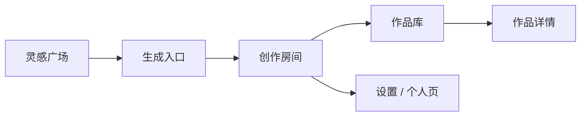

# EcRoom 动效系统设计

这份文档定义 EcRoom 的动态美化方案。目标不是增加炫技动画，而是让用户清楚感知：想法进入房间、Agent 正在协作、草稿逐步成形、作品被归档、经验被沉淀。

## 1. 动效原则

### 1.1 动效服务产品语义

EcRoom 的核心不是聊天，而是创作流程。动效必须表达状态变化：

| 场景 | 用户感知 | 动效语义 |
| --- | --- | --- |
| 灵感到生成 | 从外部灵感进入创作房间 | 轻微推进、背景后退 |
| 生成到对话 | 输入变成一次正式创作 | 输入框收束、消息浮出 |
| Agent 工作中 | 多个角色分阶段协作 | 工作台依次亮起 |
| 技能选择 | 本轮选择专家路线 | 玻璃菜单展开、技能吸附 |
| 完成作品 | 草稿成为作品资产 | 卡片收束、归档反馈 |
| 作品详情 | 从作品库进入成品空间 | 卡片放大、景深展开 |
| 偏好沉淀 | 完成后才出现可保存经验 | 低位小盒浮出 |

### 1.2 动效克制

- 不做大幅弹跳、旋转、持续闪烁；
- 动画时间以 160ms-520ms 为主；
- hover 只做轻景深和玻璃层级，不改变布局；
- 所有动效必须支持 `prefers-reduced-motion`。

### 1.3 视觉关键词

- 玻璃浮层；
- 轻景深；
- 从外到内的推进；
- 从草稿到作品的收束；
- 工作台阶段灯；
- 可撤销、可回到工作中。

## 2. Motion Tokens

```text
--motion-fast: 160ms
--motion-medium: 280ms
--motion-slow: 480ms
--ease-out: cubic-bezier(.16, 1, .3, 1)
--ease-in-out: cubic-bezier(.65, 0, .35, 1)
--glass-blur: 20px
```

这些 token 统一控制页面转场、浮层、卡片 hover、输入框启动和 Agent 工作流。

## 3. 页面空间模型

EcRoom 的页面不是并列标签，而是不同空间层级：



页面切换策略：

- 普通前进：轻微从右下进入；
- 返回或关闭：轻微从左侧回到外层；
- 进入作品详情：由小卡片展开成大空间；
- 进入对话：输入框收束成第一条消息。

当前实现采用统一 `screen-enter` 机制，不为每个页面写硬编码动画。后续如果需要更精确的共享元素转场，可以在卡片点击时记录卡片坐标，用 FLIP 动画完成真实展开。

## 4. 关键交互细节

### 4.1 输入提交

用户点击发送后：

1. 输入框出现一次短促的 `composerLaunch`；
2. 页面进入对话空间；
3. 用户输入变成右侧消息；
4. Agent 工作台卡片从下方浮出；
5. 阶段灯依次推进。

这个动作表达“想法被送进房间”，而不是普通 form submit。

### 4.2 Agent 工作台

工作流阶段必须对应真实阶段，不只是 loading：

- 需求理解；
- 资料检索；
- 创作策略；
- 初稿写作；
- 编辑整理；
- 质量评审；
- 平台规范；
- 记忆沉淀。

前端表现：

- 当前阶段有 glow；
- 已完成阶段颜色降低但保持可读；
- 阶段 tag 按序浮入；
- 工作台卡片有轻玻璃和内部流光。

### 4.3 技能菜单

技能菜单从按钮位置展开，采用玻璃层：

- 菜单本身有 blur；
- 每个技能 hover 向右轻移；
- 选中技能后高亮，并把技能名留在输入框按钮上；
- 再次点击同一技能即取消。

技能菜单不是大弹窗，它是本轮创作路线的轻量选择器。

### 4.4 完成作品

完成不是“聊天结束”，而是“作品归档”：

1. 点击完成作品；
2. 草稿卡片出现短暂收束/归档动画；
3. 后端标记完成；
4. 作品进入作品库；
5. 输入框下方出现可选偏好小盒；
6. 近期对话不再把它当工作中对话展示。

撤销完成时，卡片回到工作中状态，偏好盒隐藏。

### 4.5 作品库

作品卡片使用轻景深：

- hover 时上浮 4px；
- 背景层和文字层产生微小位移；
- 边缘出现柔和高光；
- 点击后详情页以 `depthIn` 方式打开。

作品库要像“完成作品陈列”，不是聊天记录列表。

### 4.6 灵感素材墙

灵感页是用户进入创作的外层空间。这里的动效要比对话区更轻、更有浏览感：

- 卡片按顺序浮入，形成素材墙的节奏；
- hover 时卡片轻微靠近用户，文字层向上移动；
- 卡片边缘出现柔和高光，提示“可打开、可应用、可收藏”；
- 搜索或切换分类后重新编排卡片，不做夸张重排动画，避免干扰浏览。

### 4.7 玻璃浮层

以下组件使用统一玻璃样式：

- 技能菜单；
- 预览详情；
- 删除确认；
- 改进提案确认；
- 头像裁剪；
- 可选偏好盒。

浮层入场：

- 背景 blur；
- 卡片从 12px 下方上浮；
- 透明度从 0 到 1；
- 不遮挡主体时使用小浮层，不使用大 modal。

## 5. 可访问性

- 动效不应阻止键盘操作；
- `prefers-reduced-motion: reduce` 时禁用 transform 动画；
- 不用颜色作为唯一状态提示；
- hover 动效不改变元素实际尺寸，避免布局跳动；
- 页面切换后焦点仍由现有业务逻辑控制。

## 6. 当前落地范围

本轮实现：

- 全局 motion token；
- 页面转场；
- 灵感素材墙入场与轻景深；
- 输入框提交动效；
- 消息与草稿入场；
- Agent 工作台动态；
- 技能菜单玻璃展开；
- modal/preview 玻璃入场；
- 作品卡片轻景深；
- 完成作品卡片收束；
- 可选偏好小盒浮出；
- reduced motion 保护。

后续可以继续做：

- 作品卡片到详情页的真实共享元素 FLIP；
- 完成作品二次确认里的作品预览缩略卡；
- 根据 Agent trace 精准显示阶段时长；
- 作品归档后从对话区飞入作品库入口的路径动画。
